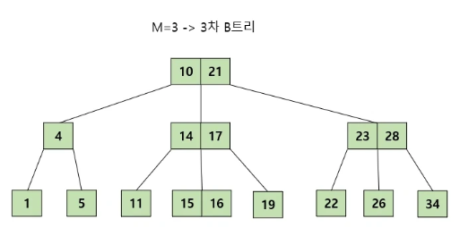

# B트리(B-트리)
- Balanced-Tree의 일종으로 어떠한 경우에도 트리의 균형 유지
- 시간 복잡도 : 최악의 경우에도 O(logN)
- 트리 자료구조의 일종
- 이진트리를 확장해 하나의 노드가 가질 수 있는 자식 노드의 최대 숫자가 2보다 큰 트리 구조

# 특징
1. 노드에는 2개 이상의 데이터가 들어갈 수 있으며, 항상 정렬된 상태로 저장됨

2. 내부 노드는 ceil(M/2) ~ M개의 자식을 가질 수 있음
   (최대 M개의 자식을 가질 수 있는 B트리는 M차 B트리라고 함)

- 내부 노드라는 것은 루트와 리프를 제외한 것

3. 노드의 Key가 K개라면, 자식 노드의 개수는 K+1개여야 함

4. 왼쪽 subTree는 작은 값, 오른쪽 subTree는 큰 값들로 구성됨

- 부모 노트가 a1, a2라고 할 때
- 왼쪽 subTree는 a1보다 작음
- 중간 subTree는 a1보다 크고 a2보다 작음
- 오른쪽 subTree는 a2보다 큼

5. 노드 내에 데이터는 ceil(M/2)-1개부터 최대 M-1개까지 포함될 수 있음

- 3차 B-Tree는 노드 내에 1~2개의 데이터를 가질 수 있음

6. 모든 리프 노드들은 같은 레벨에 존재한다.

# B-트리 탐색

1. 루트 노드에서 탐색 시작
2. K를 찾았다면 탐색 종료
3. K와 노드의 Key를 비교해 알맞은 자식 노드로 내려감
4. 1~3을 리프 노드에 도달할 때까지 반복
5. 만약 K를 찾지 못하고 리프 노드에 도달한다면, 트리에 값 존재하지 않다고 판단

- 찾고자 하는 값 : K = 16

- K는 부모 노드 Key값 중간
- 가운데 자식으로 내려옴

- K는 부모 노드 Key값 중간
- 가운데 자식으로 내려옴

- 리프 노드에서 해당 값 탐색 완료

# B-트리 삽입

: 데이터 추가는 항상 리프 노드에 함

1. 트리가 비어있다면 루트 노드 할당 후 K 삽입
2. 트리가 비어있지 않다면 데이터를 넣을 적절한 리프 노드 탐색
3. 리프 노드에 데이터를 넣고 적절한 상태라면 종료
4. 리프 노드가 부적절한 상태라면 분리

_적절한 상태 : 노드의 데이터 개수가 허용 범위 안에 있음_
_부적절한 상태 : 노드의 데이터 개수가 허용 범위를 벗어남_

## 분리가 일어나지 않는 경우

- 삽입할 값 : K = 9
- 루트 노드에서 9는 10보다 작으므로 왼쪽 노드로 이동
- 4보다 크기 때문에 오른쪽 노드로 이동
- 삽입될 위치 탐색 완료

- 탐색한 위치에 삽입
- 3차 노드는 한 노드에 최대 2개 데이터를 담을 수 있으므로, 적절한 상태임을 판단 후 종료

## 분리가 일어나는 경우

- 삽입할 값 : K = 13
- 루트 노드 값 사이이므로 중간 노드로 이동 ... 과정 거쳐 삽입 위치 탐색

- 탐색한 위치에 삽입
- 3차 노드는 한 노드에 최대 2개 데이터를 담을 수 있으므로, 부적절한 상태 판단
- 분리 진행

- 분할은 항상 중앙값을 기준으로 일어남

- 중앙값은 부모 노드로 이동

- 마찬가지로 최대 2개 데이터 기준을 넘겼으므로, 중앙값 14로 분할 수행

- 14는 부모노드로 이동, 마찬가지로 분할 수행

- 새로운 루트 노드 형성

# B-트리 삭제

## 리프 노드에서 삭제, 적합한 상태

- 바로 삭제

## 리프 노드에서 삭제, 부적합하지만 형제 노드로 처리 가능한 상태

- 19를 삭제하게 되면 자식 노드의 개수가 3개여야 하는 조건을 위반함
- 현재 왼쪽 형제에게서 값을 빌려올 수 있으므로 아래와 같은 과정 따름

- 나와 부모의 오른쪽 데이터 변경

- 나와 왼쪽형제 노드 중 가장 큰 데이터와 변경

- 제거 완료

##### _이외에 삭제 경우의 수 매우 多 | 다음 [참고](https://code-lab1.tistory.com/217)_

# B-Tree 구현

[BTree.java](https://gist.github.com/adderllyer/3bfa2d04200386b5664c)

# B+Tree란?

- B-Tree의 확장 개념
- B-Tree의 경우 중간 노드들의 데이터에 key-value 담지만, B+tree의 경우 중간 노드에는 key만 두고 value는 담지 않음
- 오직 리프 노드에만 key와 data를 저장, 리프 노드끼리는 Linked list로 연결: 메모리 공강 추가 확보 + 형제 노드를 탐색하려면 루트에서 다시 출발해야하는 B-Tree와 다르게 리프 노드만 살피면 되므로 탐색에서 유리
- 데이터베이스 index에 자주 사용됨

# 참고

[B+Tree 시뮬레이션](https://www.cs.usfca.edu/~galles/visualization/BPlusTree.html)

[왜 DB는 B-Tree를 선택하였는가](https://helloinyong.tistory.com/296)
 