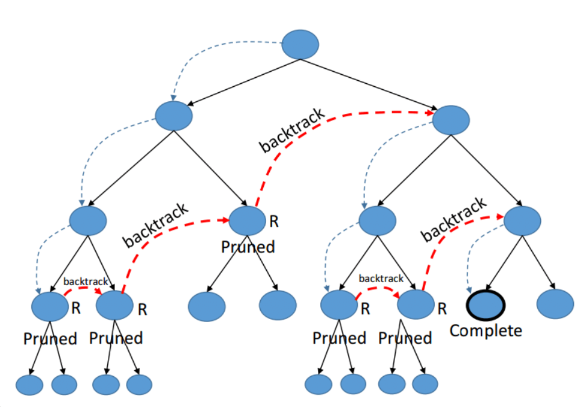
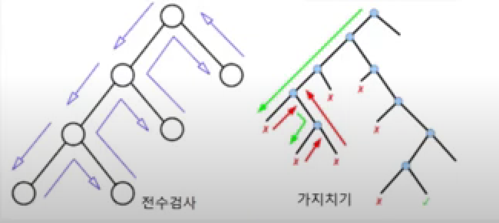
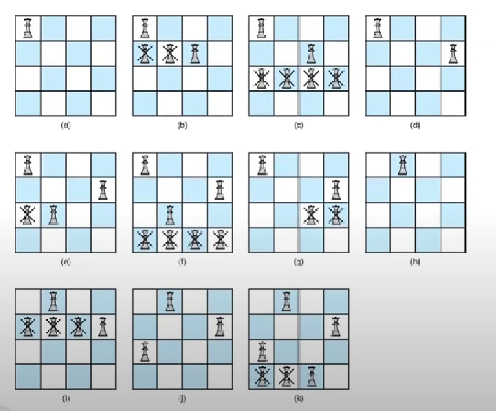

# 백트래킹(BackTracking)
## 백 트래킹이란?

- 완전 탐색을 하던 도중, 현재 탐색이 무의미한 경우 되돌아가는 알고리즘
- 순열, 부분집합에서 사용된다
- 주로 문제풀이에어서 DFS 등으로 경우의 수를 탐색하는 과정에서,<br> 조건문을 걸어서 답이 될 수 없는 상황을 정의하고,<br> 
조건에 걸리면 탐색 중지 후, 이전 단계로 돌아도록 구현

## DFS vs 백트래킹
- DFS는 가능한 모든 경로(후보)를 탐색한다. 
- 불필요한 겅로를 사전에 차단하지 않기 때문에 경우의 수를 최적으로 죽이지 못함
- N! 의 경우의 수를 가진 문제는 처리하지 못할 가능성이 매우 크다

백트래킹은 지금의 경로가 해가 될 거 같지 않으면 , 더 들어가지 않고 
이전 단계로 돌아간다. 이를 가지치기(pruning) 이라고 한다. 불필요한
부분을 쳐내고 최대한 올바를 방식으로 나아가는 형식


## 백트래킹 기법
1. 결정: 해결책의 유효성을 판단하기 위해 선택지를 하나 선택합니다.
   
2. 실행: 해당 결정을 실행하고 결과를 확인합니다.
   
3. 평가: 새로운 결정이 문제 해결에 도움이 되는지 평가합니다.
   
4. 복구: 만약 새로운 결정이 문제 해결에 도움이 되지 않으면 이전 상태로 돌아갑니다.


## 백트래킹 예시문제 ( N - Queen )


< 코드 >
```java
public class Main {
    public static void main(String[] args) {
        int n = 4; 
        solveNQueens(n);
    }
    
    public static void solveNQueens(int n) {
        int[] queens = new int[n]; 
        placeQueens(queens, 0, n); 
    }


    public static void placeQueens(int[] queens, int row, int n) {
        if (row == n) {
            printQueens(queens); 
            return;
        }
        
        for (int col = 0; col < n; col++) {
            if (isValid(queens, row, col)) {
                queens[row] = col; 
                placeQueens(queens, row + 1, n); 
            }
        }
    }
    
    public static boolean isValid(int[] queens, int row, int col) {
 
        for (int i = 0; i < row; i++) {
            if (queens[i] == col || Math.abs(queens[i] - col) == Math.abs(i - row)) {
                return false; 
            }
        }
        return true; 
    }
    
    public static void printQueens(int[] queens) {
        for (int queen : queens) {
            for (int j = 0; j < queens.length; j++) {
                if (j == queen) {
                    System.out.print("Q "); 
                } else {
                    System.out.print(". "); 
                }
            }
            System.out.println(); 
        }
        System.out.println(); 
    }
}
```
