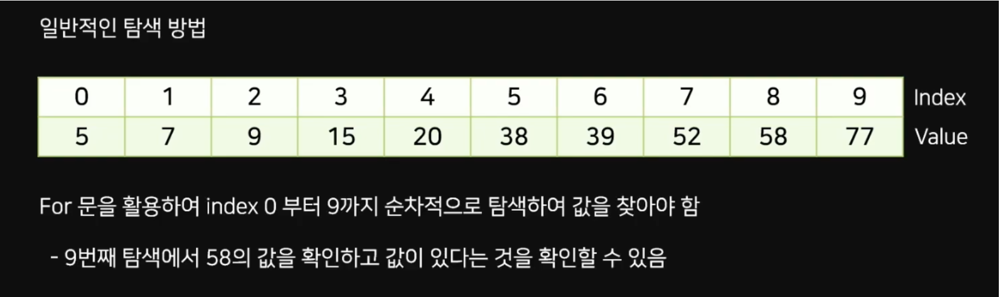

# Binary Search

## Binary Search란

- 정렬된 배열에서 사용하기 적합한 탐색 방법
- 이진 탐색이라고도 한다
- 배열의 중앙값을 조사하여 찾고자 하는 항목이 왼쪽 or 오른쪽에 있는지 확인하는 방식
- 방향이 정해지면 반대 방향은 탐색할 필요가 없어, 단계마다 범위를 반 씩 줄 일 수 있다
- 시간 복잡도 O(logN) 

## 이진 탐색 방법

1. 정렬된 배열 arr[]이 존재, 범위는 low ~ high로 설정

2. low와 high 값으로 mid 값을 설정 : mid = ( low + high ) / 2

3. arr[mid]의 값과 찾고자하는 value를 비교

### value가 더 큰 경우
: low를 mid + 1로 설정
### value가 더 작은 경우
: high를 mid. - 1 로 설정
### value와 mid가 같을 경우
:  정답이므로 arr[mid]를 리턴   
### low가 high가 될 때까지 반복 => 마지막 경우

## LinearSearch vs BinarySearch


- 이 경우를 선형 탐색(linear Search) 이라 한다
- 경우에 따라 이진 탐색은 선형 탐색보다 느릴 수 있다.

## BinarySearch 코드

```java
import java.io.BufferedReader;
import java.io.IOException;
import java.io.InputStreamReader;

public class main {

	static int count = 0;
	public static int binarySearch(int[] arr, int num) {
		int low = 0; // low
		int high = arr.length - 1;
	
		while (low <= high) {
			int mid = (high + low) / 2;
			count++;
			if (arr[mid] == num) {
				return mid; // 찾으면 반환
			} else if (arr[mid] < num) {
				low = mid + 1; // 오른쪽 이동
			} else {
				high = mid - 1; // 왼쪽 이동
			}
		}
		return -1; // 없을 때
	}

	public static void main(String[] args) throws IOException {

		BufferedReader br = new BufferedReader(new InputStreamReader(System.in));

		int[] arr = { 1, 2, 3, 4, 5, 6, 7, 8, 9, 10, 11, 13, 14 };
		int num = Integer.parseInt(br.readLine());

		int result = binarySearch(arr, num);

		if (result != -1) {
			System.out.println(num + "은 배열의 인덱스 " + result + "에 있습니다.");
			System.out.println("탐색" + count + "번");
		} else {
			System.out.println(num + " 없습니다.");
			System.out.println("탐색" + count + "번");
		}
	}
}
```

### 이진 탐색 장점

- 전부 찾는 것 보다 값을 찾는 속도가 빠르다.

### 이진 탐색 단점

- 정렬되어 있을 때만 사용이 가능하다.
- 중복된 값이 있을 때 무엇을 반환해야할지 추가적인 작업이 필요하다.
- 경우에 따라서 선형 탐색보다 더 많은 탐색을 할 수 있다.
