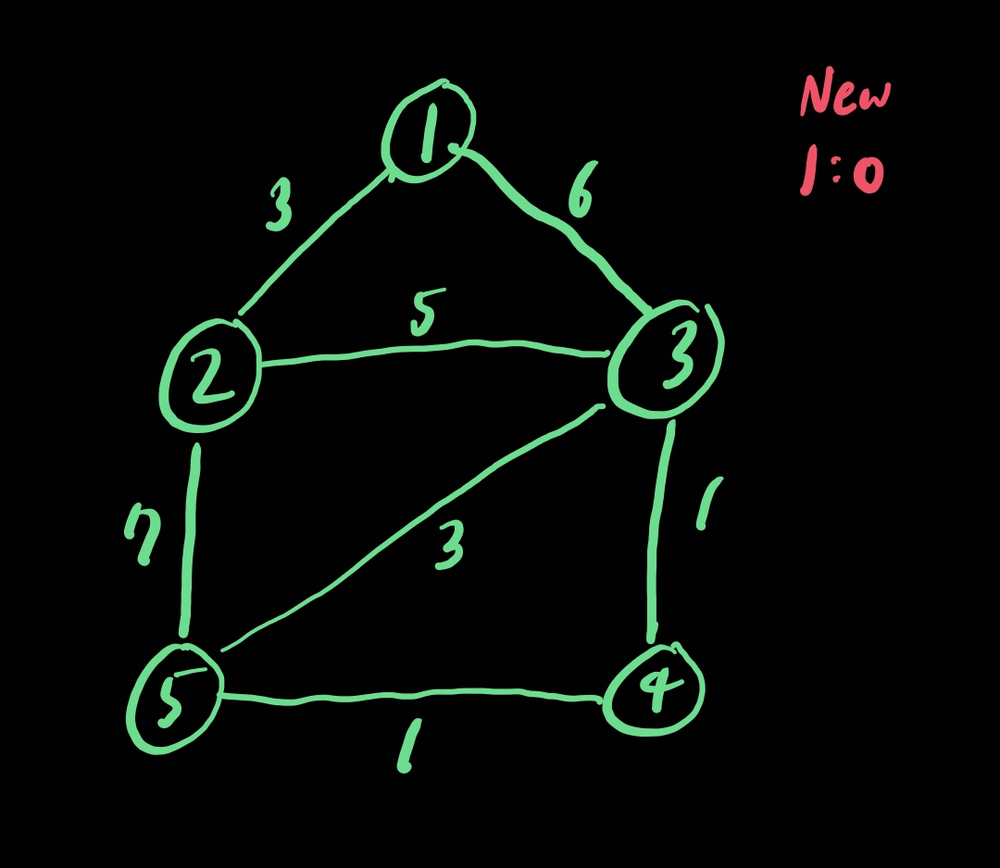
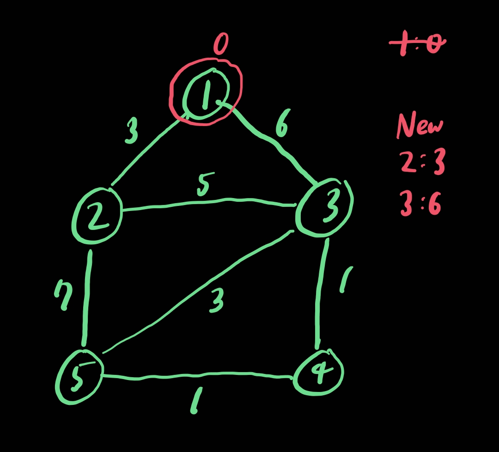
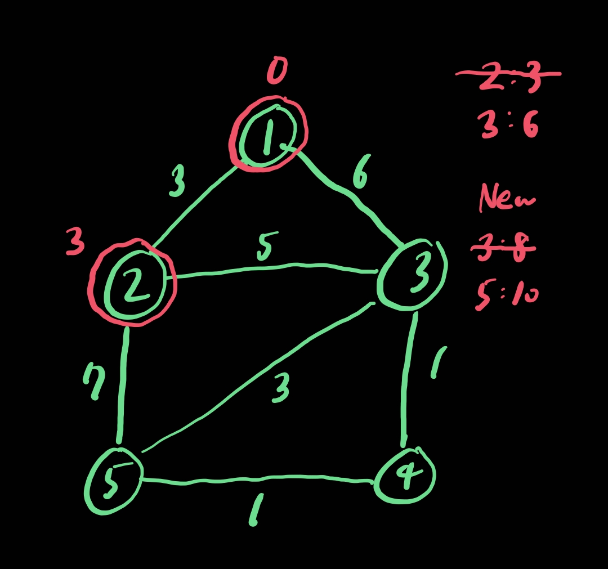
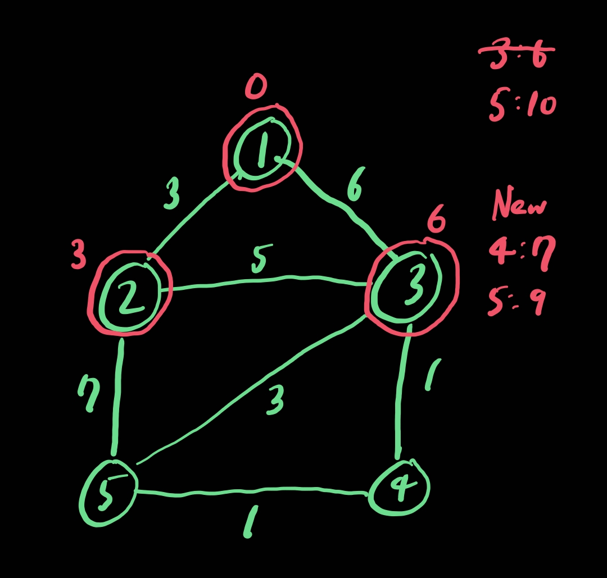
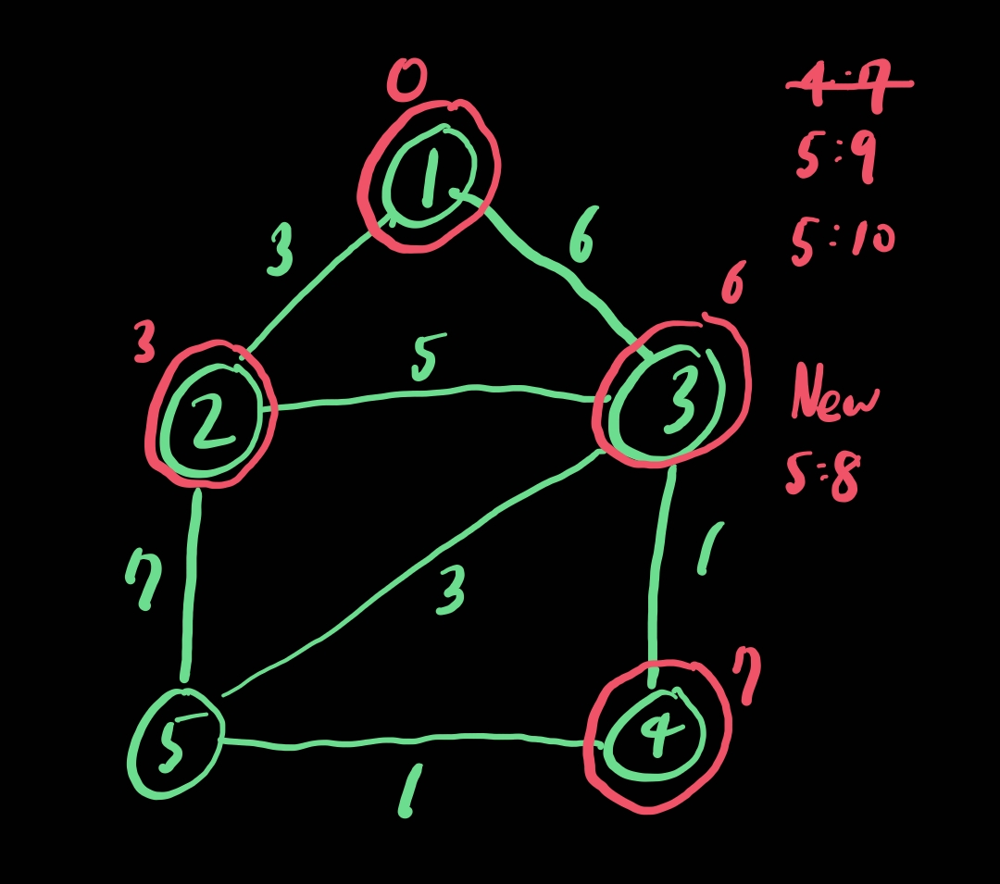
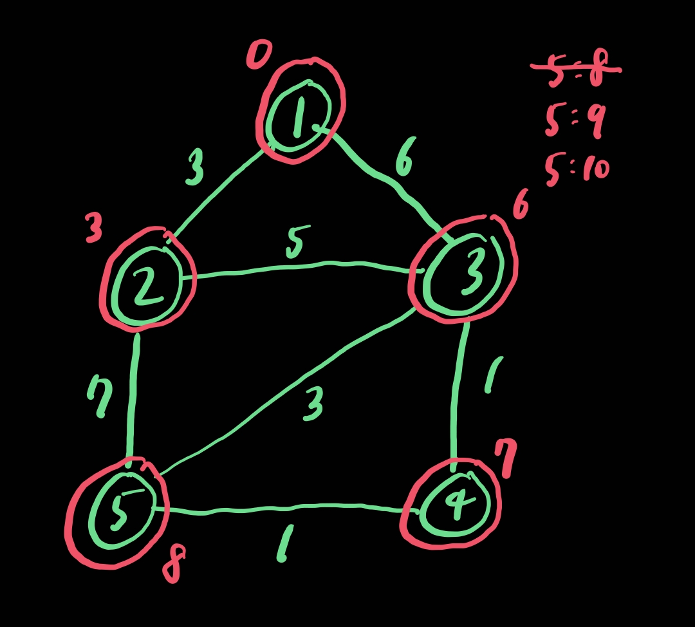

# 다익스트라 알고리즘 (Dijkstra Algorithm)

## 1. 다익스트라 알고리즘

- 시작 정점에서 다른 모든 정점까지의 최단 거리를 구하는 알고리즘이다.
- 시작 정점에서 거리가 최소인 정점부터 선택해나가면서 최단 거리를 구한다.
    - 최솟값을 찾는 과정에서 우선순위 큐를 이용하여 구현할 수도 있다.
- 그리디 알고리즘에 속한다.
    - MST의 프림 알고리즘과 유사하다.
- 음의 가중치가 없는 그래프에서 사용할 수 있다. (음의 가중치 → 벨만-포드 등)

## 2. 다익스트라 알고리즘 예제 설명













## 3. 다익스트라 알고리즘 구현

- 시간복잡도 : $O(V^2)$

```java
import java.io.BufferedReader;
import java.io.IOException;
import java.io.InputStreamReader;
import java.util.ArrayList;
import java.util.StringTokenizer;

public class shortest_path_dijkstra {

    static class Vertex {
        int to, weight;

        public Vertex(int to, int weight) {
            this.to = to;
            this.weight = weight;
        }
    }

    static final int INF = 1_000_000_000;

    public static void main(String[] args) throws IOException {
        BufferedReader br = new BufferedReader(new InputStreamReader(System.in));

        StringTokenizer st = new StringTokenizer(br.readLine(), " ");
        int v = Integer.parseInt(st.nextToken()); // 정점의 개수 (정점의 번호는 1번부터 V번까지로 가정한다)
        int e = Integer.parseInt(st.nextToken()); // 간선의 개수

        st = new StringTokenizer(br.readLine(), " ");
        int beginNode = Integer.parseInt(st.nextToken()); // 시작 노드 번호
        // int endNode = Integer.parseInt(st.nextToken()); // 도착 노드 번호

        ArrayList<Vertex>[] adjList = new ArrayList[v + 1];

        for (int u = 1; u <= v; u++) {
            adjList[u] = new ArrayList<Vertex>();
        }

        for (int i = 0; i < e; i++) {
            st = new StringTokenizer(br.readLine(), " ");
            int from = Integer.parseInt(st.nextToken());
            int to = Integer.parseInt(st.nextToken());
            int weight = Integer.parseInt(st.nextToken());
            adjList[from].add(new Vertex(to, weight));
            adjList[to].add(new Vertex(from, weight)); // 양방향
        }

        int[] minDist = new int[v + 1]; // 시작 노드부터 해당 노드까지의 최단 거리
        boolean[] visited = new boolean[v + 1];

        for (int u = 1; u <= v; u++) {
            minDist[u] = INF;
        }

        minDist[beginNode] = 0;

        for (int i = 0; i < v; i++) {
            int curMinDist = INF;
            int curVertex = -1;

            for (int u = 1; u <= v; u++) {
                if (!visited[u] && curMinDist > minDist[u]) {
                    curMinDist = minDist[u];
                    curVertex = u;
                }
            }

            if (curVertex == -1) break;

            visited[curVertex] = true;

            // if (curVertex == endNode) break;

            for (Vertex nextVertex : adjList[curVertex]) {
                if (minDist[nextVertex.to] > curMinDist + nextVertex.weight) {
                    minDist[nextVertex.to] = curMinDist + nextVertex.weight;
                }
            }
        }

        for (int endNode = 1; endNode <= v; endNode++) {
            System.out.printf("Dist from %d to %d : %d%n", beginNode, endNode, minDist[endNode] == INF ? -1 : minDist[endNode]);
        }

        br.close();
    }

}
```

## 4. 우선순위 큐를 이용한 다익스트라 알고리즘 구현

- 시간복잡도 : $O((V + E) \log V)$

```java
import java.io.BufferedReader;
import java.io.IOException;
import java.io.InputStreamReader;
import java.util.ArrayList;
import java.util.PriorityQueue;
import java.util.StringTokenizer;

public class shortest_path_dijkstra_with_priority_queue {

    static class Vertex implements Comparable<Vertex> {
        int to, weight;

        public Vertex(int to, int weight) {
            this.to = to;
            this.weight = weight;
        }

        @Override
        public int compareTo(Vertex o) {
            return weight - o.weight;
        }
    }

    static final int INF = 1_000_000_000;

    public static void main(String[] args) throws IOException {
        BufferedReader br = new BufferedReader(new InputStreamReader(System.in));

        StringTokenizer st = new StringTokenizer(br.readLine(), " ");
        int v = Integer.parseInt(st.nextToken()); // 정점의 개수 (정점의 번호는 1번부터 V번까지로 가정한다)
        int e = Integer.parseInt(st.nextToken()); // 간선의 개수

        st = new StringTokenizer(br.readLine(), " ");
        int beginNode = Integer.parseInt(st.nextToken()); // 시작 노드 번호
        // int endNode = Integer.parseInt(st.nextToken()); // 도착 노드 번호

        ArrayList<Vertex>[] adjList = new ArrayList[v + 1];

        for (int u = 1; u <= v; u++) {
            adjList[u] = new ArrayList<Vertex>();
        }

        for (int i = 0; i < e; i++) {
            st = new StringTokenizer(br.readLine(), " ");
            int from = Integer.parseInt(st.nextToken());
            int to = Integer.parseInt(st.nextToken());
            int weight = Integer.parseInt(st.nextToken());
            adjList[from].add(new Vertex(to, weight));
            adjList[to].add(new Vertex(from, weight)); // 양방향
        }

        int[] minDist = new int[v + 1]; // 시작 노드부터 해당 노드까지의 최단 거리
        PriorityQueue<Vertex> pqMinTop = new PriorityQueue<Vertex>();

        for (int u = 1; u <= v; u++) {
            minDist[u] = INF;
        }

        minDist[beginNode] = 0;
        pqMinTop.offer(new Vertex(beginNode, 0));

        while (!pqMinTop.isEmpty()) {
            Vertex curVertex = pqMinTop.poll();

            // if (curVertex.to == endNode) break;
            if (curVertex.weight > minDist[curVertex.to]) continue;

            for (Vertex nextVertex : adjList[curVertex.to]) {
                if (minDist[nextVertex.to] > curVertex.weight + nextVertex.weight) {
                    minDist[nextVertex.to] = curVertex.weight + nextVertex.weight;
                    pqMinTop.offer(new Vertex(nextVertex.to, minDist[nextVertex.to]));
                }
            }
        }

        for (int endNode = 1; endNode <= v; endNode++) {
            System.out.printf("Dist from %d to %d : %d%n", beginNode, endNode, minDist[endNode] == INF ? -1 : minDist[endNode]);
        }

        br.close();
    }

}
```
