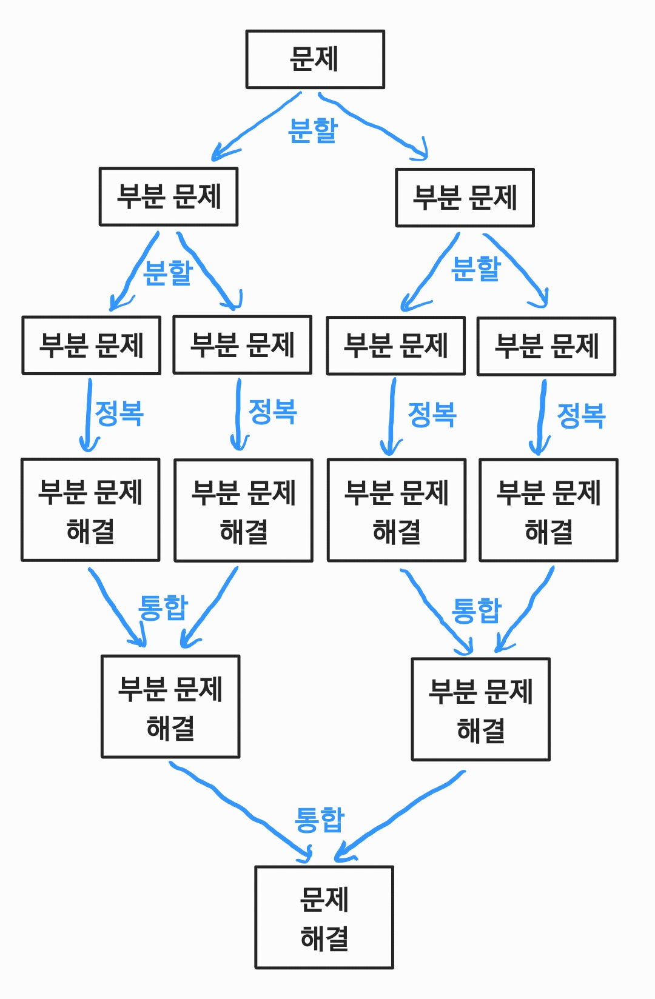

# 분할 정복 (Divide and Conquer)

- 분할 정복 알고리즘은 문제를 나눌 수 없을 때까지 나누어서 각각의 작은 문제를 풀고, 다시 합병하여 문제의 답을 얻는 알고리즘이다.

- 보통 재귀를 통해 자연스럽게 구현한다.

- 

- 알고리즘의 진행 단계

    - 분할 (Divide) : 주어진 문제를 여러 개의 작은 문제로 나눈다.

    - 정복 (Conquer) : 작은 문제가 더 이상 분할되지 않을 정도로 충분히 작다면, 작은 문제를 각각 해결하여 해를 구한다.

    - 통합 (Combine) : (필요하다면) 작은 문제에 대한 해를 결합하여 원래 문제의 해를 구한다.

- 시간 복잡도

    - 예를 들어, A의 8제곱을 계산할 경우, A^8 = A * A * A * A * A * A * A * A와 같이 계산한다면 총 7번의 연산이 필요하다.

    - 즉, 반복 기반의 알고리즘을 이용할 경우 시간복잡도는 O(N)이다.

    - 그러나 A^8 = (((A^2)^2)^2)와 같이 계산한다면 총 3번의 연산이 필요하다.

    - 즉, 분할 정복 기반의 알고리즘을 이용할 경우 시간복잡도는 O(log N)이다.

- 장점

    - 문제를 작은 문제로 나눔으로써 어려운 문제를 쉬운 문제로 바꿔서 해결할 수 있다는 장점이 있다.

- 주요 예시

    - 정렬 : 병합 정렬, 퀵 정렬

    - 이분 탐색

    - 거듭제곱 계산

    - 큰 수의 곱셈 : 카라추바 알고리즘

    - 고속 푸리에 변환 (FFT)

- 관련 문제

    - [색종이 만들기 (백준 2630)](https://www.acmicpc.net/problem/2630)

    - [쿼드트리 (백준 1992)](https://www.acmicpc.net/problem/1992)

    - [Z (백준 1074)](https://www.acmicpc.net/problem/1074)

    - [곱셈 (백준 1629)](https://www.acmicpc.net/problem/1629)
