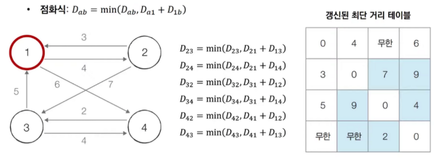

# 플로이드 워셜 알고리즘이란?
- **모든 지점**에서 **다른 모든 지점**까지의 최단 경로를 구하는 알고리즘
- 단계마다 '거쳐가는 노드'를 기준으로 알고리즘 수행
- 모든 지점에서 다른 모든 지점의 최단 거리를 저장하기 때문에 2차원 테이블 이용
- DP의 일종, 노드의 개수 N번 만큼만 반복해 점화식으로 2차원 리스트 갱신하기 때문
- 다익스트라와 다르게 음의 가중치를 허용하지만, 음수 값을 가지는 사이클이 존재하면 안됨

- 1 > 4 최단 경로를 구한다고 가정
- 양쪽 모두 2 > 3 > 2 사이클이 존재하지만 좌측은 합이 +1, 우측은 합이 -1임
- 좌측의 경우 1 > 2 > 4 경로로 해결 가능하지만, 우측의 경우 2 > 3 > 2 사이클을 돌 때마다 최단 경로가 1씩 단축이 됨
- 따라서 합이 음의 가중치인 그래프에서는 최단 경로를 구할 수 없음


## 점화식


## 설명
### 0. 전체 과정


### 1. 노드 간선에 따라 최단 거리 테이블 초기화


- 무한 : 해당 노드와 특정 노드 사이 직접적인 간선 X

### 2. 1번 노드 거치는 경우 고려해 테이블 갱신


### 3. 2번 노드 거치는 경우 고려해 테이블 갱신


### 4. 3번 노드 거치는 경우 고려해 테이블 갱신


### 5. 4번 노드 거치는 경우 고려해 테이블 갱신


## 코드
```Java
// JAVA
import java.io.*;
import java.util.*;

public class FloydWarshall {
    static BufferedReader br;
    static StringTokenizer st;
    static StringBuilder sb = new StringBuilder();

    // 노드의 개수 (N), 간선의 개수 (M)
    static int N, M;
    static final int INF = Integer.MAX_VALUE;
    static int[][] graph;

    public static void main(String[] args) throws IOException {
        br = new BufferedReader(new InputStreamReader(System.in));
        st = new StringTokenizer(br.readLine());
        N = Integer.parseInt(st.nextToken());
        M = Integer.parseInt(st.nextToken());
        graph = new int[N+1][N+1];

        // 최단 거리 테이블 초기화
        for (int i = 0; i <=N; i++) {
            Arrays.fill(graph[i], INF);
        }

        // 자신 노드 0 초기화
        for (int i = 1; i<=N; i++) {
            graph[i][i] = 0;
        }

        // 각 간선에 대한 정보를 입력 받아, 그 값으로 초기화
        for (int i = 0; i < M; i++) {
            st = new StringTokenizer(br.readLine());
            // A에서 B로 가는 비용은 C라고 설정
            int a = Integer.parseInt(st.nextToken());
            int b = Integer.parseInt(st.nextToken());
            int c = Integer.parseInt(st.nextToken());
            graph[a][b] = c;
        } // 입력 끝

        // 점화식에 따라 플로이드 워셜 알고리즘을 수행
        for (int k = 1; k <= N; k++) {
            for (int a = 1; a <= N; a++) {
                for (int b = 1; b <= N; b++) {
                    if(graph[a][k] != INF && graph[k][b] != INF){
                        graph[a][b] = Math.min(graph[a][b], graph[a][k] + graph[k][b]);
                    }
                }
            }
        }

        // 수행된 결과를 출력
        for (int r = 1; r <= N; r++) {
            for (int c = 1; c <= N ; c++) {
                sb.append(graph[r][c]).append(" ");
            }
            sb.append("\n");
        }

        System.out.println(sb);
    }
}
```

```Python
# Python
import sys

input = sys.stdin.readline
INF = int(1e9)

# 노드의 개수(n)과 간선의 개수(m) 입력
n = int(input())
m = int(input())

# 2차원 리스트 (그래프 표현) 만들고, 무한대로 초기화
graph = [[INF] * (n + 1) for _ in range(n + 1)]

# 자기 자신에서 자기 자신으로 가는 비용은 0으로 초기화
for a in range(1, n + 1):
    for b in range(1, n + 1):
        if a == b:
            graph[a][b] = 0

# 각 간선에 대한 정보를 입력받아, 그 값으로 초기화
for _ in range(m):
    # A -> B로 가는 비용을 C라고 설정
    a, b, c = map(int, input().split())
    graph[a][b] = c

# 점화식에 따라 플로이드 워셜 알고리즘을 수행
for k in range(1, n + 1):
    for a in range(1, n + 1):
        for b in range(1, n + 1):
            graph[a][b] = min(graph[a][b], graph[a][k] + graph[k][b])

# 수행된 결과를 출력
for a in range(1, n + 1):
    for b in range(1, n + 1):
        if graph[a][b] == INF:
            print('INFINITY', end=' ')
        else:
            print(graph[a][b], end=' ')
    print()

# sample input
# 4
# 7
# 1 2 4
# 1 4 6
# 2 1 3
# 2 3 7
# 3 1 5
# 3 4 4
# 4 3 2
```

## 시간복잡도
**O(N^3)**

- 노드 개수 N번 + 각 단계 마다 N^2의 연산을 통해 현재 노드를 거쳐 가는 모든 경로를 고려
- 따라서 노드의 개수가 500개 이하로, 작은 경우에 활용

## Baekjoon
- [2606번 - 바이러스](https://www.acmicpc.net/problem/2606)
- [11404번 - 플로이드](https://www.acmicpc.net/problem/11404)