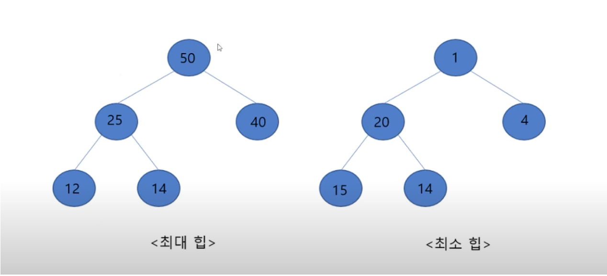
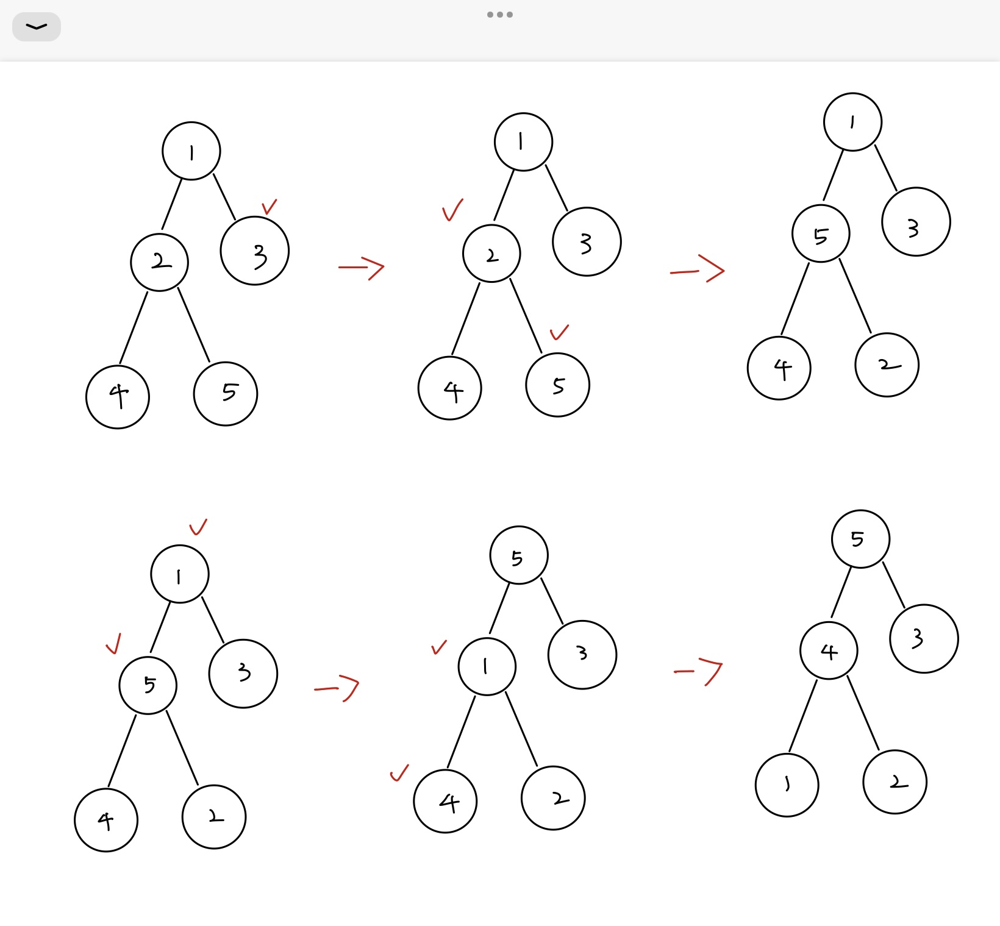

# 힙 (Heap)

- 완전 이진트리의 일종
- 루트노드가 최대 or 최소값을 가지는 자료구조
- 완전이진트리의 구조를 가지기 때문에 배열로 표현이 가능
- 힙 정렬을 하기 위해서는 주어진 데이터로 최대 or 최소 힙을 만들어야 한다

### 최대 힙
- 모든 부모 노드의 값은 자식 노드의 값보다 크다
### 최소 힙 
- 모든 부모 노드의 값은 자식 노드의 값보다 작다


### 최대 힙으로 바뀌는 과정
- 첫 시작은 노드의 갯수를 2로 나눈 지점의 인덱스서 시작한다.
  

- 사진에서는 바뀌는 위치가 없을 경우 확인하는 과정은 생략되었다.

## 힙 정렬 코드
```java
public class Heapsort2 {
	public static void main(String[] args) {
        int[] arr = {4, 10, 3, 5, 1};

        System.out.println("원래 배열:");
        printArray(arr);

        heapSort(arr);

        System.out.println("\n최대힙으로 정렬된 배열:");
        printArray(arr);
    }

    static void heapSort(int arr[]) {
        int n = arr.length;

        // 최대힙 구성
        // 정렬이 완료될 때 마다 길이를 하나씩 뺸다
        for (int i = n / 2 - 1; i >= 0; i--)
            maxHeapify(arr, n, i);

        // 최대힙에서 루트를 꺼내 정렬
        for (int i = n - 1; i > 0; i--) {
            // 루트와 마지막 노드 교환
            int temp = arr[0];
            arr[0] = arr[i];
            arr[i] = temp;

            // 힙 속성 유지하며 최대힙 구성
            maxHeapify(arr, i, 0);
        }
    }

    static void maxHeapify(int arr[], int n, int i) {
        int parent = i;
        int left = 2 * i ;
        int right = 2 * i + 1;

        if (left < n && arr[left] > arr[parent])
            parent = left;

        if (right < n && arr[right] > arr[parent])
            parent = right;

        if (parent != i) {
            // 부모와 최댓값 위치 교환
            int swap = arr[i];
            arr[i] = arr[parent];
            arr[parent] = swap;

            // 교환 후에도 힙 속성 유지
            maxHeapify(arr, n, parent);
        }
    }
    static void printArray(int arr[]) {
        for (int value : arr)
            System.out.print(value + " ");
        System.out.println();
    }
}
```