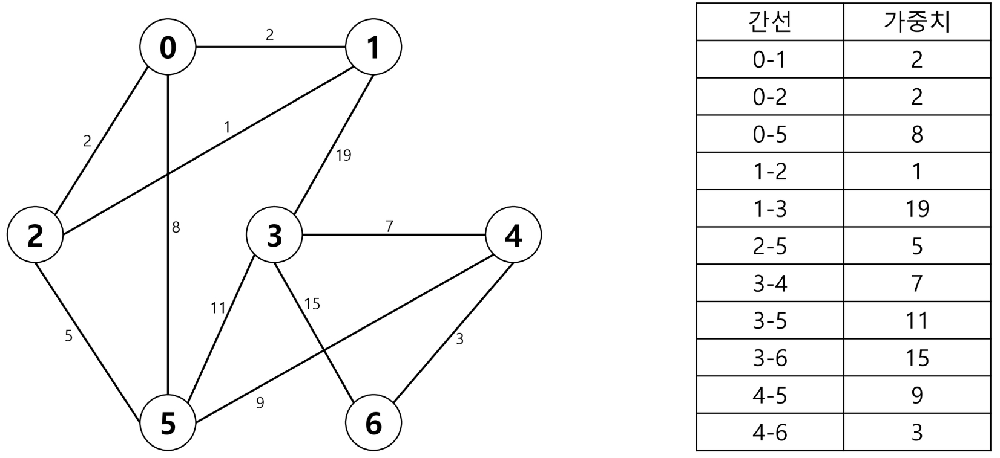
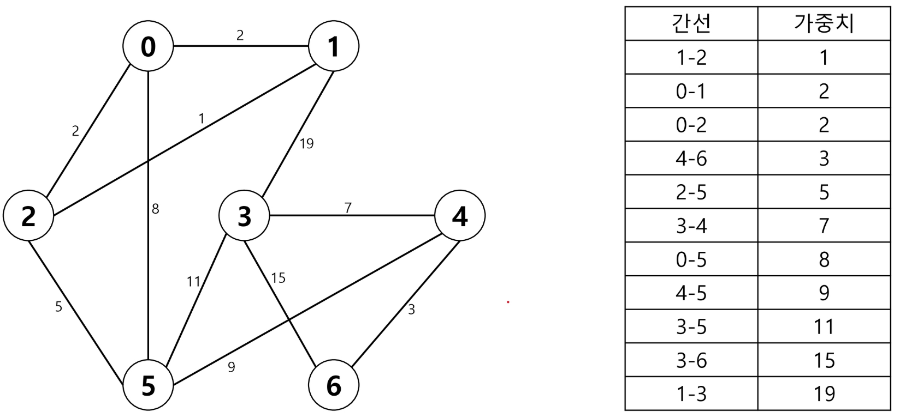
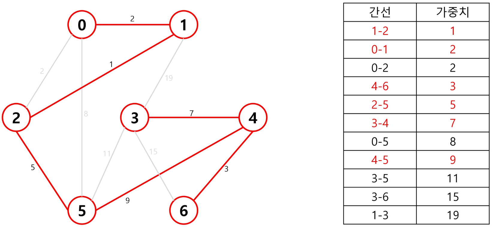
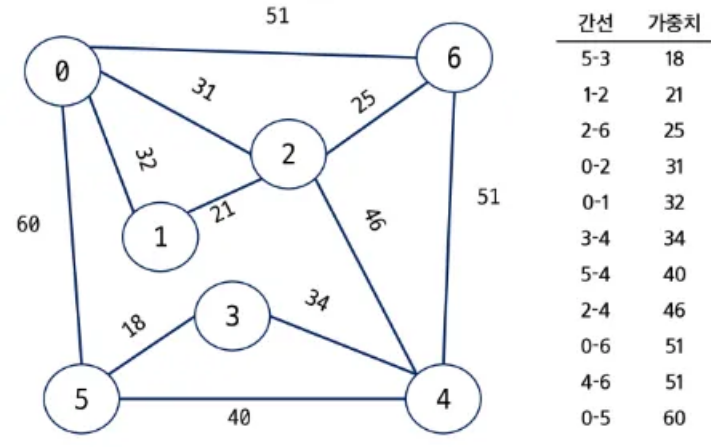

# 크루스칼(Kruskal) 알고리즘이란?

- 최소 비용 신장트리(MST) 탐색 알고리즘
- 무방향 가중치 그래프
- 사이클 존재 X

# 탐색 과정

> 1. 최초, 모든 **간선**을 가중치에 따라 오름차순으로 정렬
> 2. 가중치가 가장 낮은 간선부터 선택하면서 트리 증가
    - 단, 이미 선택된 간선과 사이클이 존재하면 다음으로 가중치가 낮은 간선 선택
    - Union-Find를 사용해 사이클 존재 여부 확인
> 3. N-1개의 간선이 선택될 때까지 2번 반복

- 기본 그래프

- 간선 가중치 오름차순 정렬

- N-1개 간선 선택


# Java



### Input
```
7 11
0 1 32
0 2 31
0 5 60
0 6 51
1 2 21
2 4 46
2 6 25
3 4 34
3 5 18
4 5 40
4 6 51
```

### Code
```java
import java.io.*;
import java.util.*;

public class kruskal {
    static int[] p;
    static BufferedReader br;
    static StringTokenizer st;
    public static void main(String[] args) throws IOException{
        br = new BufferedReader(new InputStreamReader(System.in));
        st = new StringTokenizer(br.readLine());
        int V = Integer.parseInt(st.nextToken());
        int E = Integer.parseInt(st.nextToken());

        int[][] edges = new int[E][3];
        for(int i=0; i<E; i++) {
            st = new StringTokenizer(br.readLine());
            edges[i][0] = Integer.parseInt(st.nextToken());
            edges[i][1] = Integer.parseInt(st.nextToken());
            edges[i][2] = Integer.parseInt(st.nextToken());
        }

        // 1단계 : 가중치 오름차순 정렬
        Arrays.sort(edges, new Comparator<int[]>() {
            @Override
            public int compare(int[] e1, int[] e2) {
                return e1[2]-e2[2];
            }
        });

        // 2단계 : V-1개의 간선 뽑기 (단, 사이클 발생 X)
        p = new int[V];
        for(int i=0; i<V; i++) p[i] = i;

        int cost = 0;
        int pick = 0;
        for(int i=0; i<E; i++) {
            int px = findSet(edges[i][0]);
            int py = findSet(edges[i][1]);

            if(px!=py) {
                union(px, py);
                cost += edges[i][2];
                pick++;
            }

            if(pick == (V-1)) break;
        }
        System.out.println(cost);
    }

    static int findSet(int x) {
        if(x != p[x]) p[x] = findSet(p[x]);
        return p[x];
    }

    static void union(int x, int y) {
        p[y] = p[x];
    }
}

```

# BOJ
- 1922 : [네트워크 연결](https://www.acmicpc.net/problem/1922)