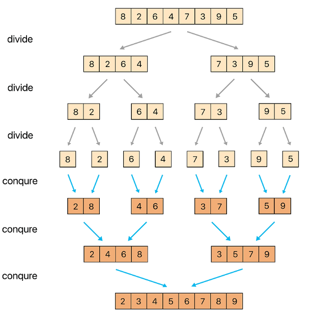
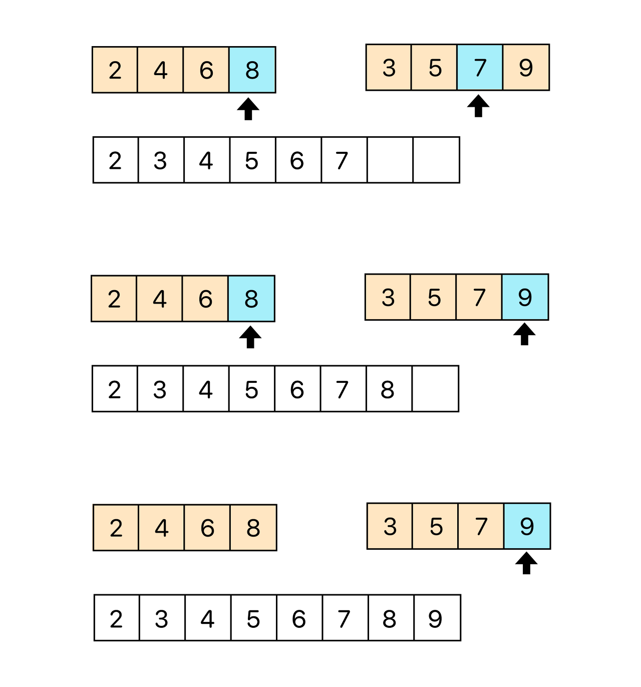

## 병합 정렬, 합병 정렬이란?

>  데이터를 정확히 정확히 반으로 나누고, 분할된 부분에 대해 정렬

### 핵심 개념

-   분할 정복 알고리즘 > 분할 부분과 정복 부분으로 나뉨
-   재귀 활용

---

### 정렬 과정



1.  모든 데이터가 한 개씩 남을 때까지 정확히 **절반**으로 나눔 (분할)
2.  다시 데이터를 합치면서 정렬시작, 이때 배열 크기는 2의 배수로 커짐 ( 1 > 2 > 4 > 8 ) (정복)




3.  두 배열의 0번 인덱스부터 비교하며 더 작은 수를 먼저 결과 배열에 넣음 -> 두 배열을 모두 순회할때까지 반복
4.  만든 배열을 원래 배열에 복사
5.  배열 크기가 원본 크기가 된다면 종료

---

### 시간 복잡도

.PNG)

-   O(NlogN)
-   항상 데이터를 절반으로 나누기 때문에 O(NlogN)을 보장

---

### 구현

```Java
import java.util.*;

public class MergeSort {
    public static void main(String[] args) {
        int [] arr = {3, 9, 7, 8, 5, 1, 0, 2, 6, 4};
        System.out.println(Arrays.toString(arr));
        mergeSort(arr);
        System.out.println(Arrays.toString(arr));
    }

    static void mergeSort(int[] arr) {
        int[] tmp = new int[arr.length];
        mergeSort(arr, tmp, 0, arr.length-1);
    }

    static void mergeSort(int[] arr, int[] tmp, int start, int end) {
        if(start<end) {
            int mid = (start+end)/2;
            mergeSort(arr, tmp, start, mid);
            mergeSort(arr, tmp, mid+1, end);
            merge(arr, tmp, start, mid, end);
        }
    }

    static void merge(int[] arr, int[] tmp, int start, int mid, int end) {
        for(int i=start; i<=end; i++) {
            tmp[i] = arr[i];
        }
        int part1 = start;
        int part2 = mid+1;
        int index = start;
        while(part1<=mid && part2<=end) {
            if(tmp[part1]<=tmp[part2]) {
                arr[index] = tmp[part1];
                part1++;
            } else {
                arr[index] = tmp[part2];
                part2++;
            }
            index++;
        }
        for(int i=0; i<=mid-part1; i++) {
            arr[index+i] = tmp[part1+i];
        }
    }

}
```

---

### 관련 문제

[백준 24060 : 알고리즘 수업 - 병합 정렬 1](https://www.acmicpc.net/problem/24060)

---

### 참고 사이트

[병합정렬 이론 정리](https://st-lab.tistory.com/233)  
[병합정렬 강의](https://www.youtube.com/watch?v=QAyl79dCO_k)