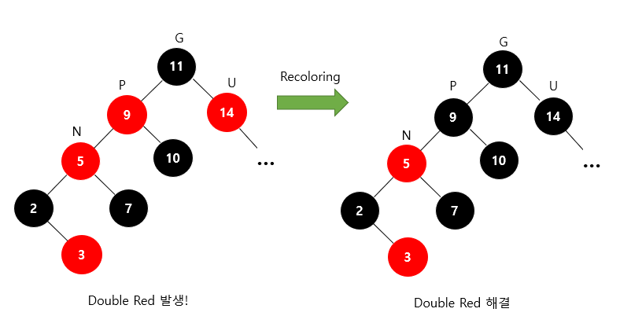

# 1. 레드-블랙 트리 (Red-Black Tree)

## 1. 레드-블랙 트리

- 레드-블랙 트리는 이진 탐색 트리의 일종이다.
- 기존의 이진 탐색 트리는 한쪽으로 편향될 수 있다는 단점이 있다. 트리 탐색은 일반적으로 O(log N)의 시간복잡도를 가지지만, 트리 모양이 한쪽으로 치우치게 되면 시간복잡도가 O(N)에 가까워지게 된다.
- 레드-블랙 트리는 이진 탐색 트리에 몇 가지 규칙을 추가한 자료구조이다. 이러한 규칙들을 통해 트리의 균형을 유지하고 O(log N)의 시간 복잡도를 유지할 수 있다.

## 2. 레드-블랙 트리의 정의

### (1) NIL node

- 이진 탐색 트리의 모든 노드는 최대 2개의 자식 노드를 가진다.
- 레드-블랙 트리에서 자식 노드가 존재하지 않는 경우에는 NIL node라는 특수한 노드가 있는 것으로 가정한다.

### (2) 레드-블랙 트리의 정의

- 아래의 5가지 조건을 만족하는 이진 탐색 트리를 레드-블랙 트리로 정의한다.
    1. 모든 노드는 빨간색 아니면 검은색이다.
    2. 루트 노드는 검은색이다.
    3. 모든 리프 노드(NIL 노드)들은 검은색이다.
    4. 빨간색 노드의 자식은 검은색이다.
        - 따라서 빨간색 노드의 부모는 항상 검은색이다.
        - 따라서 빨간색 노드가 연속으로 나올 수 없다.
    5. 임의의 한 리프 노드에서 루트 노드까지 가는 경로에 존재하는 검은색 노드의 개수는 모두 같다.

### (3) 시간 복잡도

- 기존의 이진 탐색 트리는 삽입과 삭제에서 최악의 경우 O(N)의 시간 복잡도를 가진다.
- 레드-블랙 트리의 경우 삽입, 탐색, 삭제 모두 최악의 경우에도 O(log N)의 시간 복잡도를 가진다.

## 3. 레드-블랙 트리의 삽입 과정

- 레드-블랙 트리에 새로운 노드를 삽입할 경우, 새로운 노드는 항상 빨간색으로 삽입한다.
- 이렇게 하면 4번 조건이 위배되는 상황이 발생한다. 즉, 빨간색 노드가 연속으로 2번 나타날 수 있다.
- 이러한 문제를 해결하기 위해 다음 2가지 전략을 사용한다.
    - 새로 삽입할 노드의 부모 노드 P가 빨간색이고, 새로 삽입할 노드의 삼촌 노드 U가 빨간색인 경우 recoloring을 수행한다.
    - 새로 삽입할 노드의 부모 노드 P가 빨간색이고, 새로 삽입할 노드의 삼촌 노드 U가 검은색인 경우 restructuring을 수행한다.
- 새로 삽입할 노드를 N(New), 해당 노드의 부모 노드를 P(Parent), 해당 노드의 조부모 노드를 G(Grand Parent), 해당 노드의 삼촌 노드를 U(Uncle)로 표시한다. (조부모 노드는 부모 노드의 부모 노드를 의미하고, 삼촌 노드는 부모 노드의 형제 노드를 의미한다)

### (1) Recoloring

- 새로운 노드 N의 부모 노드 P가 빨간색이고, 삼촌 노드 U가 빨간색인 경우, recoloring 과정을 수행한다.
    1. 부모 노드 P와 삼촌 노드 U를 검은색으로 바꾼다.
    2. 조부모 노드 G를 빨간색으로 바꾼다.
    3. 조부모 노드 G를 빨간색으로 바꾸게 되면 조부모 노드의 위쪽에서 다시 4번 조건이 위배되는 상황이 발생할 수 있다. 그러면 조부모 노드 G를 기준으로 다시 recoloring이나 restructuring 과정을 진행한다.

- 예를 들어, 조부모 노드 G가 루트 노드인 경우, 루트 노드는 검은색이어야 한다는 2번 조건을 지키기 위해 G 노드를 다시 검은색으로 바꾼다.

- 예를 들어, 조부모 노드 G를 빨간색으로 바꾸고 그 위쪽에서 4번 조건이 위배된 경우이다.
- 원래 조부모 노드였던 G를 새로운 N 노드로 보면 해당 노드의 부모 노드 P와 삼촌 노드 U가 모두 빨간색이므로 recoloring을 진행하여 P와 U를 검은색으로 바꾸고 G를 빨간색으로 바꿔야 한다.
- 이때 G가 루트 노드에 해당한다면 2번 조건에 의해 다시 검은색으로 바꿔야 한다.
- 이런 식으로 연쇄적으로 recoloring과 restructuring이 발생할 수 있다.

### (2) Restructuring

- 새로운 노드 N의 부모 노드 P가 빨간색이고, 삼촌 노드 U가 검은색인 경우, restructuring 과정을 수행한다.
    1. 새로운 노드 N, 부모 노드 P, 조부모 노드 G를 오름차순으로 정렬한다.
    2. 세 노드 중 중간값을 부모로 만들고, 나머지 둘을 자식으로 만든다.
    3. 새로운 부모 노드를 검은색으로 만들고, 나머지 자식들을 빨간색으로 만든다.
- 예시 그림에서 원래 5의 자식 노드였던 7은 5의 위치가 바뀌더라도 그대로 딸려가게 된다.

## 4. 레드-블랙 트리 시뮬레이터

- https://www.cs.usfca.edu/~galles/visualization/RedBlack.html

## 5. Java TreeMap에서의 구현

- 함께 읽어보면 좋을 것 같아서 링크로 가져왔습니다.
    - [https://dwaejinho.tistory.com/entry/Java-Red-Black-Tree의-연산-과정과-Java-Util에서의-구현](https://dwaejinho.tistory.com/entry/Java-Red-Black-Tree%EC%9D%98-%EC%97%B0%EC%82%B0-%EA%B3%BC%EC%A0%95%EA%B3%BC-Java-Util%EC%97%90%EC%84%9C%EC%9D%98-%EA%B5%AC%ED%98%84)

## 6. 내용 출처 및 참고

- 이미지 출처 : [https://ko.wikipedia.org/wiki/레드-블랙_트리](https://ko.wikipedia.org/wiki/%EB%A0%88%EB%93%9C-%EB%B8%94%EB%9E%99_%ED%8A%B8%EB%A6%AC)
- 이미지 및 내용 출처 : https://code-lab1.tistory.com/62
- 내용 참고 : https://blogshine.tistory.com/102
