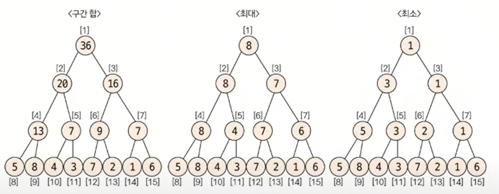

# Segment Tree
- 주어진 데이터의 구간 합과 데이터 업데이트를 빠르게 수행하기 위해 만든 자료구조 형태
- 더 큰 분야로 '인덱스 트리'라고도 불린다

## 세그먼트 트리의 사용 이유

- 기존 구간합은 합배열을 이용해서 쉽게 구할 수 있다
- 데이터의 업데이트 즉, 원본 배열의 데이터가 자주 변경될 시 성능상 별로
- 세그먼트 트리의 종류는 구간 합, 최대 or 최소 구하기로 나눌 수 있다.

## 트리 초기화 하기

- 트리 배열의 크기는  2^k >= N을 구한 후 2^k * 2
- {5, 8, 4, 3, 7, 2, 1, 6} = 8개
- k = 3 => 2^3 * 2 = 16개
- 원본 배열은 리프  노드, 2^k 위치부터 채운다

## 남은 배열 채우기

- 인덱스 위치 N에서 N/2 위치에 값을 채운다.
### 트리 결과


## 질의 값 구하기
- 주어진 질의 인덱스를 시그먼트 트리의 리프 노드의 인덱스로 변경한다.
 
### 질의  인덱스를 세그먼트 트리 인덱스로 변경
- 세그먼트 트리 index = 주어진 질의 index + 2^k - 1
- ex) 1 ~ 3까지의 구간합 구해주세요 = 8 ~ 11 까지의 구간합 구해주세요

## 질의 값 구하는 과정


### 질의의 해당하는 노드 선택 방법


## 계산
### 리프노드 인덱스 변경

### 부모 노드 이동

### start >= end 까지 반복


## 코드
```java
import java.io.BufferedReader;
import java.io.InputStreamReader;
import java.util.StringTokenizer;

public class Main {
    static int[] seg;
    static int n;
    public static void main(String[] args) throws Exception {

        int[] arr = {5, 8, 4, 3, 7, 2, 1, 6};
        n = arr.length;

        // k 구하기
        int k = 1;
        while ((2 * k) * 2 <= n) {
            k++;
        }
        // 세그 트리 만들기
        seg = new int[(int) Math.pow(2, k) * 2];

        // 리프 노드 채우기
        for (int i = 1; i <= n; i++) {
            seg[n + i - 1] = arr[i - 1];
        }

        // 부모 노드 채우기
        // n부터 리프노드 시작이니까 합은 n-1부터
        for (int i = n - 1; i > 0; i--) {
            seg[i] = seg[2 * i] + seg[2 * i + 1];
        }
        // 세그먼트 확인
        checkseg();
        //------------------------여기까지 트리 초기화 -----------------------------------

        // 구간 합 구하기
        int start = 2;  // 시작
        int end = 6; // 끝
        System.out.println(start + "에서 " + end + "의 구간 합: " +  query(start, end));

        // 업데이트
        int updateIndex = 2; // 1기반 인덱스
        int newValue = 10; // 8 -> 10으로 변경
        update(updateIndex, newValue);

        // 세그먼트 확인
        checkseg();

        // 업데이트 후 구간 합 구하기
        query(start, end);
        System.out.println("업데이트 후 " + start + "에서 " + end + "구간 합: " + query(start, end));
    }

    // 구간 합 쿼리 함수
    private static int query(int start, int end) {
        int sum = 0;

        // 1기반 인덱스에서 트리 인덱스로 변환
        start += n - 1; // 2넘어오고 9
        end += n - 1; // 6 넘어와서 13

        while (start <= end) { // 리프 노드 뿐 아니라 부모 노드 위치도 확인
            if (start % 2 == 1) {
                sum += seg[start]; // 따로 위치 저장
                start += 1;
            }
            if (end % 2 == 0) {
                sum += seg[end]; // 따로 위치 저장
                end -= 1;
            }
            start /= 2;
            end /= 2;
        }
        return sum;
    }

    // 업데이트 함수 (전체 갱신)
    private static void update(int index, int newValue) {
        // 1기반 인덱스를 트리 인덱스로 변환
        int treeIndex = index + n - 1;

        // 리프 노드 값 업데이트
        seg[treeIndex] = newValue;

        // 부모 노드 갱신
        while (treeIndex > 1) {
            treeIndex /= 2;
            seg[treeIndex] = seg[2 * treeIndex] + seg[2 * treeIndex + 1];
        }
    }

    // 세그 트리 확인
    private static void checkseg() {
        for (int i = 0; i < seg.length; i++) {
            System.out.print(seg[i] + " ");
        }
        System.out.println();
    }
}

```
#### 코테 구분
- 단순 구간합 구하기는 그냥 합배열 쓸 것
- 단, 데이터의 변경이 들어갔을 때는 무조건 세그먼트 트리 사용

