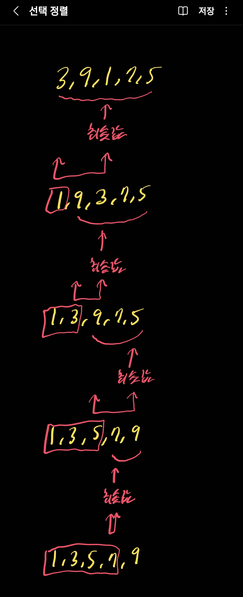

# 선택 정렬 (Selection Sort)

- 각 반복마다 정렬되지 않은 원소들 중 최솟값을 찾고, 그 값을 정렬되지 않은 원소들 중 맨 앞에 위치한 값과 교환하는 알고리즘이다.

- 이 방식에서는 각 반복마다 가장 작은 값이 정렬되지 않은 원소들 중 맨 앞쪽으로 가게 된다.

- 따라서 정렬된 원소들은 앞쪽에 차례로 쌓이게 된다.

## 시간복잡도 : O(n^2)

- 0번째 원소를 선택할 때 n - 1번의 비교 연산 수행

- 1번째 원소를 선택할 때 n - 2번의 비교 연산 수행

- 즉, 선택 정렬에서는 총 (n - 1) + (n - 2) + ... + 2 + 1 = n * (n - 1) / 2 번의 비교 연산이 수행된다.

- 따라서 최선, 평균, 최악의 경우 모두 시간복잡도는 O(n^2)이 된다.

## 공간복잡도 : O(n)

- 주어진 배열 안에서 교환(swap)을 통해 정렬이 수행되므로 추가적인 메모리 공간이 필요하지 않다.

## 장점

- 알고리즘이 단순하다.

- 교환 횟수가 적다.

- 공간복잡도가 O(n)이며, 추가적인 메모리 공간을 필요로 하지 않는다.

## 단점

- 시간복잡도가 O(n^2)으로, 비효율적이다.

- 불안정 정렬(Unstable sort)이다.
