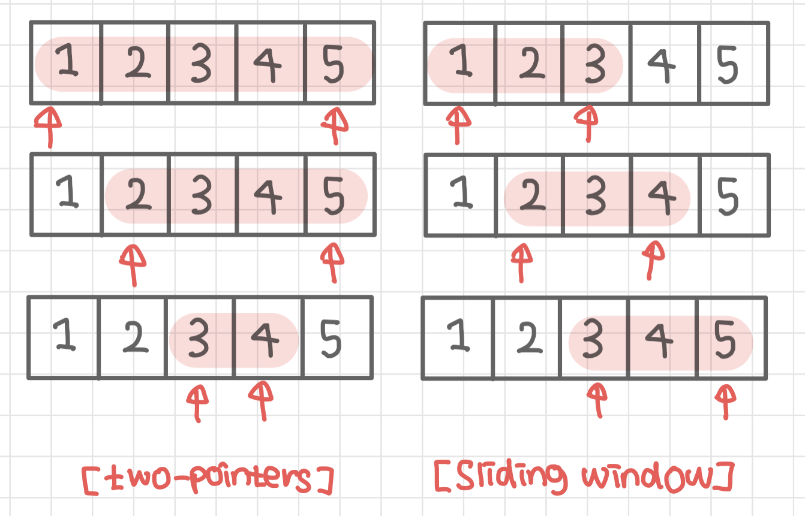

## 슬라이딩 윈도우란?

> 고정 사이즈의 윈도우가 이동하며, 윈도우 내 데이터를 이용해 문제를 풀이하는 알고리즘

### 핵심 개념

_윈도우란??_

: 전체 데이터에서, 이번에 탐색할 특정 구간의 데이터를 의미

- 한 번 구했던 값을 재활용하는 알고리즘
- 윈도우의 크기(너비)는 변하지 않음 즉, 언제나 고정된 폭을 가지고 있음
- 교집합의 정보를 가지고, 윈도우가 이동할 때 변경되는 양쪽 끝 원소만 갱신하는 방법
- 리스트나 배열에서 일정 범위의 값을 비교할 때 유용
- 투포인터 알고리즘과 결합해 자주 사용됨

---

### 알고리즘 설명



1.  윈도우의 크기 결정
2.  윈도우를 데이터의 첫 부분에 위치
3.  윈도우 내의 데이터 연산 처리
4.  윈도우를 다음 방향으로 한 칸 이동
5.  끝 데이터에 도달할 때까지 위의 3~4번 반복

---

### 시간 복잡도

1.  평균, 최악, 최선

-   O(N)

---

### 적절한 활용

- 연속된 데이터에서 최댓값, 최솟값 찾기
- 평균, 중간값 찾기
- 패턴 탐색

---

### 구현

```Java
import java.util.*;

public class SlidingWindow {
    public static void main(String[] args) {
        // 연속된 3개 숫자의 최댓값
        int[] data = {1, 10, 30, 2, 44, 16, 8, 31, 22};
        int N = data.length; // 데이터 크기
        int K = 3; // 윈도우 크기
        int window = data[0]+data[1]+data[2]; // 윈도우
        int max = window; // 결과 변수

        for(int i=K; i<N; i++) {
            window  = window + data[i] - data[i-K]; 
            System.out.println("minus : " + (i-K) + " / plus : " + i + " / res : "+ (i-K+1) +"~"+i);
            max = Math.max(window, max);
        }
        System.out.println(max);
    }
}
```

### 관련 문제

[백준 21921 : 블로그](https://www.acmicpc.net/problem/21921)

[백준 2003 : 수들의 합 2](https://www.acmicpc.net/problem/2003)

---

[참고자료]

[관련 그림](https://mmirann.github.io/algorithm/concept/2021/12/10/twopointers_slidingwindow.html)
