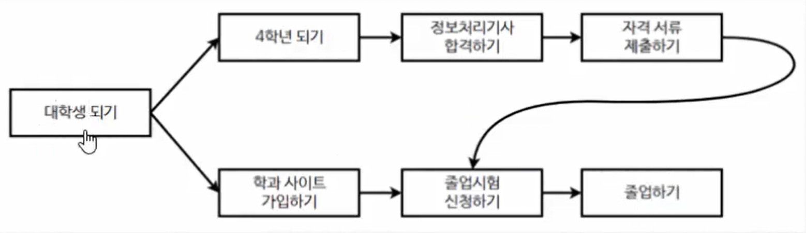
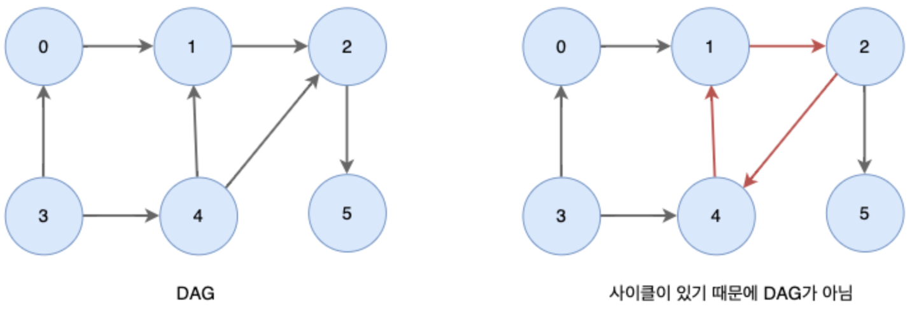
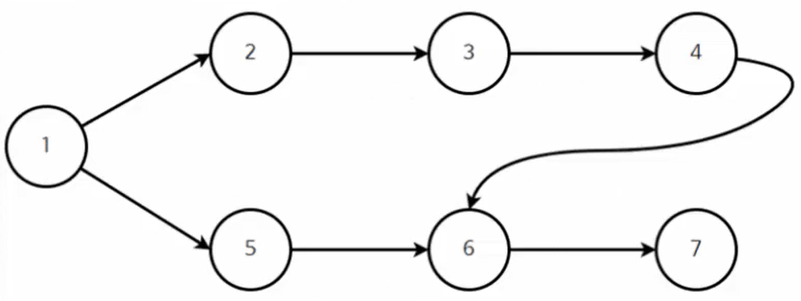
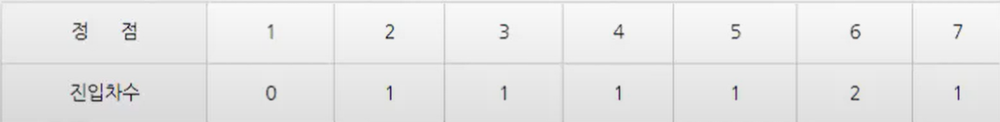
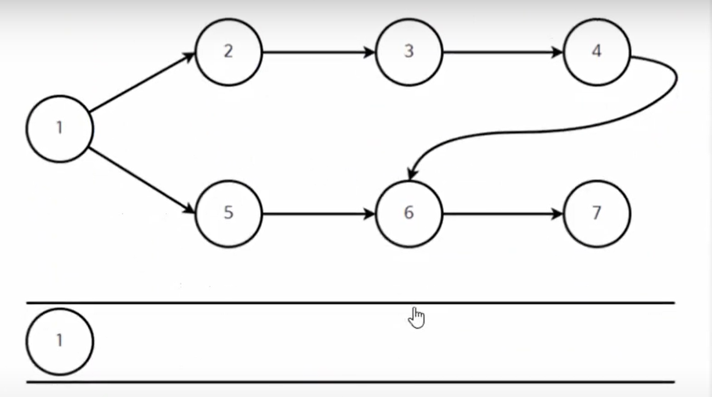
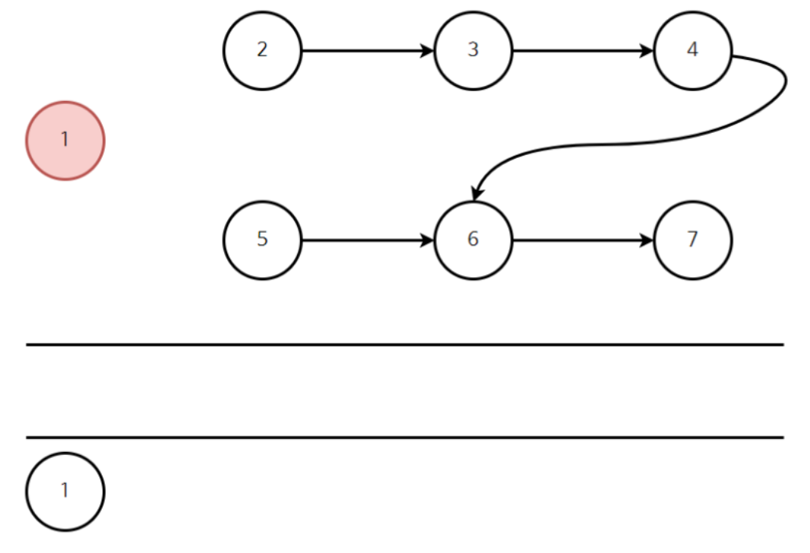
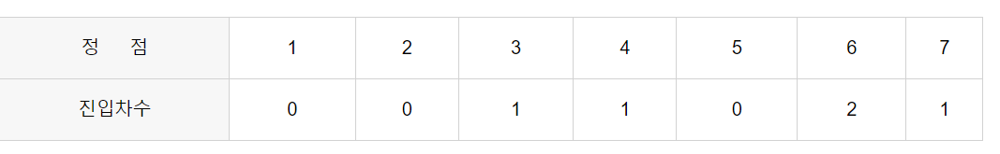
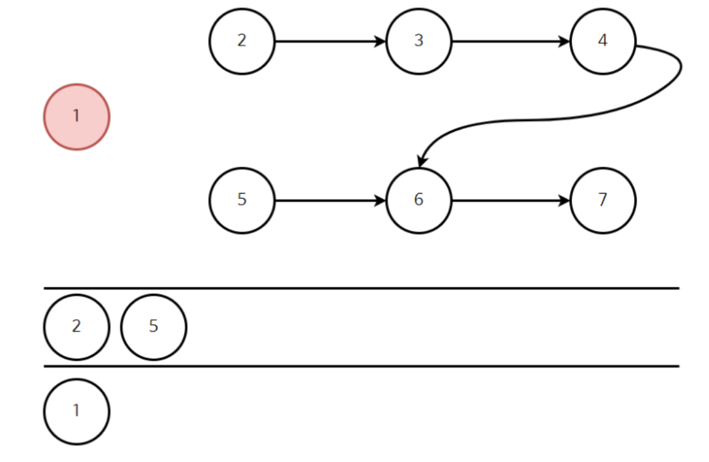
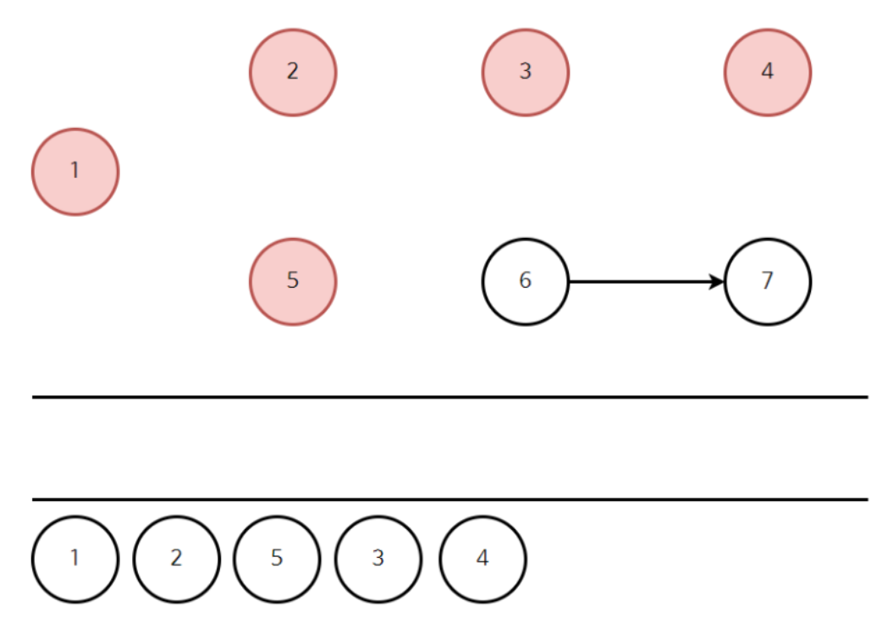
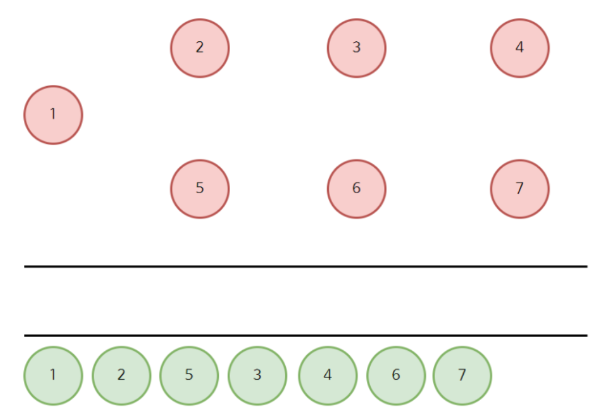

# Topological Sort(위상 정렬)
- 순서가 있는 작업을 차례로 진행해야 할 때 순서를 결정해주기 위해 사용하는 알고리즘
- 사이클 없는 방향 그래프의(DAG) 모든 노드를 주어진 방향성에 어긋나지 않게 순서를 나열하는 것
- ex) 대학 선수과목, 요리 순서 등

## 위상 정렬 예시


### 위상 정렬 결과
```
대학생 -> 학과 사이트 가입 -> 4학년 -> 정처기 합격 -> 자격 서류 제출 ->
졸업 시험 신청 -> 졸업
```

## 위상 정렬 특징

- 위상 정렬은 여러 개의 답이 존재할 수 있다.
- DAG(Directed Acyclic Graph)에서만 적용이 가능
- 사이클이 발생하는 경우 위상 정렬을 사용 불가
- 시간 복잡도 O(V+E)
- 스택과 큐로 구현 가능
 ### 위상 정렬은 2가지의 해결책을낸다
- (1) 현재 그래프는 위상 정렬이 가능한지
- (2) 위상 정렬이 가능하다면 그 결과는 무엇인지

 ## 위상 정렬 방식
### (1) 진입차수가 0인 정점을 큐에 삽입
### (2) 큐에서 원소를 꺼내 연결된 모든 간선 제거
### (3) 간선 제거 이후에 진입차수가 0이 된 정점을 큐에 삽입
### (4) 큐가 빌 때까지 2 ~ 3번 반복
### (*) 모든 원소를 방문하기 전 큐가 빈다면 사이클이 존재
### (*) 모든 원소를 방문했다면 큐에서 꺼낸 순서가 위상 정렬 결과 

## 예제



### 처음 진입차수 0을 큐에 삽입


### 큐에서 빼면서 연결된 간선 제거 및 반복




### 반복 후 마지막

### 결과



```java
import java.util.*;

public class Main {
    static final int MAX = 10; // 최대 노드 수 (이거 왜 필요함)
    static int n; // 실제 노드 수
    static int[] inDegree = new int[MAX]; // 진입 차수 저장할 배열
    static List<Integer>[] a = new ArrayList[MAX]; // 인접 리스트 배열

    public static void main(String[] args) {
        n = 7;

        // 그래프 초기화 (이건 항상 해야함)
        for (int i = 1; i <= n; i++) {
            a[i] = new ArrayList<>();
        }

        // 간선 정보 추가
        int[][] edges = {
                {1, 2}, {1, 5}, {2, 3}, {3, 4}, {4, 6}, {5, 6}, {6, 7}
        };

        for (int[] edge : edges) { // 진입 차수 갯수 저장
            int u = edge[0], v = edge[1];
            a[u].add(v);
            inDegree[v]++;
        }

        topologySort();
    }

    static void topologySort() {
        int[] result = new int[MAX]; // 결과 저장 배열
        Queue<Integer> q = new LinkedList<>(); // 진입 차수 0 관리할 큐

        // 진입 차수가 0인 노드 큐 삽입
        for (int i = 1; i <= n; i++) {
            if (inDegree[i] == 0) {
                q.offer(i); // 진입 차수가 0인 노드 큐에삽입
            }
        }

        // 정렬이 완전히 수행되려면 정확히 n개의 노드 방문
        for (int i = 1; i <= n; i++) {
            if (q.isEmpty()) {
                System.out.println("사이클이 발생했습니다.");
                return;
            }

            int x = q.poll();
            result[i] = x;

            // 새롭게 진입차수가 0이 된 정점을 큐에 삽입
            for (int y : a[x]) {
                if (--inDegree[y] == 0) {
                    q.offer(y);
                }
            }
        }

        // 결과 출력
        for (int i = 1; i <= n; i++) {
            System.out.print(result[i] + " ");
        }
    }
}

```
### 강의 영상
https://www.youtube.com/watch?v=qzfeVeajuyc&t=207s

### 백준
[위상 정렬](https://www.acmicpc.net/step/25)

