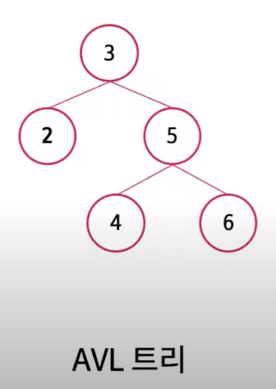
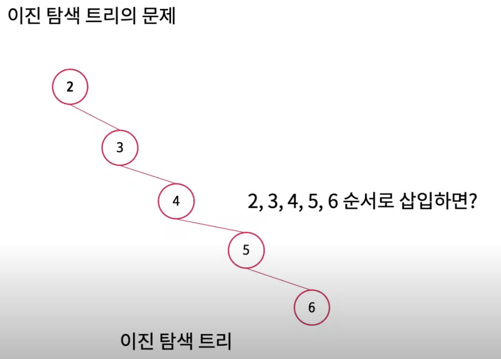
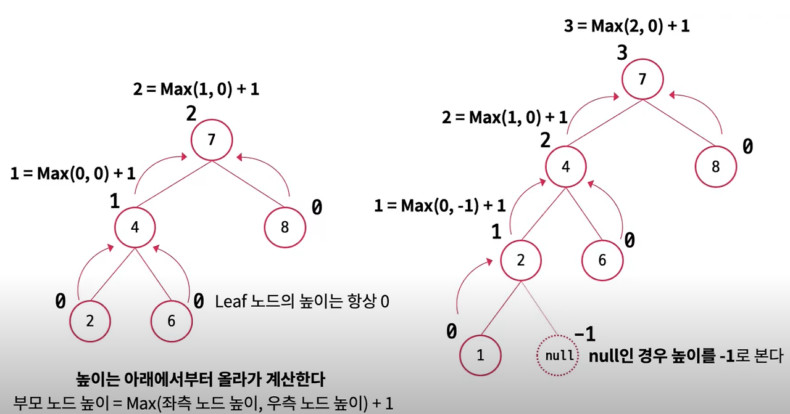
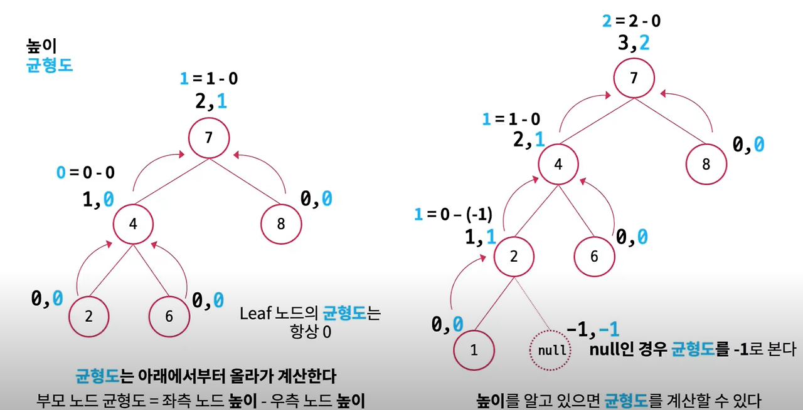
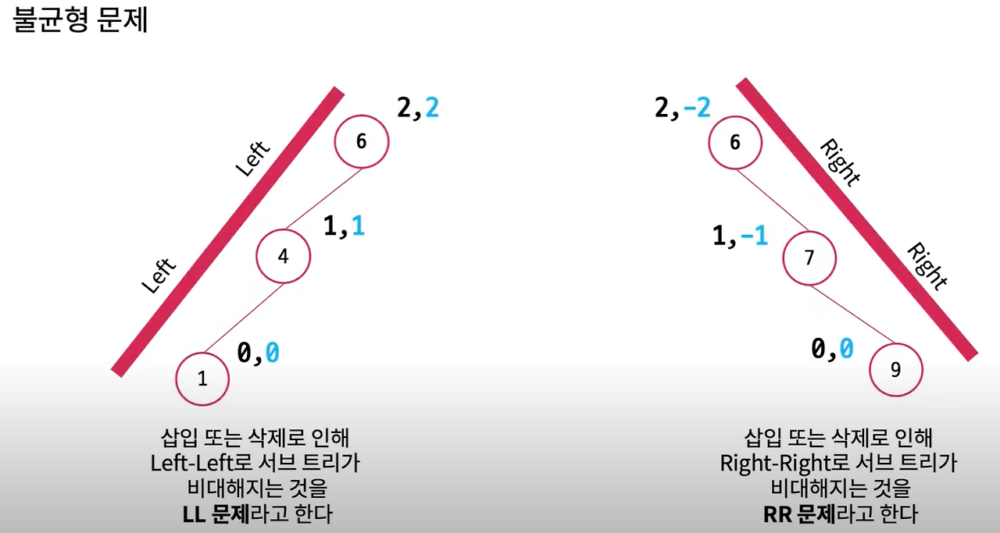
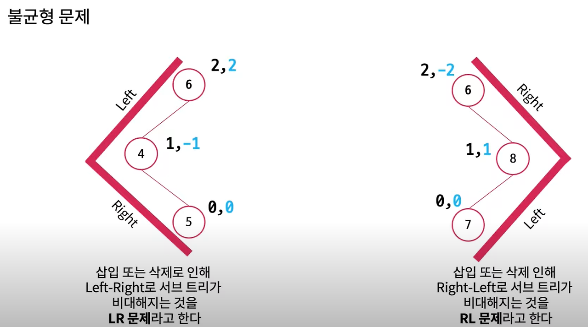
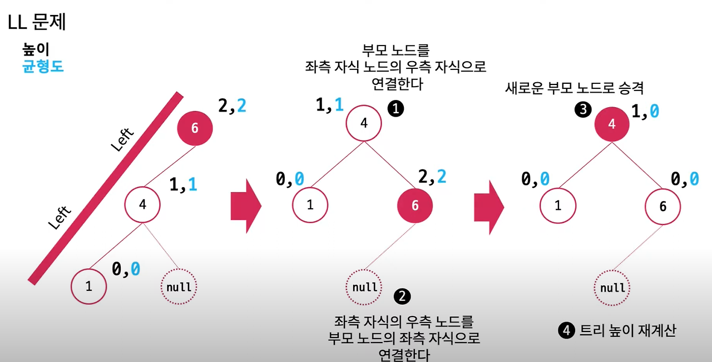
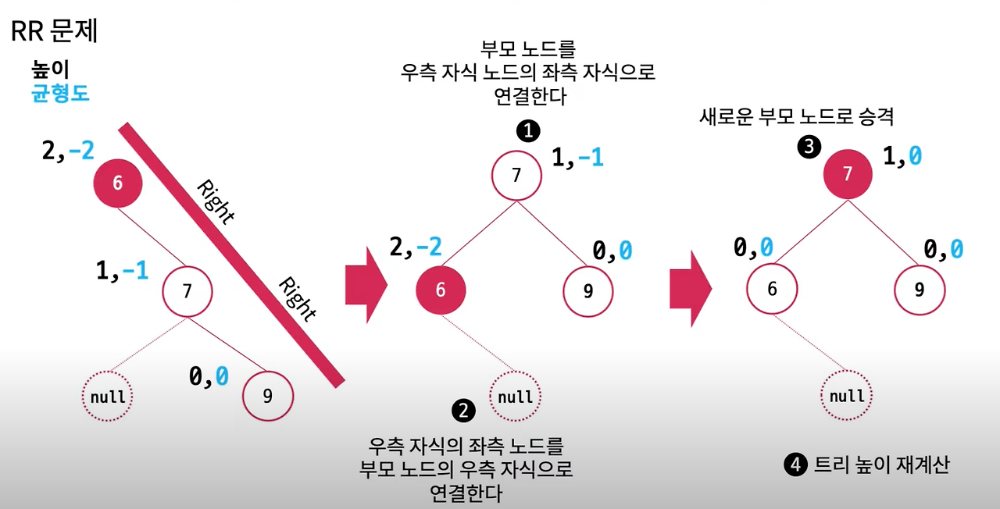

## AVL 트리(Adelson-Velsky and Landis tree)란?

- 스스로 균형을 잡는 이진 탐색트리

### 기존 이진트리의 문제
 

- 이러한 모양의 불균형 트리를 만들어지는 문제가 발생할 수 있다.\
- 각 노드마다 균형도를 추가하여 트리의 높이를 조절해 문제를 해결할 수 있다.

### AVL 특징
- 이진 트리의 속성을 가진다.\
- 높이 차이가 1보다 커지면 회전( rotation )을 통해 균형을 잡아 차이를 줄인다.\
- 왼쪽, 오른쪽 서브 트리의 높이 차이가 -1, 0, 1
- 각 노드의 추가적인 높이 정보를 저장해야하기 때문에 더 많은 저장공간이 필요하다.
- AVL 트리는 높이를 logN으로 유지하기 때문에 삽입, 검색, 삭제의 시간 복잡도는 O(logN)이다.

### 균형도를 구하는 방법


- 부모 노드의 높이 =  좌측 우측 노드 높이 중 큰 숫자의 1을 더한 것이 부모 노드의 높이 
- 높이를 구하면 균형도를 알 수 있다
- 균형도 = 좌측 노드 높이 - 우측 노드 높이
- 균형도가 -1, 0, 1 이 아닐 시 불균형 트리
- 균형도가 양수이면 좌측편향 트리, 음수이면 우측 편향 트리



### 불균형 트리의 4가지 문제
- LL 문제 : 부모 노드 균형도가 2이고 자식 노드의 균형도가 1인 경우
- RR 문제 : 부모 노드 균형도가 -2이고 자식 노드의 균형도가 -1인 경우
- LR 문제 : 부모 노드 균형도가 2이고 자식 노드의 균형도가 -1인 경우
- RL 문제 : 부모 노드 균형도가 2이고 자식노드의 규형도가 1인 경우
  




### AVL트리 구현
```java
class Node {
    int key, height;
    Node left, right;

    Node(int key) {
        this.key = key;
        this.height = 1;
    }
}

public class AVLTree {
    Node root;

    // 노드 높이 반환
    int height(Node node) {
        if (node == null)
            return 0;
        return node.height;
    }

    // 최대 값
    int max(int a, int b) {
        return (a > b) ? a : b;
    }

    // 노드의 균형도
    int getBalance(Node node) {
        if (node == null)
            return 0;
        return height(node.left) - height(node.right);
    }

    // RR회전
    Node rightRotate(Node y) {
        Node x = y.left;
        Node T2 = x.right;

        // 회전
        x.right = y;
        y.left = T2;

        // 높이 갱신
        y.height = max(height(y.left), height(y.right)) + 1;
        x.height = max(height(x.left), height(x.right)) + 1;

        return x;
    }

    // LL 회전
    Node leftRotate(Node x) {
        Node y = x.right;
        Node T2 = y.left;

        // 회전 
        y.left = x;
        x.right = T2;

        // 높이 갱신
        x.height = max(height(x.left), height(x.right)) + 1;
        y.height = max(height(y.left), height(y.right)) + 1;

        return y;
    }

    // 트리 삽입
    Node insert(Node node, int key) {
        // 일단 BST 삽입
        if (node == null)
            return new Node(key);

        if (key < node.key)
            node.left = insert(node.left, key);
        else if (key > node.key)
            node.right = insert(node.right, key);
        else // 중복값 안받아요
            return node;

        // 높이 갱신
        node.height = 1 + max(height(node.left), height(node.right));

        // 균형도
        int balance = getBalance(node);

        // 
        if (balance > 1 && key < node.left.key)
            return rightRotate(node);
        //
        if (balance < -1 && key > node.right.key)
            return leftRotate(node);
        //    
        if (balance > 1 && key > node.left.key) {
            node.left = leftRotate(node.left);
            return rightRotate(node);
        }
        // 
        if (balance < -1 && key < node.right.key) {
            node.right = rightRotate(node.right);
            return leftRotate(node);
        }

        return node;
    }

    // 중위 순회 출력
    void inOrderTraversal(Node root) {
        if (root != null) {
            inOrderTraversal(root.left);
            System.out.print(root.key + " ");
            inOrderTraversal(root.right);
        }
    }

    public static void main(String[] args) {
        AVLTree tree = new AVLTree();
        
        tree.root = tree.insert(tree.root, 1);
        tree.root = tree.insert(tree.root, 2);
        tree.root = tree.insert(tree.root, 3);

        System.out.println("중위 순회 결과:");
        tree.inOrderTraversal(tree.root);
    }
}
```
위와 같은 코드로 AVL트리로 구할 수 있다.


### 구현된 자바 클래스 
```java
import java.util.TreeMap;
import java.util.TreeSet;

public class AVLTreeExample {
    public static void main(String[] args) {
        // TreeMap 
        TreeMap<Integer, String> treeMap = new TreeMap<>();
        treeMap.put(3, "Three");
        treeMap.put(1, "One");
        treeMap.put(2, "Two");

        System.out.println("TreeMap: " + treeMap);

        // TreeSet 
        TreeSet<Integer> treeSet = new TreeSet<>();
        treeSet.add(3);
        treeSet.add(1);
        treeSet.add(2);

        System.out.println("TreeSet: " + treeSet);
    }
}
```

### 파이썬 사용예시
```python
# SortedDict 사용 예시
sorted_dict = SortedDict({3: 'Three', 1: 'One', 2: 'Two'})
print("SortedDict:", sorted_dict)
```
AVL 트리 과정
아래 링크에서  AVL트리로 변환되는 과정이 확인이 가능하다.

https://www.cs.usfca.edu/~galles/visualization/AVLtree.html