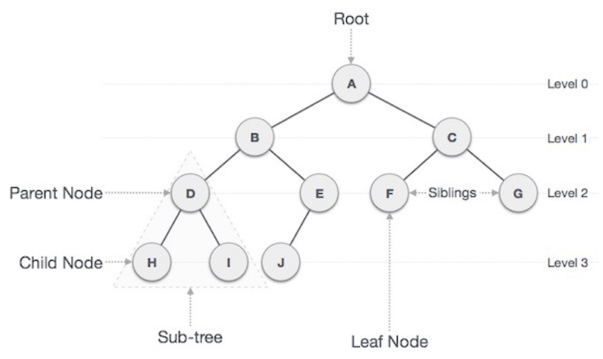
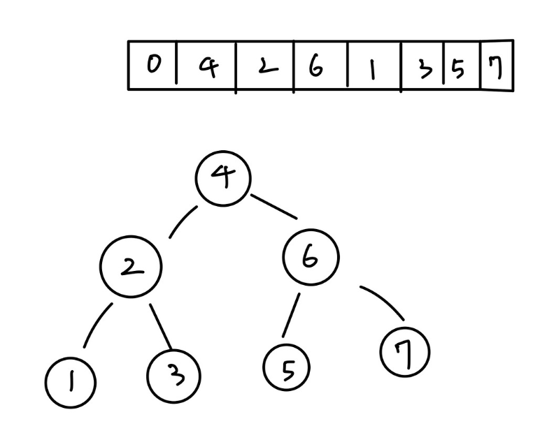
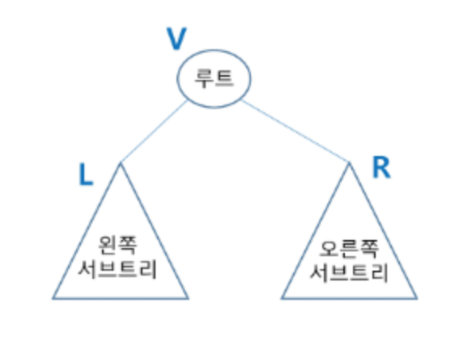
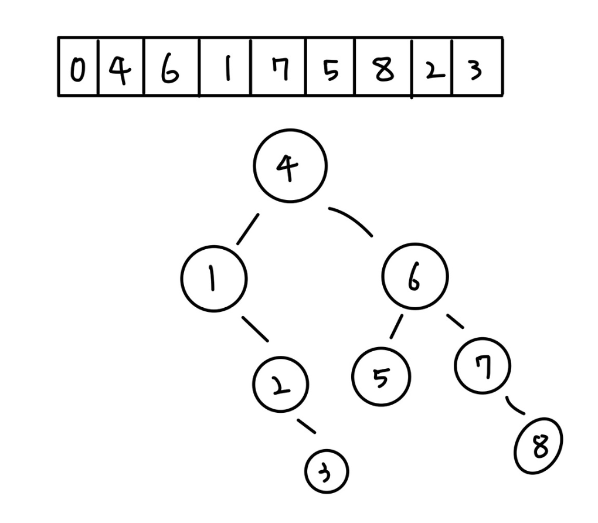

# 트리(Tree)

- 비선형 구조
- 원소들 간에 1:N 관계를 가지는 자료구조
- 원소들 간에 계층관계를 가지는 계층형 자료구조
- 상위 원소에서 하위 원소로 내려가면서 확장되는 트리(나무)모양의 구조
- 한 개 이상의 노드로 이루어진 유한 집합이며 다음 조건을 만족한다

- 노드 중 최상위 노드를 루트(root)라 한다
나머지 노드들은 n(>=0)개의 분리 집합 T1, ..., TN으로 분리될 수 있다
- 이들 T1, ..., TN은 각 각 하나의 트리가 되며(재귀적 정의)루트의 부 트리 (subtree)라 한다

## 트리 용어 정리

(1) 노드(node) - 트리의 원소<br>
- 트리 T의 노드 = A, B, C, D, E, F, G,H, I, J, 

(2) 간선(edge) - 노드를 연결하는 선, 부모 노드와 자식 노드를 연결

(3) 루트 노드(root node) - 트리의 시작 노드

(4) 형제 노드(sibling node) - 같은 부모 노드의 자식 노드들

(5) 조상 노드- 간선을 따라 루트 노드까지 이르는 경로에 있는 모든 노드들

(6) 서브 트리(subtree) - 부모 노드와 연결된 간선을 끊었을 때 생성되는 트리

(7) 자손 노드 - 서브 트리에 있는 하위 레벨의 노드들

(8) 차수 (degree) 
- 노드의 차수 : 노드에 연결된 자식 노드의 수
- 트리의 차수 : 트리에 있는 노드의 차수 중에서 가장 큰 값
- 단말 노드(리프 노드) : 차수가 0인 노드. 즉, 자식 노드가 없는 노드

(9) 높이
- 노드의 높이 : 루트에서 노드에 이르는 간선의 수 - 노드의 레벨
- 트리의 높이 : 트리에 있는 노드의 높이 중에서 가장 큰 값 - 최대 레벨

# 이진트리

- 모든 노드들이 2개의 서브 트리를 갖는 특별한 형태의 트리
- 각 노드가 자식 노드를 최대한 2개까지만 가질 수 있는 트리 
- 레벨 i에서의 노드의 최대 개수는 2^i 개
- 높이가 h인 이진 트리가 가질 수 있는 노드의 최소 개수는 (h+1)개가 되며 최대 개수는 (2^h+1) - 1개

## 포화 이진트리(Full Binary Tree)

- 모든 레벨에 노드가 포화상태로 차 있는 이진 트리
- 높이가 h일 때, 최대의 노드 개수인 (2^h+1) - 1 의 노드를 가진 이진 트리
- 루트를 1번으로 하여 (2^h+1) - 1까지 정해진 위치에 대한 노드를 가짐

## 완전 이진트리 (Complete Binary Tree)

- 높이가 h이고 노드 수가 n개일 때, 포화 이진 트리의 노드 번호 1번부터 n번까지 빈 자리가 없는 이진 트리
- 배열로 표현하면 효율적

## 편향 이진 트리 (Skewed Binary Tree)

- 높이 H에 대한 최소 개수의 노드를 가지면서 한쪽 방향의 자식 노드 만을 가진 이진 트리
- 배열을 이용한 이진 트리 표현의 단점
- 편향 이진 트리의 경우에 사용하지 않는 배열 원소에 대한 메모리 공간 낭비 발생
- 트리의 중간에 새로운 노드를 삽입하거나 기존의 노드를 삭제할 경우 배열의 크기 변경이 어려워 비효율

## 트리의 표현 - LinkedList (연결 리스트)

- 배열을 이용한 이진 트리의 표현의 단점을 보완하기 위해 LinkedList를 이용하여 트리를 표현
- 이진 트리의 모든 노드는 최대 2개의 자식 노드를 가지므로 일정한 구조의 - 단순 연결리스트를 사용하여 구현

## 트리 정렬이란?


- 데이터를 트리의 구조로 만들어 전위, 중위, 후위 순위에 따라 값을 정렬하는 방법
- 배열의 이 처럼 값이 주어졌을 때 트리로 표현하면 이런 형식이 된다

## 이진트리 - 순회 (traversal)

- 순회 : 트리의 노드들을 체계적으로 방문하는 것

### 3가지의 기본적인 순회 방법
- 전위 순회 (preorder traversal) : VLR 
- 중위 순회 (inorder traversal) : LVR
- 후위 순회 (postorder traversal) : LRV


```java
public class Tree{
    // 트리 배열로 표현
	static int[] tree = new int[]{0, 4, 2, 6, 1, 3, 5, 7}; 

    public static void main(String[] args) {
        System.out.println("전위");
        
        preorder(1);
        System.out.println();
        System.out.println("중위");
        inorder(1);
        System.out.println();
        System.out.println("후위");
        postorder(1);
    }

    // 전위 순회
    // VLR
    static void preorder(int i) {
        // 기저 조건
        if (tree.length <= i || tree[i] == 0) {
            return;
        }
        // 부모노드 방문(출력)
        System.out.print(tree[i] + " ");
        // 왼쪽 자식
        preorder(i * 2);
        // 오른쪽 자식
        preorder(i * 2 + 1);
    }

    // 중위 순회
    // LVR
    static void inorder(int i) {
        // 기저 조건
        if (tree.length <= i || tree[i] == 0) {
            return;
        }
        // 왼쪽 자식
        inorder(i * 2);
        // 부모노드 방문(출력)
        System.out.print(tree[i] + " ");
        // 오른쪽 자식
        inorder(i * 2 + 1);
    }

    // 후위 순회
    // LRV
    static void postorder(int i) {
        // 기저 조건
        if (tree.length <= i || tree[i] == 0) {
            return;
        }
        // 왼쪽 자식
        postorder(i * 2);
        // 오른쪽 자식
        postorder(i * 2 + 1);
        // 부모노드 방문(출력)
        System.out.print(tree[i] + " ");
    }
}
/*
전위
4 2 1 3 6 5 7 
중위
1 2 3 4 5 6 7 
후위
1 3 2 5 7 6 4 
*/
```

## BST란

- 처음에 추가된 데이터를 부모노드가 되며 추가되는 값이 작으면 부모노드 왼쪽  크면 오른쪽으로 간다
- 노드의 저장되는 값은 유일하다
- 이진 탐색 트리라 불리운다
- 

```java
class TreeNode {
    int key;
    TreeNode left, right;

    public TreeNode(int item) {
        key = item;
        left = right = null;
    }
}

public class BinaryTree {
    TreeNode root;

    public BinaryTree() {
        root = null;
    }

    // 이진 트리에 노드 추가
    public void insert(int key) {
        root = insertRec(root, key);
    }

    private TreeNode insertRec(TreeNode root, int key) {
        if (root == null) {
            root = new TreeNode(key);
            return root;
        }

        if (key < root.key)
            root.left = insertRec(root.left, key);
        else if (key > root.key)
            root.right = insertRec(root.right, key);

        return root;
    }

    // 중위 순회로 트리 출력
    public void inorder() {
        inorderRec(root);
    }

    private void inorderRec(TreeNode root) {
        if (root != null) {
            inorderRec(root.left);
            System.out.print(root.key + " ");
            inorderRec(root.right);
        }
    }

    public static void main(String[] args) {
        BinaryTree tree = new BinaryTree();

        // 이진 트리에 노드 추가
        tree.insert(4);
        tree.insert(6);
        tree.insert(1);
        tree.insert(7);
        tree.insert(5);
        tree.insert(8);
        tree.insert(2);
        tree.insert(3);
        
        // 중위 순회로 트리 출력
        System.out.println("중위 순회 결과:");
        tree.inorder();
    }
}
```
