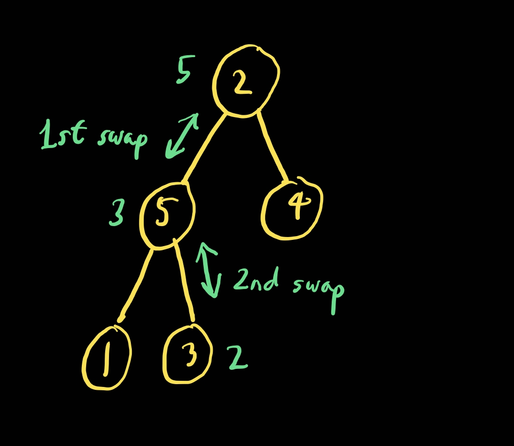

# 힙 (Heap)

- 최대 힙과 최소 힙 2종류가 있다.

- 시간 복잡도 (삽입, 삭제) : O(log N)

## 최대 힙 (max heap)

- 부모 노드의 값이 자식 노드의 값보다 크거나 같은 완전 이진 트리

- 키 값이 가장 큰 노드는 루트 노드가 된다.

## 최소 힙 (min heap)

- 부모 노드의 값이 자식 노드의 값보다 작거나 같은 완전 이진 트리

- 키 값이 가장 작은 노드는 루트 노드가 된다.

## 힙의 삽입 연산 과정

## 힙의 삭제 연산 과정

