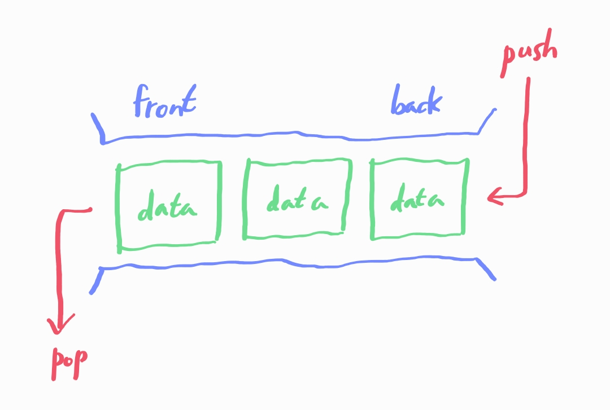

# 큐 (Queue)

## 목차

1. 큐의 개념

2. 실생활에서 찾아볼 수 있는 큐의 예시

3. 큐의 활용 예시

4. 큐의 주요 연산

## 1. 큐의 개념

- 선입선출 특징을 가지는 자료구조 (FIFO, First-In-First-Out)

    - 즉, 먼저 들어온 데이터가 먼저 나간다.

    - 삽입과 삭제과 다른 쪽에서 이루어진다. 즉, 데이터가 들어오는 쪽과 나가는 쪽이 다르다.

    

## 2. 실생활에서 찾아볼 수 있는 큐의 예시

- 줄 서기

## 3. 큐의 활용 예시

- BFS (너비 우선 탐색)

    - BFS 탐색 시 큐를 활용할 수 있다. 큐의 모든 원소가 사라질 때까지 큐에 먼저 들어온 점부터 탐색한다.

## 4. 큐의 주요 연산

- `enQueue` : 큐의 뒤쪽에 새로운 원소를 삽입한다.

- `deQueue` : 큐에서 가장 앞쪽에 있는 원소를 제거한다.

- `front` : 큐에서 가장 앞쪽에 있는 원소를 반환한다.

- `isEmpty` : 큐가 비어있으면 true를, 비어있지 않다면 false를 반환한다.

- `size` : 큐에 들어있는 원소의 개수를 반환한다.
