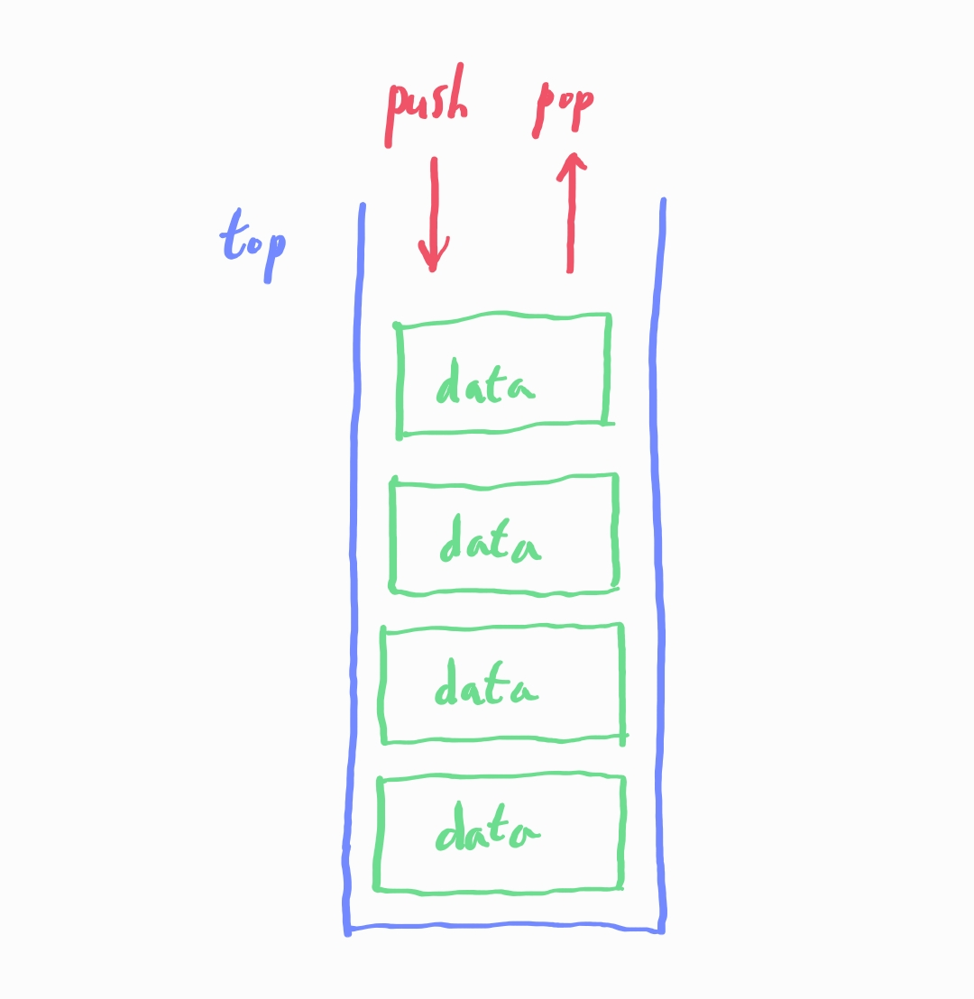
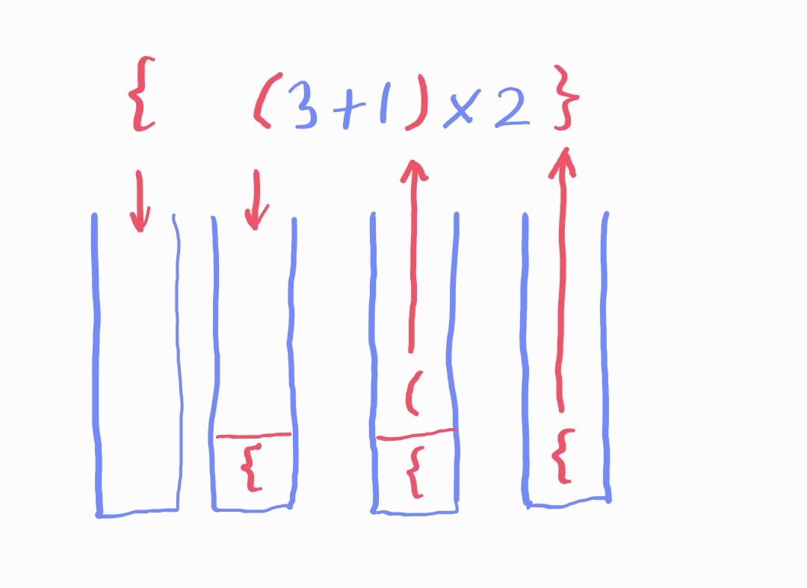
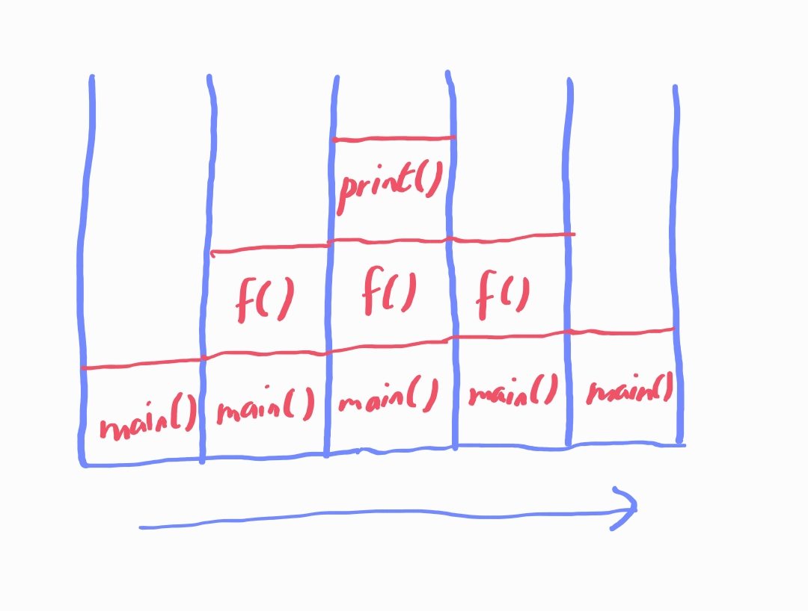

# 스택 (Stack)

## 목차

1. 스택의 개념

2. 실생활에서 찾아볼 수 있는 스택의 예시

3. 스택의 활용 예시

4. 스택의 주요 연산

## 1. 스택의 개념

- 후입선출 특징을 가지는 자료구조 (LIFO, Last-In-First-Out)

    - 즉, 나중에 들어온 데이터가 먼저 나간다.

    - 삽입과 삭제가 같은 쪽에서 이루어진다. 즉, 데이터가 들어오는 쪽과 나가는 쪽이 같다.

    

## 2. 실생활에서 찾아볼 수 있는 스택의 예시

- 엘리베이터

- 프링글스

- 하노이 탑

## 3. 스택의 활용 예시

- 괄호 검사

    

- 함수 호출 스택

    

- 웹 브라우저에서 뒤로가기 기록 및 앞으로가기 기록

- 연산자 후위표기법

- DFS (깊이 우선 탐색)

    - DFS 탐색 시 스택을 활용할 수 있다. 스택의 모든 원소가 사라질 때까지 스택에 나중에 들어온 점부터 탐색한다.

- 문자열 또는 List 역순으로 바꾸기

## 4. 스택의 주요 연산

- `push` : 스택에 새로운 원소를 삽입한다.

- `pop` : 스택에서 가장 위에 있는 원소를 제거한다.

- `top` : 스택에서 가장 위에 있는 원소를 반환한다.

- `isEmpty` : 스택이 비어있으면 true를, 비어있지 않다면 false를 반환한다.

- `size` : 스택에 들어있는 원소의 개수를 반환한다.
