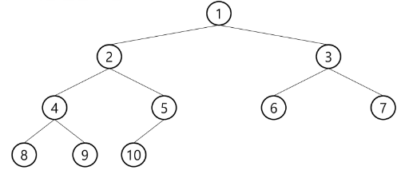
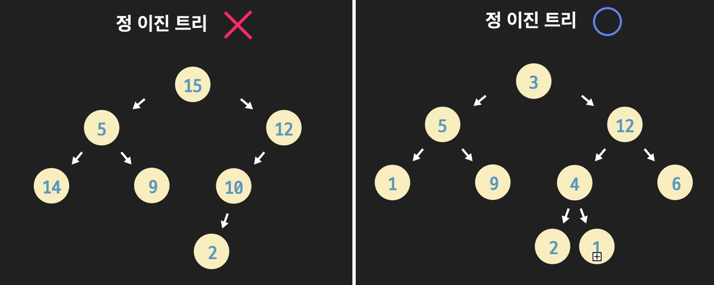
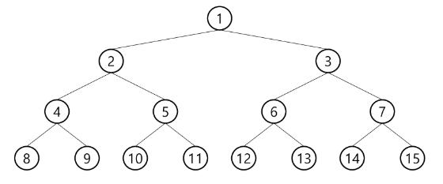
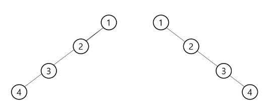

## 이진트리란(Binary Tree)?



> 모든 노드가 2개의 서브트리를 갖는 특별한 형태의 트리로, 각 노드는 자식 노드를 최대 2개까지만 가질 수 있음

---

### 특징

-  트리 레벨이 i일 때, 해당 레벨의 노드 최대 개수는 2^i
-  높이가 h인 이진 트리가 가질 수 있는 최소 개수는 (h+1)개가 되며 최대 개수는 2^(h+1)-1개임

---

### 종류

1. **정 이진 트리(Full Binary Tree)**



- 모든 노드가 0개 혹은 2개의 자식 노드를 갖는 트리

2.  **포화 이진 트리(Perfect Binary Tree)**



-   모든 레벨에 노드가 포화 상태로 차있는 이진 트리
-   높이가 h일 때, 노드 개수는 2^(h+1)-1임 (최대이므로)
-   루트를 1번으로하여 마지막 노드까지 위치에 따른 정해진 노드 번호 존재

3.  **완전 이진 트리(Complete Binary Tree)**


-   레벨이 낮고, 왼쪽에 있는 노드부터 채워지는 이진 트리
-   마지막 레벨을 제외하고 모든 노드 채워져 있어야함
-   높이가 h이고 노드 수가 n개 일 때, 1~n번까지 빈 자리 X
-   배열로 구현하기에 효율적인 트리

4.  **편향 이진 트리(Skewed Binary Tree)**



-   레벨이 낮은 노드부터 한쪽 방향의 자식만을 가진 이진 트리
-   높이가 h일 때, 노드 개수는 h+1임 (최소이므로)
-   배열로 구현하기에 비효율적인 트리


## 힙이란?

- 완전이진트리에 있는 노드 중에서 키 값이 가장 크거나 작은 노드를 찾기 위한 자료구조


### 조건

- 완전이진트리
- 최대 힙일 경우, 항상 부모>자식이며 root는 최댓값
- 최소 힙일 경우, 항상 부모<자식이며 root는 최솟값

=> 따라서, 최댓값 혹은 최솟값을 구할 때 쓰는 자료구조임

### 연산

#### 1. 삽입
- 완전 이진 트리 형태 유지하면서 추가 데이터를 마지막 순서 노드에(new node) 삽입
- 정렬 조건 만족하도록 Swap (자식→부모로 비교. 즉, 부모랑만 비교하면 됨)

#### 2. 삭제
- 루트 노드 삭제
- 가장 마지막 순서의 노드를 루트로 이동
- 루트 노드부터 부모→자식으로 비교해 Swap

_최대힙일 때, 만약 자식이 모두 부모보다 크다면?_

 ⇒ 둘 중 더 큰 자식으로 이동

## 구현

```Java
import java.util.Arrays;

public class Tree2_01_Heap {
	static int[] heap = new int[100];
	static int heapSize;
	public static void main(String[] args) {
		heapPush(5);
		heapPush(50);
		heapPush(66);
		heapPush(27);
		heapPush(16);
		
		System.out.println(heapPop());
		System.out.println(heapPop());
		System.out.println(heapPop());
		System.out.println(heapPop());
		System.out.println(heapPop());
	}
	
	// Swap
	static void swap(int a, int b) {
		int tmp = heap[a];
		heap[a] = heap[b];
		heap[b] = tmp;
	}
	
	// 삽입
	static void heapPush(int data) {
		// 마지막 노드에 데이터 추가
		heap[++heapSize] = data;
		
		// 부모와 비교하면서 swap
		int child = heapSize;
		int parent = heapSize/2;
		while(parent>0 && heap[parent] < heap[child]) {
			swap(parent, child);
			child = parent;
			parent = child/2;
		}
	}
	
	// 삭제
	static int heapPop() {
		// 루트 원소 제거
		int popItem = heap[1];
		
		// 마지막 원소 루트로 옮김
		heap[1] = heap[heapSize--];
		int parent = 1;
		int child = parent*2;
		
		while(child<=heapSize && heap[parent] < heap[child]) {
			if(child + 1 <= heapSize && heap[child] < heap[child+1]) {
				child++;
			}
			// 자식이 더 클 경우 swap
			swap(parent, child);
			parent = child;
			child = parent*2;
		}
		return popItem;
	}
}
```


### 조건

- 완전이진트리
- 최대 힙일 경우, 항상 부모>자식이며 root는 최댓값
- 최소 힙일 경우, 항상 부모<자식이며 root는 최솟값

---

\[참고 자료\]

[이진탐색트리의 정의, 탐색/삽입/삭제](https://dream-and-develop.tistory.com/146)

[이진탐색트리(BST)](https://yoongrammer.tistory.com/71)