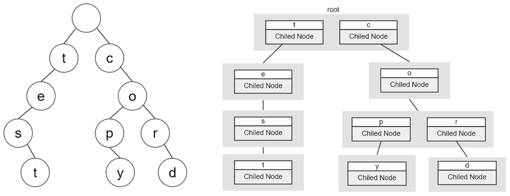
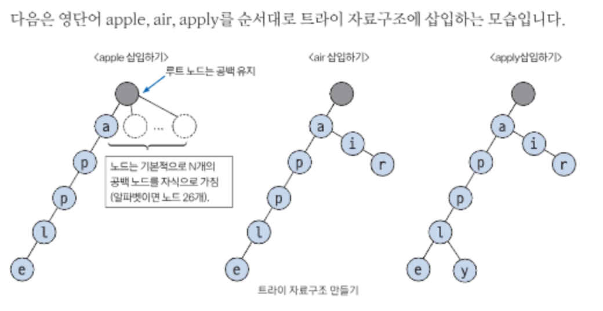
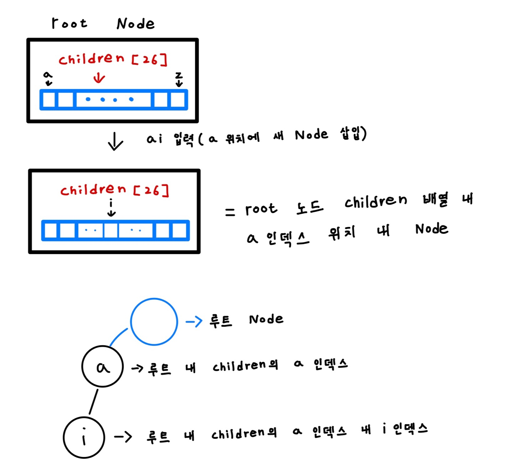

# Trie
- 문자열을 저장하고 검색하기 위한 트리 기반의 자료구조
- 맨 앞 접두어부터 시작하여 단어 전체를 찾아가는 과정
- 접두사 트리(Prefix-Tree)라고도 불린다
- 시간 복잡도 O(N)
- 단어들을 사전의 형태로 생성한 후 트리의 부모 자식 노드 관계를 이용해 검색을 수행

##




## Trie 특징
### (1) N진 트리
- 문자 종류에 따라 N이 결정
- 알파벳은 26개의 문자로 이루어져있으므로 26진 트리
### (2) 루트 노드는 항상 빈 문자열을 뜻하는 공백을 유지

## 예시 코드 - 검색 (배열)
```java
public class Trie {
    public static void main(String[] args) {
        // Trie 자료구조 생성
        search_Trie trie = new search_Trie();

        // Trie에 문자열 저장
        trie.insert("kakao");
        trie.insert("busy");
        trie.insert("card");
        trie.insert("cap");

        // Trie 문자열 확인
        System.out.println(trie.search("yeondong"));    // false
        System.out.println(trie.search("kakao"));       // true
        System.out.println(trie.search("busy"));        // true
        System.out.println(trie.search("card"));        // true
        System.out.println(trie.search("cap"));         // true
    }
}

class search_Trie {

    // Trie 생성할 때 rootNode는 기본적으로 생성
    Node rootNode = new Node();

    // Trie에 문자열 저장
    void insert(String str) {
        // Trie 자료구조는 항상 rootNode부터 시작
        Node node = this.rootNode;

        // 문자열의 각 글자마다 가져와서 자식노드 중에 있는지 체크
        // 없으면 자식노드를 새로 생성
        for (int i = 0; i < str.length(); i++) {
            int index = str.charAt(i) - 'a'; // 알파벳을 배열 인덱스로 변환 ('a' -> 0, 'b' -> 1, ...)
            if (node.children[index] == null) {
                node.children[index] = new Node(); // 자식 노드가 없으면 새로 생성
            }
            node = node.children[index]; // 해당 자식 노드로 이동
        }
        // 저장할 문자열의 마지막 글자에 매핑되는 노드에 단어의 끝임을 명시
        node.end = true;
    }

    // Trie에서 문자열 검색
    boolean search(String str) {
        // Trie 자료구조는 항상 rootNode부터 시작
        Node node = this.rootNode;

        // 문자열의 각 글자마다 노드가 존재하는지 체크
        for (int i = 0; i < str.length(); i++) {
            int index = str.charAt(i) - 'a'; // 알파벳을 배열 인덱스로 변환
            if (node.children[index] == null) {
                // 자식 노드가 없으면 해당 문자열은 Trie에 없음
                return false;
            }
            node = node.children[index]; // 자식 노드로 이동
        }
        // 마지막 글자까지 매핑된 노드가 단어의 끝인지 확인 후 반환
        return node.end;
    }
}

class Node {
    // 자식노드 배열 (알파벳 26개의 자식 노드를 위한 고정 크기 배열)
    Node[] children = new Node[26];

    // 단어의 끝인지 아닌지 체크
    boolean end;
}

```

## 예시코드 - 검색 (Map)
```java
import java.util.HashMap;
import java.util.Map;

public class Trie {
    public static void main(String[] args) {
        // Trie 자료구조 생성
        search_Trie trie = new search_Trie();

        // Trie에 문자열 저장
        trie.insert("kakao");
        trie.insert("busy");
        trie.insert("card");
        trie.insert("cap");

        // Trie 문자열 확인
        System.out.println(trie.search("yeondong"));    // false
        System.out.println(trie.search("kakao"));       // true
        System.out.println(trie.search("busy"));        // true
        System.out.println(trie.search("card"));        // true
        System.out.println(trie.search("cap"));         // true
    }
}

class search_Trie {

    // Trie 생성할 때 rootNode는 기본적으로 생성
    Node rootNode = new Node();

    // Trie에 문자열 저장
    void insert(String str) {
        // Trie 자료구조는 항상 rootNode부터 시작
        Node node = this.rootNode;

        // 문자열의 각 단어마다 가져와서 자식노드 중에 있는지 체크
        // 없으면 자식노드를 새로 생성
        for (int i = 0; i < str.length(); i++) {
            node = node.childNode.computeIfAbsent(str.charAt(i), key -> new Node());
        }
        // 저장할 문자열의 마지막 글자에 매핑되는 노드에 단어의 끝임을 명시
        node.end = true;
    }

    // Trie에서 문자열 검색
    boolean search(String str) {
        // Trie 자료구조는 항상 rootNode부터 시작
        Node node = this.rootNode;

        // 문자열의 각 글자마다 노드가 존재하는지 체크
        for (int i = 0; i < str.length(); i++) {
            // 문자열의 각 글자에 매핑된 노드가 존재하면 가져오고 아니면 null
            node = node.childNode.getOrDefault(str.charAt(i), null);
            if (node == null) {
                // node가 null이면 현재 Trie에 해당 문자열은 없음
                return false;
            }
        }
        // 마지막 글자까지 매핑된 노드가 단어의 끝인지 확인 후 반환
        return node.end;
    }
}

class Node {
    // 자식노드
    // 맵으로 선언하면 크기 지정 필요x (맵이라 동적 할당)
    Map<Character, Node> childNode = new HashMap<>();


    // 단어의 끝인지 아닌지 체크
    boolean end;
}

```

## 정리


### 백준
https://www.acmicpc.net/problem/14425 (문자열찾기)