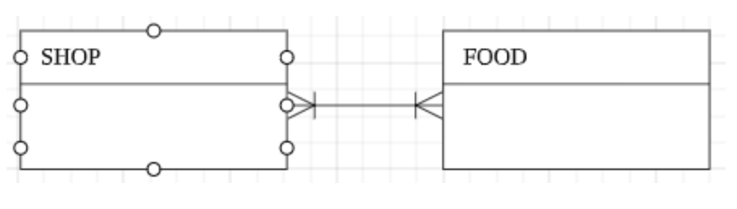

# ERD (Entity Relationship Diagram)

## 1. ERD란?

- 객체-관계 모델(Entity-Relationship Modeling)은 세상의 사물을 개체(Entity)와 개체 간의 관계(Relationship)로 표현하는 데이터 모델링 방식으로, 개념적 데이터 모델링 단계에서 사용된다.

- ERD는 개체(Entity)와 개체 간의 관계(Relationship)를 중점적으로 표시하는 다이어그램이다.

- 요구분석사항에서 얻은 엔티티와 속성들의 관계를 그림으로 표현한 것이다.

- 데이터베이스 구조를 한 눈에 알아보기 위해 그리는 다이어그램으로, 테이블 간의 관계를 설명해준다.

## 2. ERD의 구성 요소

### (1) 엔티티 (Entity)

- 엔티티는 정의 가능한 사물 또는 개념을 의미한다.

    - 어떤 시스템인지에 따라 사람, 장소, 사건(이벤트), 오브젝트가 될 수 있다.

    - 예를 들어, 학생이라는 엔티티가 정의될 수 있다.

- DB에서 테이블이 엔티티로 표현된다고 보면 된다.

- 엔티티는 사각형으로 표기한다.

- 엔티티의 이름은 대문자로 표기하며, 단수형이어야 하고 유일해야 한다.

- 엔티티는 하나 이상의 식별자(UID, Unique Identifiers)를 가져야 한다.

- Weak Entity

    - 존재하는 다른 Entity에 의존적인 Entity이다.

    - 그 자식의 속성들에 의해 식별할 수 없는 Entity이다.

### (2) 속성 (Attribute)

- 속성은 엔티티의 구성 요소로, 개체가 가지고 있는 성질이다.

    - 예를 들어, 학생 엔티티는 학번, 전공, 이름, 주소 등의 속성을 가지도록 정의될 수 있다.

- 데이터베이스에서 테이블의 각 필드(컬럼)들이 엔티티 속성이다.

- 속성은 선으로 연결된 동그라미로 표기한다.

- 속성의 이름은 소문자로 표기하며, 엔티티의 이름과 중복되지 않아야 한다.

- 자신의 속성이 아니면서 관계를 위해 자신의 속성으로 표시해서는 안된다.

- Multivalued Attribute

    - 한 개 이상의 값을 가진 Attribute이다.

- Derived Attribute

    - 다른 속성에 기초한 속성이다.

    - ERD에서는 보기 드물다.

### (3) 관계 (Relationship)

- 관계는 엔티티 간의 관계 또는 상호작용을 의미한다.

### (4) 엔티티 도메인 (Domain)

- 도메인은 속성의 값, 타입, 제약사항 등에 대해 범위를 표현하는 것이다.

- 사용자 기호에 따라 속성 타입만 그릴 수도 있고, 가독성을 위해 생략할 수도 있다.

- 데이터 타입을 명시할 때, 데이터베이스가 지원하는 타입에 맞게 명시해야 한다.

## 3. ERD 키와 제약 조건 표기법

### (1) 주 식별자 (PK, Primary Key)

- DB의 Primary Key는 중복이 없고 NULL 값이 없는 유일한 값에 지정하는 식별자이다.

- ERD 엔티티에서 다이아몬드 등의 기호로 표시한다.

- PK는 유일한 속성이므로 다른 속성과의 명확한 구분을 위해 구분선을 두기도 한다.

### (2) NOT NULL

- 해당 속성에 들어갈 값으로 NULL을 비허용한다면 N 또는 NN을 표기한다.

- NULL을 허용하는 경우에는 N을 표기하지 않는다.

### (3) 외래 식별자 (FK, Foreign Key)

- DB의 Foreign Key 역시 key의 일종이므로 ERD 엔티티에서 다이아몬드 등의 기호로 표시한다.

- 외래 식별자를 표시할 경우 선을 이어주는데, 개체와의 관계를 따져서 표시한다.

## 4. ERD 엔티티의 관계 표기법

- 각 엔티티 유형들을 만들었다면, 엔티티끼리 관계가 있는 경우에 선을 이어서 관계를 표시해야 한다.

- 두 엔티티 관계에서 부모의 키를 자식에서 PK로 사용한다면 실선으로, 부모의 키를 자식에서 일반 속성으로 사용한다면 점선으로 표기한다.

- 실선은 강한 관계를 나타내는 것으로 식별자 관계라고 부르며, 점선은 약한 관계를 나타내는 것으로 비식별자 관계라고 부른다.

### (1) 식별자 관계

- 실선으로 표시한다.

- 부모 자식 관계에서 부모의 PK를 자식이 FK로 참조해서 자신의 PK로 설정한다.

### (2) 비식별자 관계

- 점선으로 표시한다.

- 부모 자식 관계에서 부모의 PK를 자식이 FK로 참조해서 일반 속성으로 사용한다.

## 5. ERD Cardinality (관계 차수)

- 관계가 존재하는 두 엔티티 사이에서 한 엔티티가 다른 엔티티 몇 개와 대응되는지 제약조건을 선을 그어서 표기한다.

- 관계 차수는 1:1, 1:N, N:M 등 하나의 개체에 몇 개의 개체가 대응되는지를 표현하는 것을 말한다. 즉, 테이블 간의 수적 관계를 명시하는 표현이다.

- Cardinality는 한 개체에서 발생할 수 있는 발생 횟수를 정의하며, 다른 개체에서 발생할 수 있는 발생 횟수와 연관된다.

- 종류

    - One-to-One

    - One-to-Many

    - Many-to-One

    - Many-to-Many

### (1) One-to-One Cardinality (1:1 관계)

- 예를 들어, 학생 테이블과 신체정보 테이블의 관계가 해당된다. 한 명의 학생은 하나의 신체정보를 가지므로 학생과 신체정보는 1:1로 매칭되기 때문이다.

### (2) One-to-Many Cardinality (1:N 관계)

- 예를 들어, 한 명의 학생은 여러 개의 취미를 가질 수 있다.

- 두 엔티티 간에 1:N 관계가 성립할 때는 새발 표기로 표시한다.

### (3) Many-to-Many Cardinality (N:M 관계)

- 제품 엔티티 입장에서, TV 제품은 삼성 티비, 애플 티비 같은 여러 제조업체 제품이 있을 수 있다. 이는 냉장고나 세탁기도 마찬가지이며, 여러 기업에서 자신만의 상표를 생산한다.

- 제조업체 엔티티 입장에서, 삼성이나 애플 회사는 세탁기만 생산하는 것이 아니라 티비, 스마트폰 등 여러 종류의 제품을 생산한다.

- 따라서 제품과 제조업체 관계는 N:M 관계가 된다.

- 선의 양쪽 모두에 새발로 표기한다.

### (4) Many-to-Many Cardinality 관계의 문제점과 해소

- 두 엔티티가 N:M 관계에 있는 경우, 두 개의 엔티티만으로는 서로를 표현하기에 다소 부족하다.

- 특히 테이블에서 데이터가 중복되다보니 데이터를 확인할 때 애매한 상황이 발생하게 되고, 데이터를 수정할 때 더욱 많은 데이터를 수정해야 하는 문제점이 발생한다.

- 데이터 모델링에서는 N:M 관계를 완성되지 않은 모델로 간주하여, 두 엔티티의 관계를 1:N 또는 N:1로 조정하는 작업이 필요하다.

- 따라서 두 엔티티의 관련성을 표현하기 위해서는 중간에 또 다른 엔티티를 필요로 한다. 즉, N:M 관계를 각각 1:N과 1:M으로 풀어줄 수 있는 연관 테이블을 추가하는 방식으로 해결할 수 있다.

- 이 부분은 데이터 모델링에서 공식처럼 적용되는 규칙이다. ERD 프로그램에서 N:M을 잡게 된다면 자동으로 아래와 같이 조정 작업이 행해지게 된다.

## 6. ERD 관계의 참여도

- 관계선 양끝에 기호를 표시한다.

- I 표시는 반드시 있어야 하는 개체를 의미한다. (필수)

- O 표시는 없어도 되는 개체를 의미한다. (선택)

- 삼지창 모양은 하나 이상을 의미한다. (one or more)

- 1:1 관계

    - 

- 1:N 관계

    - 

- N:M 관계

    - 

- 1:1(o) 관계

    - 

- 1:N(o) 관계

    - 
