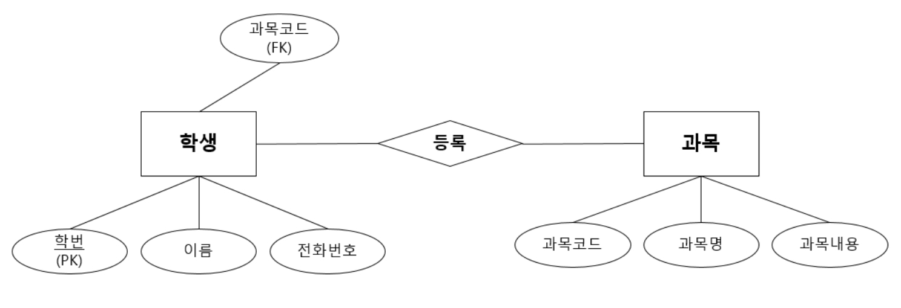
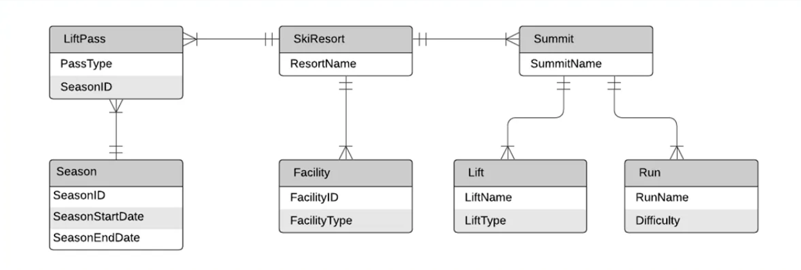
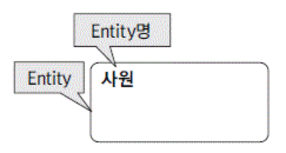
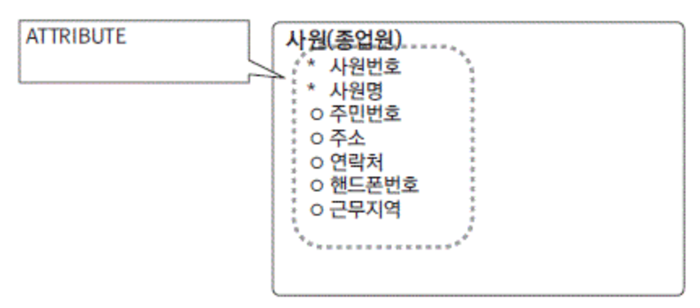
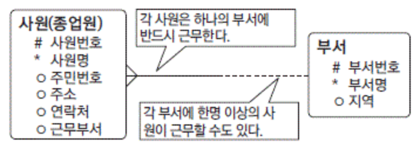
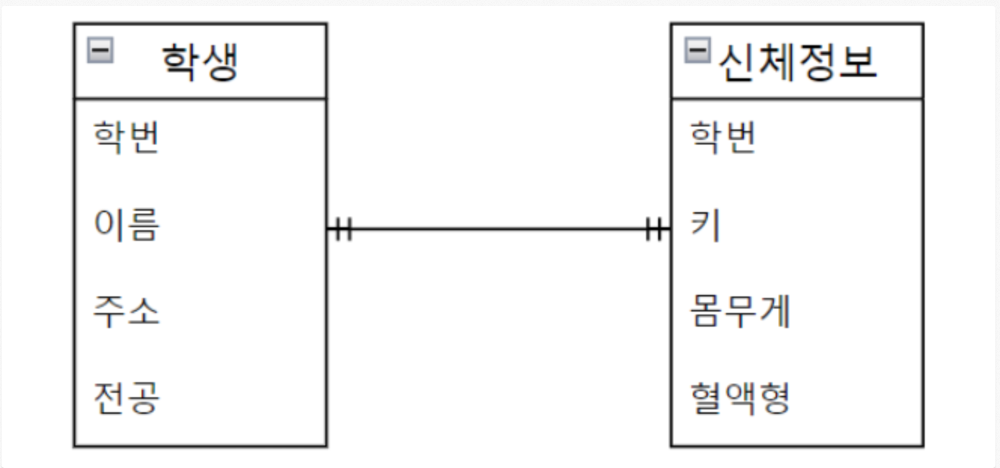
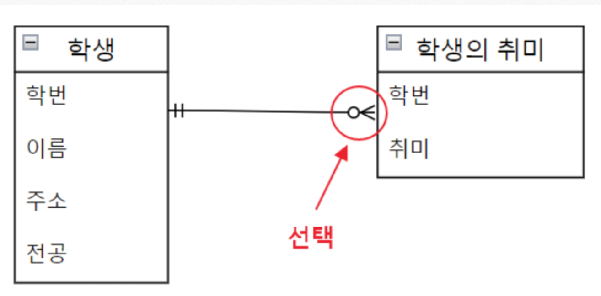
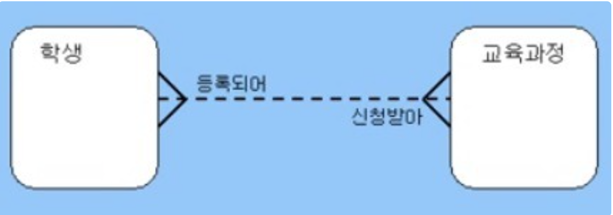
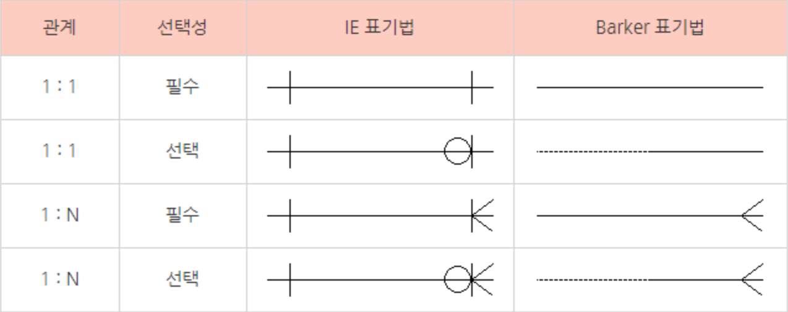

# ERD
## ERD란?
- Entity Relationship Diagram
- DB구조를 한 번에 알아보기 위해 사용하는 다이어그램
- 존재하고 있는 것(Entity) 즉, 데이터들의 관계(Relationship)을 나타낸 도표(Diagram)
- ERD를 그리기 위한 툴로 이알윈(ER-win)이 있다

## ERD 예시

## ERD 구성 요소
### Entity

- 정의 가능한 사물 또는 개념
- 기업에서 지속적으로 관리해야할 대상
- 반드시 2개 이상의 속성(Attribute)을 가진다
- 하나 이상의 식별자(UID)를 가진다

### Attribute

- Entity를 구성하고 있는 구성요소
- 데이터 타입을 같이 명시해줘야 한다
- "#"은 UID, "*"은 필수, "o"는 선택 Attribute를 의미한다

### Relationship

- Entity간의 관계를 의미
- 실세계에 해당 엔터티에서 발생하는 상황을 표기한다

### 관계 형태
(1) 1 : 1 관계

- 하나의 원소는 하나의 원소만 관계를 맺는 것
- 양쪽 다 하나씩만 가지고 있음 
ex) 학생 한 명당 하나의 신체정보만을 가지고있다

(2)  1 : N 관계
 
- 하나의 원소가 2개 이상의 원소와 관계를 맺는 것 
ex) 1명의 학새은 여러 개의 취미를 가질 수 있다.

(3) N : M 관계

- 양 쪽 모두 하나 이상과 연관될 수 있는 관계 
  ex) 하나의 수업에는 여러 명의 학생이 있을 수 있고, 
  한 명의 학생이 여러개의 수업을 들을 수 있다.

### 표기법
 