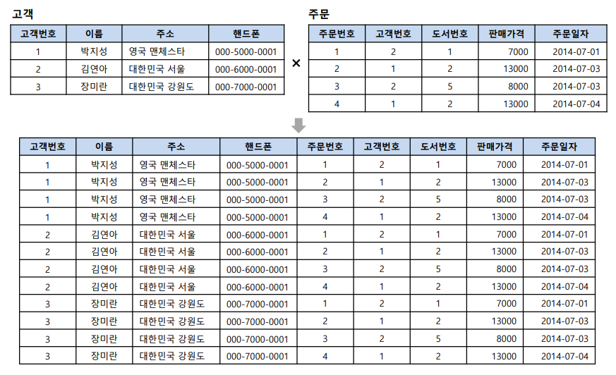

## JOIN

### JOIN이란?

> 두 개 이상의 테이블을 연결하여 하나의 결과 테이블로 만드는 것

- 두 테이블의 공통 속성을 기준으로, 속성 값이 같은 행을 수평으로 결합하는 연산
- 조인에 참여하는 속성은 서로 동일한 도메인을 가짐

---

### 필요성
- 정규화를 수행하면 의미 있는 데이터 집합으로 테이블이 구성되고, 각 테이블끼리 관계(Relationship)를 가짐

- 관계있는 데이터가 여러 테이블로 나뉘어 저장되므로, 이를 효과적으로 검색하기 위해 조인이 필요함

- 조인을 통해 데이터 중복을 최소화하고 데이터의 일관성을 유지할 수 있음

---

### 종류

1. 내부조인(INNER JOIN)


- 동등조인(EQUAL JOIN)과 같음

- 가장 기본 조인 형식

- 조인 조건에서 = 만을 사용

- 공통 속성의 **속성 값이 동일한 행**만을 반환

```SQL
SELECT *
FROM A
INNER JOIN B
ON A.id = B.id;
```

2. 자연조인(NATURAL JOIN)


- 동등(이너)조인에서 조인에 참여한 속성이 두 번 나오지 않도록, 공통 속성 중 두 번째 속성을 제거한 결과를 반환

3. 교차조인(CROSS JOIN)


- 카티젼 조인이라고도 함

- 두 테이블에 조인 조건이 없는 경우

- 생길 수 있는 **모든 데이터의 조합**

- 결과 테이블은 첫 번째 테이블 행 다음에 두 번째 테이블의 모든 행을 순서대로 배열해 반환

- 따라서 결과 행의 개수는 (첫번째 테이블 행 수X두 번째 테이블 행 수)

```SQL
SELECT *
FROM A
CROSS JOIN B
ON A.id = B.id;
```

4. 외부조인(OUTER JOIN)


- 자연조인시 조인에 실패한 행을 모두 보여주되, 값이 없는 속성은 NULL값을 채워서 반환

- 모든 속성을 보여주는 기준 테이블 위치에 따라 왼쪽 외부조인, 오른쪽 외부조인, 완전 외부조인으로 나뉨

[LEFT OUTER JOIN]
- 왼쪽 테이블을 기준으로 조인을 진행하여, 왼쪽 속성 값이 오른쪽 속성 값과 매치되지 않아도 NULL 값으로 채워 반환

- JOIN 명령어 기준으로, 왼쪽에 있는 A가 기준 테이블이 됨
```SQL
SELECT *
FROM A
LEFT OUTER JOIN B
ON A.id = B.id;
```

[RIGHT OUTER JOIN]
- 오른쪽 테이블을 기준으로 조인을 진행하여, 오른쪽 속성 값이 왼쪽 속성 값과 매치되지 않아도 NULL 값으로 채워 반환

- JOIN 명령어 기준으로, 오른쪽에 있는 B가 기준 테이블이 됨

```SQL
SELECT *
FROM A
RIGHT OUTER JOIN B
ON A.id = B.id;
```

[FULL OUTER JOIN]
- 양쪽 테이블 중 서로의 속성 값이 존재하지 않아도 NULL 값으로 채워 반환

- 두 테이블 간의 조인을 수행하고, 양쪽 테이블의 모든 행을 포함하는 결과 반환

- LEFT OUTER JOIN과 RIGHT OUTER JOIN의 합집합이라 생각

```SQL
SELECT *
FROM A
FULL OUTER JOIN B
ON A.id = B.id;
```

**__CROSS JOIN과 FULL OUTER JOIN의 차이점?__**
- CROSS JOIN은 모든 가능한 조합을 생성, 각각의 행을 매치하는 것이기 때문에 JOIN 연산으로 인해 발생하는 NULL값은 없음

- FULL OUTER JOIN은 
- 두 테이블 간의 행을 결과에 포함하고, 일치하지 않을 경우 NULL 값을 포함

- 아래의 예시로 확인


두 테이블은 각각 1, 2, 3 .. 값을 가지는 속성이 있다고 가정, 해당 속성을 이용해 JOIN

**CROSS JOIN**

- 모든 가능한 조합, 왼쪽 테이블인 customer를 기준으로, 각 행에 오른쪽 테이블 products가 연결됨

- 결과 행 개수는 3X3 = 9임

**FULL OUTER JOIN**


- 없는 속성은 NULL 값으로 채워 반환되었음

---

\[참고자료\]

[조인이란?](https://velog.io/@ragnarok_code/DataBase-%EC%A1%B0%EC%9D%B8Join%EC%9D%B4%EB%9E%80)