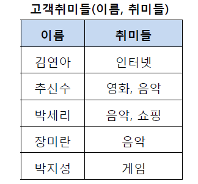
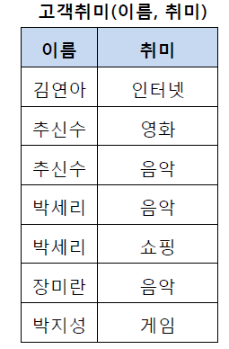
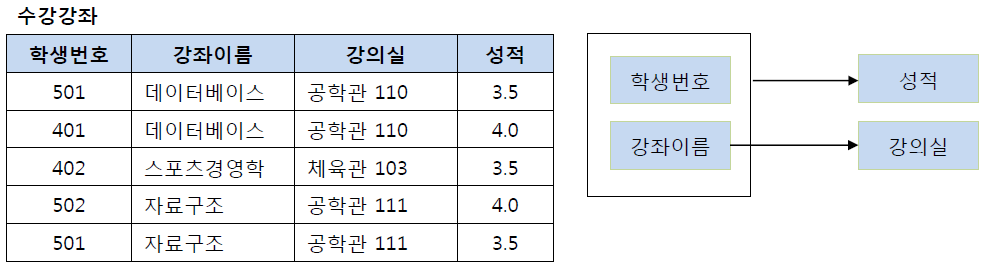
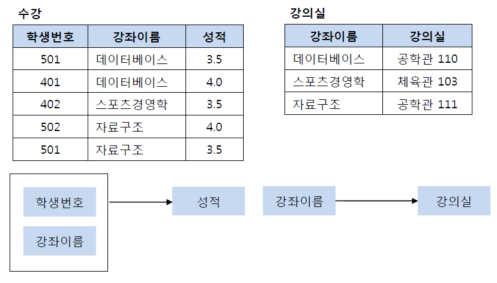
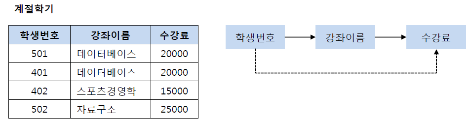
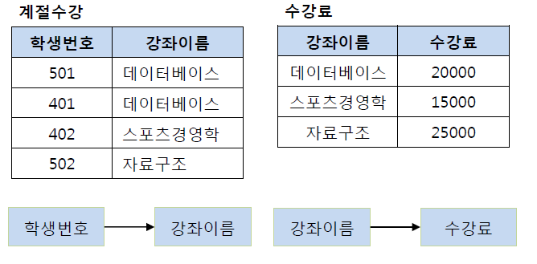
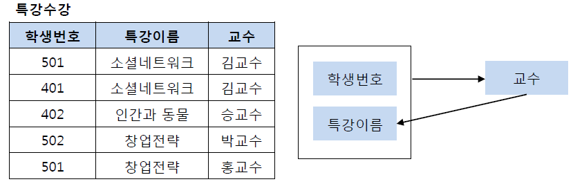
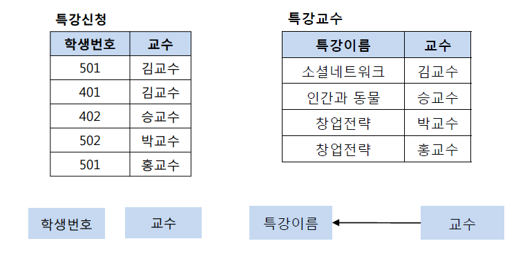

## RDBMS

## 릴레이션

행과 열로 구성된 테이블로 스키마+인스턴스임

- 스키마 : 기본적인 구조 정의
- 인스턴스 : 실제 데이터 집합
- 튜플 : 행
- 카디널리티 : 튜플의 개수
- 애트리뷰트 : 열
- 차수 : 애트리뷰트의 개수

---

## 키

- 특정 튜플을 식별할 때 사용하는 하나 이상의 속성 모임
- 릴레이션은 중복된 튜플을 허용하지 않음
- 즉, 키가 되는 속성은 반드시 값이 달라 튜플을 서로 구별할 수 있어야 함
- 릴레이션 간 관계를 맺을 때에도 사용

1. 슈퍼키(super key)

튜플을 고유하게 식별할 수 있는 속성(들)

- 위와 같은 릴레이션에서 고객번호와 주민번호를 포함한 모든 속성의 집합이 슈퍼키임
- (주민번호), (고객번호), (주민번호, 이름), (주민번호, 이름, 주소), (고객번호, 이름, 주민번호, 주소 핸드폰) 등등

2. 후보키(candidate key)

튜플을 유일하게 식별할 수 있는 **최소한**의 속성 집합

고객 번호 : 한명의 고객이 여러 권의 도서를 구입할 수 있음

도서 번호 : 위와 같은 이유

- 따라서 고객 번호, 도서 번호만으로는 튜플을 유일하게 식별할 수 없음
- 위 릴레이션의 후보키는 두 개의 속성을 합친 (고객번호, 도서번호)가 됨
- 이렇게 2개 이상의 속성으로 이루어진 키를 복합키라고 부름
- 하나의 릴레이션의 반드시 하나 이상의 후보키가 존재함

3. 기본키(primary key)

여러 후보키 중 하나를 선정해 대표로 삼는 키

후보키가 하나라면 해당 키가 후보키이자 기본기가 되고, 여러 개라면 릴레이션의 특성을 가장 잘 나타낼 수 있는 것으로 선정

- 릴레이션 스키마에서 기본키는 밑줄을 그어 표시함
- 기본키는 릴레이셔 내 튜플을 식별할 수 있는 고유한 값을 가져야함
- NULL 값은 허용되지 않음
- 키 값의 변동이 나타나선 안됨
- 최대한 적은 수의 속성을 가진 것이어야함
- 향후 키를 사용하며 문제 발생 소지가 없어야함

4. 대리키(surrogate)

일련번호 같은 가상의 속성을 만들어 기본키로 삼는 경우

아래와 같은 상황에서 대리키를 사용함

- 기본키가 보안을 요함
- 기본키가 여러 개의 속성으로 구성되어 복잡함
- 마땅한 기본키가 없음

5. 대체키(alternate key)

기본키로 선정되지 않은 후보키

- 위와 같은 릴레이션에서 고객번호를 기본키로 선정하면 주민번호가 대체키가 됨

6. 외래키(foreign key)

- 다른 릴레이션의 기본키를 참조하는 속성
- 관계 데이터 모델의 특징인 릴레이션간 관계를 표현
- 기본키가 변경되면 외래키도 변경
- NULL 값, 중복값 허용
- 자기 자신을 참조하는 외래키도 가능
- 기본키의 구성요소가 될 수 있음

## DB 정규화란?

> 데이터베이스 내의 데이터 구조를 조직화, 최적화하는 과정

### 목적

- 테이블 간 중복된 데이터를 제거, 허용하지 않는 것
- 중복된 데이터를 허용하지 않음으로써 데이터 무결성 유지
- DB의 저장 용량 확보

### 장점

- 데이터베이스 변경시 이상 현상 제거 가능
- 데이터베이스와 연동된 응용 프로그램에 최소한의 영향을 미쳐 생명력 연장 시킴

__이상 현상이란?__

1. 삽입 이상 : 데이터 삽입시 의도와 다른 값이 함께 삽입
2. 삭제 이상 : 데이터 삭제시 의도와 다른 값이 함께 삭제
3. 갱신 이상 : 속성값 갱신시 일부 튜플만 갱신

### 단점
- 릴레이션간 분해로 인한 JOIN 연산 증가
- 조인 연산 증가에 대한 성능 저하는 반정규화를 통해 해결 가능

---

### 제 1 정규형(1NF)

: 데이터베이스의 각 컬럼이 원자 값(하나의 값)을 가지도록 하는 것

1.  각 컬럼은 유일한 이름을 가져야함
2.  각 컬럼은 하나의 속성만을 가져야함
3.  하나의 컬럼은 같은 종류/타입이어야함
4.  칼럼의 순서는 상관이 없어야함

__위 릴레이션은 제 1 정규형을 만족할까?__
-  2번 조건 위배
-  1, 3번째 튜플은 과목에 대해 두 개의 값을 가지기 때문
-  제 1 정규형을 만족하기 위해선 아래와 같이 릴레이션을 변경해야함

---

### 제 2 정규형(2NF)

1.  제 1 정규형을 만족해야함
2.  모든 컬럼은 부분적 종속 없이, 완전 종속을 만족해야함

__위 릴레이션은 제 2 정규형을 만족할까?__
-  2번 조건 위배
-  위 릴레이션의 기본키는 (학생번호, 강좌이름)임
-  (학생번호, 강좌이름)은 성적을 결정하지만, (강좌이름)은 강의실을 결정함
-  제 2 정규형을 만족하기 위해선 아래와 같이 릴레이션을 변경해야함

---

### 제 3 정규형(3NF)

1.  제 2 정규형을 만족해야함
2.  기본키를 제외한 속성들간의 이행적 함수 종속성이 없어야함

이때, 이행적 함수 종속성이란 A->B, B->C 일 때, A->C 가 성립하는 관계

__위 릴레이션은 제 3 정규형을 만족할까?__
-  2번 조건 위배
-  학생 번호에 따라 강좌이름이 결정되고, 강좌이름에 따라 수강료가 결정됨
-  만약 어떤 학생이 강좌이름을 변경한다고 했을 때, 그에 맞춰 수강료 또한 변경해주어야 하는 일이 발생
-  제 3 정규형을 만족하기 위해선 아래와 같이 릴레이션을 변경해야함

---

### 보이스코드 정규형 (BCNF)

1.  제 3 정규형을 만족해야함
2.  모든 결정자가 후보키 집합에 속해야함

__결정자란?__
어떤 속성의 값이 다른 속성의 값을 고유하게 결정할 수 있을 때, 결정자라고 함

__위 릴레이션은 BCNF를 만족할까?__
-  2번 조건 위배
-  (학생번호, 특강이름)은 교수를 결정하고, (교수)는 특강이름을 결정하지만 교수는 후보키가 아님
-  BCNF를 만족하기 위해선 아래와 같이 릴레이션을 변경해야함

---

제 4 정규화와 제 5 정규화에 대해서는 [해당 링크](https://zzozzomin08.tistory.com/12) 참조

---

\[참고자료\]

[(DB) 데이터베이스의 정규화란](https://velog.io/@rlrhs11/DB%EB%8D%B0%EC%9D%B4%ED%84%B0%EB%B2%A0%EC%9D%B4%EC%8A%A4%EC%9D%98-%EC%A0%95%EA%B7%9C%ED%99%94%EB%9E%80)
[데이터베이스 정규화란?](https://hstory0208.tistory.com/entry/%EB%8D%B0%EC%9D%B4%ED%84%B0%EB%B2%A0%EC%9D%B4%EC%8A%A4-%EC%A0%95%EA%B7%9C%ED%99%94Normalization%EB%9E%80-%EC%98%88%EC%8B%9C%EB%A5%BC-%ED%86%B5%ED%95%B4-%EC%89%BD%EA%B2%8C-%EC%9D%B4%ED%95%B4%ED%95%B4%EB%B3%B4%EC%9E%90)
