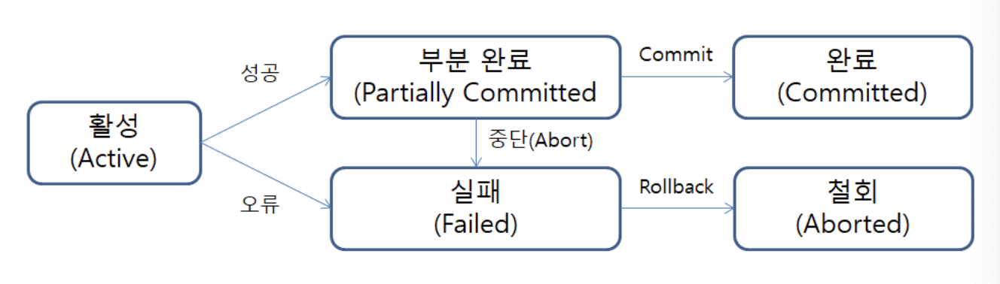

# 트랜잭션 (Transaction)

## 1. 트랜잭션이란?

- 사전적 의미 : 거래

- 컴퓨터 과학 분야에서의 트랜잭션은 더 이상 분할이 불가능한 업무처리의 단위를 의미한다.

- 하나의 작업을 위해 더 이상 분할할 수 없는 명령들의 모음으로, 한꺼번에 수행되어야 할 일련의 연산모음이다.

### (1) 안전성 확보를 위한 방법

- DB와 어플리케이션의 데이터 거래에 있어서 안전성을 확보하기 위한 방법이 바로 트랜잭션이다.

    - 예를 들어, A가 B에게 돈을 송금했는데 A의 계좌에서는 잔액이 차감되었고 B의 계좌에는 입금되지 않았을 경우 치명적인 결과가 발생한다. 즉, 계좌 이체라는 행위는 인출과 입금 두 과정으로 이루어지는데, 이 두 과정은 동시에 성공하거나 또는 동시에 실패해야 한다. 즉, 이러한 과정들이 한꺼번에 수행되도록 하는 방법이 바로 트랜잭션이다.

- 따라서 DB에서 테이블의 데이터를 읽어온 후 다른 테이블에 데이터를 입력하거나 갱신, 삭제하는 도중에 오류가 발생하는 경우, 결과를 재반영하는 것이 아니라 모든 작업을 원상복구하고, 처리 과정이 모두 성공했을 경우에만 그 결과를 반영한다.

### (2) MySQL 트랜잭션

- MySQL에서 트랜잭션은 DB의 상태를 바꾸는 일종의 작업 단위이다.

- 우리가 MySQL에서 입력하는 모든 쿼리 명령어들은 각각 하나의 트랜잭션이라고 할 수 있다. INSERT, DELETE, UPDATE 등의 SQL 명령문을 통해 데이터의 상태를 바꿀 때마다 내부적으로 자동으로 commit을 실행하여 변경된 내역을 DB에 반영한다.

- 그러나 작업단위는 사실 질의어 한 문장이 아니다. 작업단위는 많은 질의어 명령문들을 사람이 정하는 기준에 따라 정하는 것을 의미한다.

## 2. 트랜잭션의 4가지 특징 (ACID)

### (1) 원자성 (Atomicity)

- 트랜잭션은 DB에 모두 반영되거나, 그렇지 않다면 전혀 반영되지 않아야 한다.

- 트랜잭션은 사람이 설계한 논리적인 작업 단위이고, 데이터는 트랜잭션 단위로 처리되어야 한다.

- 즉, 트랜잭션 내의 모든 명령은 반드시 완벽하게 수행되어야 한다. 모두가 완벽하게 수행되지 못하고 어느 하나라도 오류가 발생할 경우, 트랜잭션 전부가 취소되어야 한다.

- savePoint

    - savePoint는 트랜잭션 내부에서 사용자가 지정할 수 있는 세부 작업 단위이다.

    - 특정 지점에 savePoint를 설정한 후 `Rollback to savePoint1`을 통해 해당 지점으로 롤백할 수 있다.

    - savePoint로 롤백한 경우, 미래 시점의 savePoint는 삭제된다.

### (2) 일관성 (Consistency)

- 트랜잭션의 처리 결과는 항상 일관성이 있어야 한다.

- 트랜잭션이 진행되는 동안 DB가 변경되더라도, 업데이트된 DB로 트랜잭션이 진행되는 것이 아니라, 트랜잭션을 진행하기 위해 처음에 참조한 DB로 트랜잭션이 진행되어야 한다.

### (3) 독립성 (Isolation)

- 둘 이상의 트랜잭션이 동시에 실행되고 있을 경우, 어떤 트랜잭션도 다른 트랜잭션의 연산에 끼어들 수 없다.

- 수행 중인 트랜잭션이 완료될 때까지, 다른 트랜잭션에서 수행 중인 트랜잭션의 결과를 참조할 수 없다.

- 독립성을 보장할 수 있는 가장 쉬운 방법은 모든 트랜잭션을 순차적으로 수행하는 것이다. 그러나 병렬적 수행의 장점을 얻기 위해 DBMS는 트랜잭션들을 병렬적으로 수행하면서도 일렬 수행과 같은 결과를 보장할 수 있는 방식을 제공한다.

### (4) 지속성 (Durability)

- 트랜잭션이 성공적으로 완료되었을 경우, 결과는 영구적으로 반영되어야 한다.

- 성공적으로 완료된 트랜잭션의 결과는 시스템이 고장나더라도 영구적으로 반영되어야 한다.

## 3. 트랜잭션의 상태



- 위 그림은 트랜잭션의 연산과정에서 각 단계와 상태를 정리한 것이다.

### (1) 활성 (Active)

- 트랜잭션이 정상적으로 실행되고 있는 상태를 의미한다.

- 트랜잭션이 시작되면 해당 트랜잭션의 상태는 활성(Active) 상태가 된다.

- 해당 상태는 설계자가 설계한 대로 연산들이 정상적으로 실행되고 있는 상태를 의미한다.

### (2) 부분 완료 (Partially Committed)

- 트랜잭션의 마지막까지 정상적으로 실행되었고, commit 연산이 실행되기 직전의 상태를 의미한다.

- 설계된 작업대로 모든 작업이 성공한 경우, 그 결과를 무조건 반영하는 것이 아니라 설계자의 최종 승인(Commit)이 있을 때까지 실제 DB에 작업 내용을 반영하지 않고 기다린다. 이때의 상태가 바로 부분 완료(Partially Committed)이다.

### (3) 완료 (Committed)

- 부분 완료(Partially Committed) 상태에서 Commit 연산이 실행되어 트랜잭션이 성공적으로 종료되고 트랜잭션의 결과가 DB에 반영된 상태를 의미한다.

- 설계자가 작업 결과에 대해 반영을 승인(Commit)한다면 트랜잭션이 성공적으로 종료된다.

### (4) 실패 (Failed)

- 트랜잭션을 수행하는 중간에 모종의 원인으로 인해 오류가 발생하여 실행이 중단된 상태를 의미한다.

### (5) 철회 (Aborted)

- 트랜잭션이 비정상적으로 종료되어 Rollback 연산을 수행한 상태이다.

- 실패(Failed) 상태에서 트랜잭션 내부의 작업을 트랜잭션 수행 이전의 상태로 되돌리는 Rollback 연산을 수행한 상태가 바로 철회(Aborted) 상태이다.

## 4. 트랜잭션의 상태에 관련된 연산

### (1) Commit 연산

- Commit은 모든 작업을 정상적으로 처리하겠다고 확정하는 명령어로, 해당 처리 과정을 DB에 영구적으로 저장하겠다는 의미이다.

- Commit을 수행하면 하나의 트랜잭션 과정이 종료된다.

### (2) Rollback 연산

- Rollback은 작업 중 문제가 발생되어 트랜잭션의 처리 과정에서 발생한 변경사항을 취소하는 명령어이다.

- Rollback 연산을 수행하면 트랜잭션은 작업이 시작되기 이전의 상태로 되돌아간다.

- 이것은 마지막 Commit을 완료한 시점으로 돌아간다는 말과 같다.

- 즉, Rollback은 Commit하여 저장한 예전 상태를 복구하는 것이다.

## 5. 트랜잭션의 예외

- 모든 명령어에 대하여 트랜잭션의 Rollback 명령이 적용될 수 있는 것은 아니다.

- DDL문(CREATE, DROP, ALTER, RENAME, TRUNCATE)은 트랜잭션의 Rollback 대상이 아니므로 해당 명령문을 입력할 때 주의해야 한다.

## 6. MySQL 트랜잭션의 전역 설정

- MySQL에서는 auto commit이 기본적으로 on으로 설정되어 있다.

- 이는 명령어를 한 번 찍을 때마다(즉 세미콜론을 한 번 찍을 때마다) DB에서 자동으로 commit해주는 것을 의미한다.

- MySQL의 auto commit 설정을 확인하고 변경하는 방법은 아래와 같다.

    ```sql
    -- 현재 AutoCommit 값 확인
    SELECT @@AUTOCOMMIT;

    -- AutoCommit 설정
    SET AUTOCOMMIT = 1;

    -- AutoCommit 해제
    SET AUTOCOMMIT = 0;
    ```

- 이렇게 설정하면 MySQL Workbench를 기동할 때마다 초기화된다. 아래 방법을 이용하면 언제나 AutoCommit이 해제되어 시작되도록 설정할 수 있다.

    

## 0. 내용 및 사진 출처

- [https://inpa.tistory.com/entry/MYSQL-📚-트랜잭션Transaction-이란-💯-정리](https://inpa.tistory.com/entry/MYSQL-%F0%9F%93%9A-%ED%8A%B8%EB%9E%9C%EC%9E%AD%EC%85%98Transaction-%EC%9D%B4%EB%9E%80-%F0%9F%92%AF-%EC%A0%95%EB%A6%AC)

- https://blog.naver.com/bb_/221230947655
