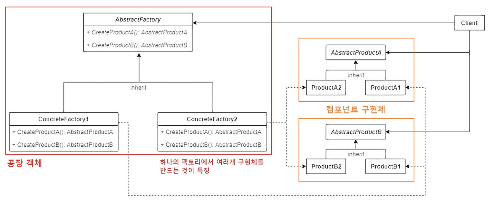

# 추상 팩토리 패턴 (Abstract Factory Pattern)

## 1. 추상 팩토리 패턴

- 추상 팩토리 패턴은 연관성이 있는 객체 군이 여러 개 있을 경우 이들을 묶어서 추상화하고, 어떤 구체적인 상황이 주어지면 팩토리 객체에서 집합으로 묶은 객체 군을 구현화하는 생성 패턴이다.
- 클라이언트에서 특정 객체를 사용할 때 팩토리 클래스만을 참조함으로써 특정 객체에 대한 구현부를 감출 수 있고 따라서 역할과 구현을 분리시킬 수 있다.
- 추상 팩토리의 핵심은 **제품 군 집합**을 타입 별로 찍어낼 수 있다는 점이다.

### (1) 추상 팩토리 패턴 VS 팩토리 메서드 패턴

- 공통점
    - 두 패턴 모두 객체를 통해 구체적인 타입을 감추고 객체 생성에 관여하는 패턴이다.
    - 공장 클래스가 제품 클래스를 각각 나눠서 느슨한 결합 구조를 구성하는 모습이 유사하다.
- 차이점
    - 팩토리 메서드는 추상 메서드를 통한 다른 제품 구현과 더불어 **객체 생성에 관한 전처리와 후처리를 해주는 로직이 핵심**이며, 추상 팩토리는 **여러 타입의 객체 군을 생성할 수 있다는 것이 핵심**이다.
        - 팩토리 메서드 패턴은 **객체 생성 이후 해야 할 일**의 공통점을 정의하는 데 초점을 맞추고 있는 반면, 추상 팩토리 패턴은 생성해야 할 **객체 집합 군**의 공통점에 초점을 맞추고 있다.
    - 두 패턴의 차이점은 명확하므로, 상황에 따라 적절한 선택을 해야 한다.
    - 이 두 패턴은 엄연히 별개의 코드 패턴이므로, 두 패턴 중 하나만을 선택해야 하는 것이 아니다. **두 패턴을 적절하게 조합해서 복합 패턴을 구성하는 것도 가능하다.**
    - 추상 팩토리와 팩토리 메서드를 조합하게 된다면, 여러 타입의 객체 군을 생성하면서 동시에 템플릿 메서드를 통해 전처리와 후처리 작업을 해주는 것이 가능해진다.
- 구체적인 공통점
    - 객체 생성 과정을 추상화한 인터페이스를 제공한다.
    - 객체 생성을 캡슐화함으로써 구체적인 타입을 감추고 느슨한 결합 구조를 표방한다.
- 구체적인 차이점
    - 팩토리 메서드 패턴은 구체적인 객체 생성 과정을 하위 또는 구체적인 클래스로 옮기는 것이 목적이다. 반면 추상 팩토리 패턴은 관련이 있는 여러 객체를 구체적인 클래스에 의존하지 않고 생성할 수 있도록 해주는 것이 목적이다.
    - 팩토리 메서드 패턴에서는 한 팩토리 당 한 종류의 객체만 생성할 수 있다. 반면 추상 팩토리 패턴에서는 한 팩토리에서 서로 연관된 여러 종류의 객체를 생성할 수 있다. (제품군 생성 지원)
    - 팩토리 메서드 패턴에서는 메서드 레벨에 포커스를 맞춤으로써 클라이언트의 ConcreteProduct 인스턴스 생성 및 구성에 대한 의존을 감소시킨다. 반면 추상 팩토리 패턴에서는 클래스(Factory) 레벨에 포커스를 맞춤으로써 클라이언트의 ConcreteProduct 인스턴스 군의 생성 및 구성에 대한 의존을 감소시킨다.

## 2. 추상 팩토리 패턴의 구조



- AbstractFactory : 최상위 공장 클래스로, 여러 개의 제품들을 생성하는 여러 메서드들을 추상화한다.
- ConcreteFactory : 서브 공장 클래스들은 타입에 맞는 제품 객체를 반환하도록 메서드들을 재정의한다.
- AbstractProduct : 각 타입의 제품들을 추상화한 인터페이스이다.
- ConcreteProduct : 각 타입의 제품 구현체들로, 이들은 팩토리 객체로부터 생성된다.
- Client : Client는 추상화된 인터페이스만을 이용하여 제품을 받기 때문에, 구체적인 제품, 공장에 대해서는 모른다.

### (1) 클래스 구성

- 제품(Product) 클래스
    
    ```java
    // Product A 제품군
    interface AbstractProductA {
    }
    
    // Product A - 1
    class ConcreteProductA1 implements AbstractProductA {
    }
    
    // Product A - 2
    class ConcreteProductA2 implements AbstractProductA {
    }
    
    // Product B 제품군
    interface AbstractProductB {
    }
    
    // Product B - 1
    class ConcreteProductB1 implements AbstractProductB {
    }
    
    // Product B - 2
    class ConcreteProductB2 implements AbstractProductB {
    }
    ```
    
- 공장(Factory) 클래스
    
    ```java
    interface AbstractFactory {
        AbstractProductA createProductA();
        AbstractProductB createProductB();
    }
    
    // Product A1와 B1 제품군을 생산하는 공장군 1
    class ConcreteFactory1 implements AbstractFactory {
        @Override
        public AbstractProductA createProductA() {
            return new ConcreteProductA1();
        }
    
        @Override
        public AbstractProductB createProductB() {
            return new ConcreteProductB1();
        }
    }
    
    // Product A2와 B2 제품군을 생산하는 공장군 2
    class ConcreteFactory2 implements AbstractFactory {
        @Override
        public AbstractProductA createProductA() {
            return new ConcreteProductA2();
        }
    
        @Override
        public AbstractProductB createProductB() {
            return new ConcreteProductB2();
        }
    }
    ```
    
- Client
    
    ```java
    class Client {
        public static void main(String[] args) {
            AbstractFactory factory = null;
    
            // 1. 공장군 1을 가동시킨다.
            factory = new ConcreteFactory1();
    
            // 2. 공장군 1을 통해 제품군 A1를 생성한다. (클라이언트는 구체적인 구현은 모르고 인터페이스에 의존한다)
            AbstractProductA product_A1 = factory.createProductA();
            System.out.println(product_A1.getClass().getName()); // ConcreteProductA1
    
            // 3. 공장군 2를 가동시킨다.
            factory = new ConcreteFactory2();
    
            // 4. 공장군 2를 통해 제품군 A2를 생성한다. (클라이언트는 구체적인 구현은 모르고 인터페이스에 의존한다)
            AbstractProductA product_A2 = factory.createProductA();
            System.out.println(product_A2.getClass().getName()); // ConcreteProductA2
        }
    }
    ```
    

## 3. 추상 팩토리 패턴의 특징

### (1) 패턴 사용 시기

- 관련 제품의 다양한 제품 군과 함께 작동해야 할 때, 해당 제품의 구체적인 클래스에 의존하고 싶지 않은 경우
- 여러 제품군 중 하나를 선택해서 시스템을 설정해야 하고 한번 구성한 제품을 다른 것으로 대체할 수도 있는 경우
- 제품에 대한 클래스 라이브러리를 제공하고, 그들의 구현이 아닌 인터페이스를 노출시키고 싶은 경우

### (2) 장점

- 객체를 생성하는 코드를 분리함으로써 클라이언트 코드와 결합도를 낮출 수 있다.
- 제품 군을 쉽게 대체할 수 있다.
- SOLID 원칙의 SRP와 OCP를 준수할 수 있다.

### (3) 단점

- 각 구현체마다 팩토리 객체들을 모두 구현해주어야 하기 때문에, 객체가 늘어날 때마다 클래스가 증가하여 코드의 복잡성이 증가한다. (팩토리 패턴의 공통적인 문제점)
- 기존 추상 팩토리의 세부사항이 변경되면 모든 팩토리에 대한 수정이 필요해진다. 즉, 추상 팩토리와 모든 하위 클래스들의 수정이 필요해진다.
- 새로운 종류의 제품을 지원하는 것이 어렵다. 새로운 제품이 추가되면 팩토리 구현 로직 자체를 변경해야 한다.

## 4. 예제

- Product : Button, CheckBox, TextEdit 등을 정의한다.
    
    ```java
    interface Component {
        void render(); // 요소 그리기
    }
    
    abstract class Button implements Component {
    }
    
    class WindowsButton extends Button {
        @Override
        public void render() {
            System.out.println("윈도우 버튼 생성 완료");
        }
    }
    
    class MacButton extends Button {
        @Override
        public void render() {
            System.out.println("맥 버튼 생성 완료");
        }
    }
    
    abstract class CheckBox implements Component {
    }
    
    class WindowsCheckBox extends CheckBox {
        @Override
        public void render() {
            System.out.println("윈도우 체크박스 생성 완료");
        }
    }
    
    class MacCheckBox extends CheckBox {
        @Override
        public void render() {
            System.out.println("맥 체크박스 생성 완료");
        }
    }
    
    abstract class TextEdit implements Component {
    }
    
    class WindowsTextEdit extends TextEdit {
        @Override
        public void render() {
            System.out.println("윈도우 텍스트박스 생성 완료");
        }
    }
    
    class MacTextEdit extends TextEdit {
        @Override
        public void render() {
            System.out.println("맥 텍스트박스 생성 완료");
        }
    }
    ```
    
- Factory : WindowsFactory와 MacFactory를 정의한다.
    
    ```java
    interface ComponentAbstractFactory {
        Button createButton();
        CheckBox createCheckBox();
        TextEdit createTextEdit();
    }
    
    class WindowsFactory implements ComponentAbstractFactory {
        @Override
        public Button createButton() {
            return new WindowsButton();
        }
    
        @Override
        public CheckBox createCheckBox() {
            return new WindowsCheckBox();
        }
    
        @Override
        public TextEdit createTextEdit() {
            return new WindowsTextEdit();
        }
    }
    
    class MacFactory implements ComponentAbstractFactory {
        @Override
        public Button createButton() {
            return new MacButton();
        }
    
        @Override
        public CheckBox createCheckBox() {
            return new MacCheckBox();
        }
    
        @Override
        public TextEdit createTextEdit() {
            return new MacTextEdit();
        }
    }
    ```
    
- Client
    
    ```java
    public static void main(String[] args) {
        ComponentAbstractFactory factory = null;
    
        // 윈도우 버튼을 생성한다.
        factory = new WindowsFactory();
        Button WindowsBtn = createBtn(factory);
        WindowsBtn.render();
    
        // 맥 버튼을 생성한다.
        factory = new MacFactory();
        Button MacBtn = createBtn(factory);
        MacBtn.render();
    }
    
    // 추상 팩토리에서 객체를 생성하는 코드는 같기 때문에, 따로 메서드로 묶어서 분리할 수 있다.
    public static Button createBtn(ComponentAbstractFactory fac) {
        return fac.createButton();
    }
    ```
    

### (1) 추상 팩토리 객체의 싱글톤화

- 기본적으로 팩토리 클래스는 호출되면 객체를 생성하기만 하면 되기 때문에, 메모리 최적화를 위해 각 팩토리 메서드마다 싱글톤을 적용하는 것이 좋다.

## 5. 내용 출처 및 참고

- [https://inpa.tistory.com/entry/GOF-💠-추상-팩토리Abstract-Factory-패턴-제대로-배워보자](https://inpa.tistory.com/entry/GOF-%F0%9F%92%A0-%EC%B6%94%EC%83%81-%ED%8C%A9%ED%86%A0%EB%A6%ACAbstract-Factory-%ED%8C%A8%ED%84%B4-%EC%A0%9C%EB%8C%80%EB%A1%9C-%EB%B0%B0%EC%9B%8C%EB%B3%B4%EC%9E%90)
