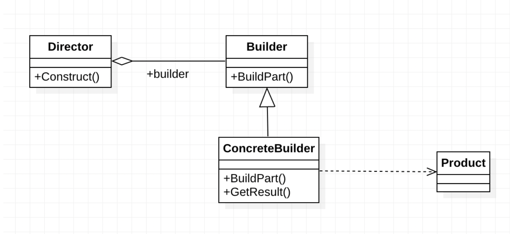

# Builder Pattern

## Builder Pattern이란?
- 복잡한 객체의 생성 과정을 단계별로 분리하여, 동일한 생성 절차에서 서로 다른 표현을 생성할 수 있게 하는 디자인 패턴
- 객체의 생성 과정을 세분화하여, 클라이언트가 필요한 조합으로 객체를 만들 수 있도록 지원
- 객체 생성의 복잡성을 줄이고, 객체의 다양한 표현을 쉽게 생성할 수 있음

### ※ 생성해야 하는 객체가 Optional한 속성을 많이 가질 때 빛을 발휘

## Builder Pattern 사용 이유
### (1) 객체 생성의 유연성
- 객체 생성의 각 단계를 개별적으로 조정할 수 있어, 동일한 생성 절차에서 서로 다른 결과물을 얻을 수 있음
### (2) 코드의 가독성 향상
- 복잡한 객체를 단계별로 생성하기 때문에 코드의 가독성이 높아짐
### (3) 불변 객체 생성 지원
- 생성 과정이 완료된 후 객체를 불변 상태로 유지할 수 있어, 안정적인 객체를 생성할 수 있음

### ※ 지속성 없는 상태 값들에 대해 처리해야 하는 문제들을 해결
### 팩토리 패턴이나 추상 팩토리 패턴에서는 생성해야 하는 클래스에 대한 속성 값이 많을 때 아래와 같은 이슈
- 클라이언트 프로그램으로부터 팩토리 클래스로 많은 파라미터를 넘겨줄 때 타입, 순서 등에 대한 관리가 어려워져 에러가 발생할 확률이 높아짐
- 경우에 따라 필요 없는 파라미터들에 대해서 팩토리 클래스에 일일이 null 값을 넘겨줘야 함
- 생성해야 하는 sub class가 무거워지고 복잡해짐에 따라 팩토리 클래스 또한 복잡해짐

## Builder 패턴의 구성 요소
### (1) Product
- 빌더가 생성하는 최종 객체
- 빌더에 의해 단계적으로 설정되는 다양한 속성을 가짐
### (2) Builder
- 객체 생성의 각 단계를 정의하는 인터페이스 또는 추상 클래스
- `Product` 객체의 속성을 설정하는 메서드를 제공
### (3) ConcreteBuilder
- `Builder` 인터페이스를 구현하는 구체적인 클래스
- `Product` 객체의 구체적인 속성을 설정하며, 객체 생성을 완료하는 `build()` 메서드를 제공
### (4) Director
- `Builder` 객체를 사용하여 `Product` 객체를 생성하는 클래스
- `Builder`의 메서드를 순차적으로 호출하여 객체 생성 과정을 제어
- 하지만 모든 상황에서 반드시 필요한 것은 아니며, 클라이언트가 `Builder`를 직접 호출하여 객체를 생성할 수도 있음

## 사용 예제 ( 마라탕 ) 
```java
// Product: 마라탕
class Malatang {
    private String broth;
    private String noodle;
    private String protein;
    private String vegetable;
    private String spicinessLevel;

    // Private Constructor to enforce the use of Builder
    private Malatang(MalatangBuilder builder) {
        this.broth = builder.broth;
        this.noodle = builder.noodle;
        this.protein = builder.protein;
        this.vegetable = builder.vegetable;
        this.spicinessLevel = builder.spicinessLevel;
    }

    // Builder: 마라탕 주문을 위한 Builder
    public static class MalatangBuilder {
        private String broth;
        private String noodle;
        private String protein;
        private String vegetable;
        private String spicinessLevel;

        public MalatangBuilder() {
        }

        public MalatangBuilder setBroth(String broth) {
            this.broth = broth;
            return this;
        }

        public MalatangBuilder setNoodle(String noodle) {
            this.noodle = noodle;
            return this;
        }

        public MalatangBuilder setProtein(String protein) {
            this.protein = protein;
            return this;
        }

        public MalatangBuilder setVegetable(String vegetable) {
            this.vegetable = vegetable;
            return this;
        }

        public MalatangBuilder setSpicinessLevel(String spicinessLevel) {
            this.spicinessLevel = spicinessLevel;
            return this;
        }

        public Malatang build() {
            return new Malatang(this);
        }
    }
}

// Client: 마라탕 주문 예제
public class MalatangOrderExample {
    public static void main(String[] args) {
        // 마라탕 Builder를 사용하여 주문하기
        Malatang myOrder = new Malatang.MalatangBuilder()
                .setBroth("매운 국물")
                .setNoodle("당면")
                .setProtein("소고기")
                .setVegetable("청경채")
                .setSpicinessLevel("매운맛")
                .build();

        System.out.println("마라탕 주문 완료: " + myOrder);

        // 다른 마라탕 주문
        Malatang anotherOrder = new Malatang.MalatangBuilder()
                .setBroth("안매운 국물")
                .setNoodle("우동")
                .setProtein("닭고기")
                .setVegetable("숙주나물")
                .setSpicinessLevel("중간 매운맛")
                .build();

        System.out.println("또 다른 마라탕 주문 완료: " + anotherOrder);
    }
}
```