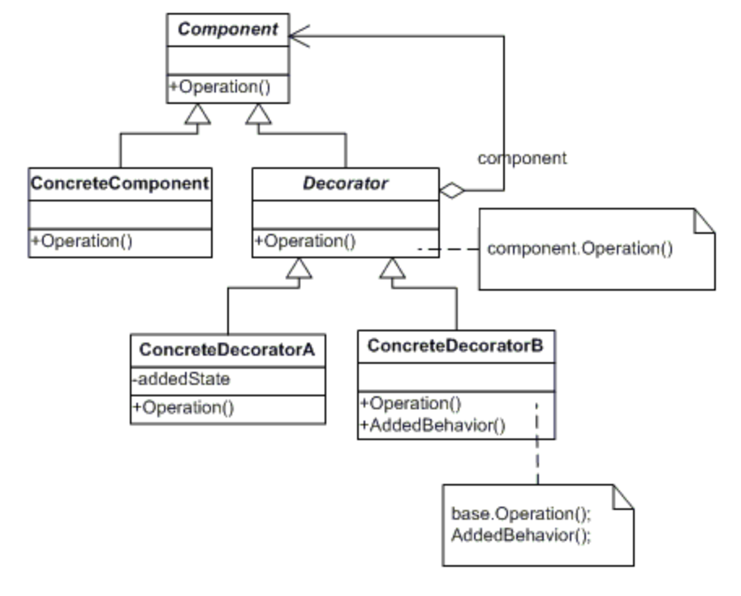

# Decorator Pattern
## Decorator Pattern이란?
- 상속(Inheritance)과 합성(Composition)을 사용하여 객체에 동적으로 책임을 추가
- 기존 코드를 수정하지 않고도 객체의 책임과 역할을 확장할 수 있다
- 서브클래스를 만들 때보다 유연하기 기능을 확장 가능

## Decorator Pattern의 구성요소

### (1) Component
- 데코레이터 패턴에서 추가 기능을 부여할 객체의 인터페이스 역할
- 기본 기능을 정의하는 인터페이스
- 원본 객체와 데코레이터를 묶는 역할

### (2) ConcreteComponent
- Component 인터페이스를 구현한 구체적인 객체
- 기본 기능을 실제로 구현하는 구체적인 컴포넌트
- 데코레이터 패턴의 시작점

### (3) Decorator
- Compontnt 인터페이스를 구현하고, 추가 기능을 부여할 객체의 추상 클래스
- Docorator는 Component를 멤버 변수로 가진다

### (4) ConcreteDecorator
- Decorator 클래스를 사속받아 실제로 추가 기능을 구현하는 구체적인 클래스
- 새로운 기능이나 기존 기능을 수정하는 역할


## 장점
### 유연한 확장
- 기존기능 수정 or 새로운 기능 추가할 때 동적으로 변경 가능
### 코드 재사용
- 기존 코드를 수정하지 않고 새로운 기능을 추가 가능
- 기존 구성 요소를 변경하지 않고 여러 조합으로 새로운 객체를 만들 수도 있다.
### 단일 책임 원칙(SRP) 준수
- 각 데코레이터는 특정 기능의 추가 or 수정에만 집중
### 개방 폐쇄 원칙(OCP) 준수
- 기존 코드를 변경하지 않고 새로운 데코레이터 클래스를 추가함으로써 기능을 쉽게 확장 가능
### 의존성 역전 원칙(DIP) 준수
- 컴포넌트와 데코레이터 모두 동일 인터페이스 or 추상클래스를 공유하므로 컴포넌트에 의존적이지 않다

## 단점
### 복잡성 증가
- 객체를 여러 층으로 감싸기 떄문에 클래스가 많아지고 복잡성 증가
### 순서 의존성
데코레이터를 적용하는 순서에 따라 최종적으로 생성되는 객체의 동작이나 상태가 달라질 수 있다.
### 불필요한 복사
- 모든 데코레이터는 원본 객체의 인스턴스를 가지고 있기 때문에 여러 레벨의 데코레이터를 사용할 경우 불필요한 객체 복사가 발생할 수 있다.

## Decorator 패턴 예제
### 커피 주문 애플리케이션
#### 아메리카노 주문 시 설탕, 샷 추가등의 옵션 선택 가능

#### Coffie.java
```java
public interface Coffee {
    String getCoffee();
    int getPrice();
}
```
- 주문한 커피와 가격을 나타내는 메서드

#### Americano.java
```java
public class Americano implements Coffee {

    @Override
    public String getCoffee() {
        return "아메리카노";
    }

    @Override
    public int getPrice() {
        return 2000;
    }
}
```
- 아메리카노 기본 정보 제공

#### CoffeeDecorator.java
```java
// Decorator
public abstract class CoffeeDecorator implements Coffee {
    private Coffee coffee;

    public CoffeeDecorator(Coffee coffee) {
        this.coffee = coffee;
    }

    @Override
    public String getCoffee() {
        return coffee.getCoffee();
    }

    @Override
    public int getPrice() {
        return coffee.getPrice();
    }
}
```
- CoffeeDecorator 클래스는 Coffee 객체를 감싼다

#### ShotDecorator.java
```java
// ConcreteDecoratorA
public class ShotDecorator extends CoffeeDecorator {
    public ShotDecorator(Coffee coffee) {
        super(coffee);
    }

    @Override
    public String getCoffee() {
        return super.getCoffee() + " 샷추가";
    }

    @Override
    public int getPrice() {
        return super.getPrice() + 500;
    }
}
```
- ShotDecorator 클래스는 CoffeeDecorator 객체를 상속

#### SugarDecorator.java
```java
// ConcreteDecoratorB
public class SugarDecorator extends CoffeeDecorator {
    public SugarDecorator(Coffee coffee) {
        super(coffee);
    }

    @Override
    public String getCoffee() {
        return super.getCoffee() + " 설탕추가";
    }

    @Override
    public int getPrice() {
        return super.getPrice() + 500;
    }
}
```
- SugarDecorator 클래스는 CoffeeDecorator 객체를 상속

#### Main.java
```java
public class Main {
    public static void main(String[] args) {
        Coffee americano = new Americano();
        Coffee americanoShotAdd = new ShotDecorator(americano);
        Coffee americanoShotSugarAdd = new SugarDecorator(americanoShotAdd);

        // 아메리카노 샷 추가
        System.out.println(americanoShotAdd.getCoffee());
        System.out.println(americanoShotAdd.getPrice());

        // 아메리카노 샷, 설탕 추가
        System.out.println(americanoShotSugarAdd.getCoffee());
        System.out.println(americanoShotSugarAdd.getPrice());
    }
}
// 출력
아메리카노 샷추가
2500
아메리카노 샷추가 설탕추가
3000
```

