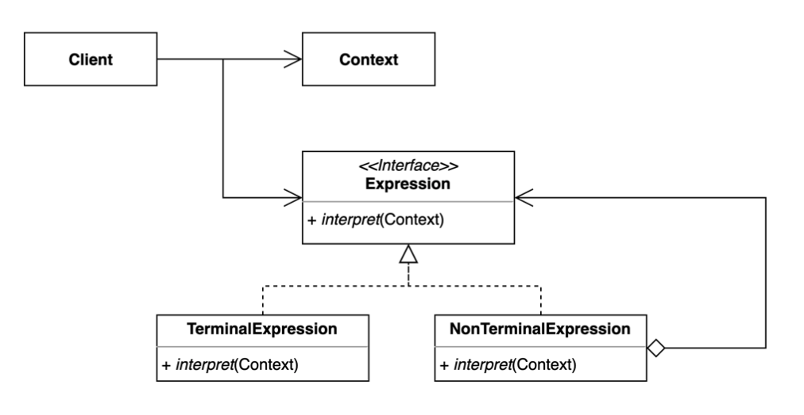

# 인터프리터 패턴 (Interpreter Pattern)

## 1. 인터프리터 패턴

- 인터프리터 패턴은 언어나 문법을 해석하고 실행하는 역할을 담당하는 패턴이다.
- 행위 패턴에 속한다.
- 문법에 등장하는 규칙을 클래스로 표현하고, 언어에서의 표현식을 해석하고 평가한다.
- 인터프리터 패턴에서는 문법 규칙을 나타내는 클래스를 정의하고, 이를 해석하여 실행할 수 있는 클래스를 만들어서 구성한다. 이때 해석하는 작업은 주로 문장의 구조를 분석하고 각 구성 요소를 적절한 동작으로 변환하는 것이다.
    - 예를 들어, 자연어로 작성된 수학 수식을 계산하는 프로그램을 만들기 위해서는 우선 문법 규칙을 정의하고, 이를 해석하여 수식을 계산하는 클래스를 구현해야 한다. 이때 문법 규칙은 수식에 대한 문법적인 구조를 나타내는 클래스를 만들어서 정의하고, 해석 작업은 각 구성 요소를 분석하여 적절한 계산 작업을 수행하는 클래스를 만들어서 구성한다.

### (1) 인터프리터 패턴의 장점

- 반복되는 패턴을 언어 또는 문법으로 정의하고 확장할 수 있다.
    - 여러 인스턴스에 대해 동일한 표현식 클래스와 인터프리터 로직을 사용할 수 있다. 즉 재사용성이 높아진다.
- 문법과 해석을 기본 로직에서 분리하여 별도의 클래스로 캡슐화하므로, 유지보수가 쉬워진다.
    - 기존 코드를 변경하지 않고 새로운 Expression을 만들 수 있다.
- 문법과 규칙을 계층 구조로 명시적으로 모델링하기 때문에 코드의 가독성이 높아진다.
- 문법과 요소의 관계를 이해하는 데 도움이 된다.

### (2) 인터프리터 패턴의 단점

- 복잡한 문법 규칙을 처리하는 경우, 클래스가 많아질 수 있고 코드의 유지보수가 어려워질 수 있다.
- 성능 관점에서 몇몇 사례에서는 인터프리터 패턴이 효율적인 해답이 아닐 수 있다.

### (3) 인터프리터 패턴의 구조



- `Context` : 모든 Expression에서 사용하는 공통된 정보가 담겨있다.
- `Expression` : 우리가 표현하는 문법을 나타낸다. `Context` 를 참조하여 `interpret` 을 수행한다.
- `TerminalExpression` : 그 자체로 종료되는 `Expression` 이다.
- `NonTerminalExpression` : 다른 `Expression` 들을 재귀적으로 참조하고 있는 `Expression` 이다.

## 2. 예제 : Postfix

### (1) Before : 스택을 이용한 알고리즘으로 구현

```java
public class App {

    public static void main(String[] args) {
        PostfixNotation postfixNotation = new PostfixNotation("123+-4+");
        int result = postfixNotation.calculate();
        System.out.println(result);
    }

}

public class PostfixNotation {
    private final String expression;

    public PostfixNotation(String expression) {
        this.expression = expression;
    }

    private int calculate() {
        Stack<Integer> numbers = new Stack<>();

        for (char c : this.expression.toCharArray()) {
            switch (c) {
                case '+':
                    numbers.push(numbers.pop() + numbers.pop());
                    break;
                case '-':
                    int right = numbers.pop();
                    int left = numbers.pop();
                    numbers.push(left - right);
                    break;
                default:
                    numbers.push(Integer.parseInt(c + ""));
            }
        }

        return numbers.pop();
    }
}
```

### (2) After : 인터프리터 패턴을 적용하여 문법을 만들어서 구현

```java
public class App {

    public static void main(String[] args) {
        PostfixExpression expression = PostfixParser.parse("xyz+-a+");
        int result = expression.interpret(Map.of('x', 1, 'y', 2, 'z', 3, 'a', 4));
        System.out.println(result);
    }

}
```

```java
public class PostfixParser {
    public static PostfixExpression parse(String expression) {
        Stack<PostfixExpression> stack = new Stack<>();

        for (char c : expression.toCharArray()) {
            stack.push(getExpression(c, stack));
        }

        return stack.pop();
    }

    private static PostfixExpression getExpression(char c, Stack<PostfixExpression> stack) {
        switch (c) {
            case '+':
                return new PlusExpression(stack.pop(), stack.pop());
            case '-':
                PostfixExpression right = stack.pop();
                PostfixExpression left = stack.pop();
                return new MinusExpression(left, right);
            default:
                return new VariableExpression(c);
        }
    }
}
```

```java
public interface PostfixExpression {
    int interpret(Map<Character, Integer> context);
}
```

- `PlusExpression` 과 `MinusExpression` 은 `NonTerminalExpression` 이다.

```java
public class PlusExpression implements PostfixExpression {
    private PostfixExpression left;
    private PostfixExpression right;

    public PlusExpression(PostfixExpression left, PostfixExpression right) {
        this.left = left;
        this.right = right;
    }

    @Override
    public int interpret(Map<Character, Integer> context) {
        return left.interpret(context) + right.interpret(context);
    }
}
```

```java
public class MinusExpression implements PostfixExpression {
    private PostfixExpression left;
    private PostfixExpression right;

    public MinusExpression(PostfixExpression left, PostfixExpression right) {
        this.left = left;
        this.right = right;
    }

    @Override
    public int interpret(Map<Character, Integer> context) {
        return left.interpret(context) - right.interpret(context);
    }
}
```

- `VariableExpression` 은 `TerminalExpression` 이다.

```java
public class VariableExpression implements PostfixExpression {
    private Character character;

    public VariableExpression(Character character) {
        this.character = character;
    }

    @Override
    public int interpret(Map<Character, Integer> context) {
        return context.get(this.character);
    }
}
```

## 3. 내용 출처 및 참고

- https://shan0325.tistory.com/29
- https://jake-seo-dev.tistory.com/508
- https://kingchan223.tistory.com/311
