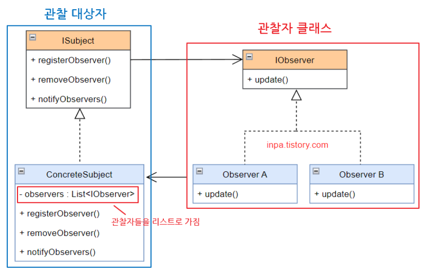
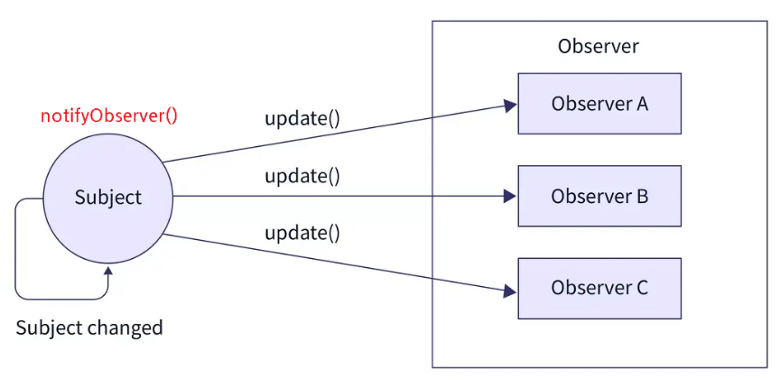

# Observer Pattern?

- 관찰 대상의 상태에 변화가 있을 때마다 대상이 관찰자들에게 변화를 통지하고, 관찰자들은 알림을 받아 조치를 취하는 패턴
- 즉, 어떤 객체의 상태가 변할 때 그와 연관된 객체들에게 알림을 보내는 디자인 패턴
- 주로 분산 이벤트 핸들링 시스템 구현에 사용되며 다른 패턴들과 다르게 **일대다 의존성을 가짐**
    - Pub/Sub(발행, 구독) 모델로도 알려져있음

## 예시 1. 유튜브


- 유튜브 채널은 발행자, 즉 관찰 대상
- 구독자들은 관찰자
- 유튜버가 영상을 올리거나 커뮤니티 글을 쓰게 되면 구독자들은 알림을 받고 변화를 탐지함
    
    *✋ 프로그래밍적으로 옵저버 패턴은 ‘관찰’보다 ‘전달’의 느낌*
    
    *관찰자라는 뉘앙스는 능동적으로 느껴지지만, 사실 대상 객체로부터 정보가 오길 기다리고 있기 때문*
    

# 구조



- ISubject : 관찰 대상자 정의 인터페이스
- ConcreteSubject : 관찰 당하는 대상자/발행자/게시자
    - 관찰자들을 List로 가짐
    - 관찰자들을 내부 리스트에 등록/삭제하는 인프라 가짐
    - 상태 변경, 동작 실행 시 관찰자들에게 알림 발행

- IObserver : 구독자 묶는 인터페이스
- Observer : 관찰자/구독자/알림 수신자
    - 대상이 발행한 알림에 대해 현재 상태 취득
    - 대상의 변화에 대한 전후 정보 처리

⇒ Subject가 Observer를 **리스트로 관리**하고, 리스트 모두 **메서드 위임을 통한 전파 행위**를 한다는 것이 핵심

# 흐름



1. 대상자와 관찰자는 1:M 관계
2. 대상자의 상태에 변화가 있을 경우 관찰자에게 통보
3. 통보받은 관찰자는 값을 바꾸거나 삭제하는 등 각자 알맞는 메서드 수행
4. 관찰자는 대상자의 그룹에 언제든 삭제/추가 될 수 있음
포함될 경우 정보 전달 O, 삭제될 경우 정보 전달 X

# 언제 사용하는가?

1. 앱이 한정된 시간, 특정 케이스에서 다른 객체를 관찰하는 경우
2. 대상 객체의 상태 변화에 따라 다른 객체의 동작을 유발할 때
3. 한 객체의 상태가 변경됐을 경우, 다른 객체 또한 변경될 때
But, 어떤 객체들이 변경되어야 하는지 몰라도 될 때
4. MVC 패턴
    - Model ↔ View는 Subject ↔ Observer
    - 하나의 Model에 복수의 View가 대응

# 장점

- 대상의 상태를 주기적으로 조회하지 않고도 자동 감지 가능
- 대상의 코드를 변경하지 않고 새 관찰자 클래스를 도입할 수 있어 개방폐쇄원칙을 준수함
- 런타임 시점에서 대상자와 구독 알림 관계를 맺을 수 있음
- 대상과 관찰자의 느슨한 결합 가능

# 단점

- 관찰자들의 알림 순서를 제어할 수 없으며, 무작위 순서임
    - 하드 코딩 가능하긴 하지만, 복잡도&결합도가 높아지기 때문에 비추천 방식임
- 자주 구성할 시 구조 및 동작을 알아보기 힘들며 코드 복잡도가 증가함
- 다수의 관찰자 객체를 등록하고 해지하지 않는다면 메모리 누수 발생 가능성 존재

# 예시 2. 날씨 API

- Subject : 현재 날씨의 온도, 습도, 기압 데이터 제공
- Object : 각 국가 사용자들은 해당 데이터를 제공하는 서비스 개발

## 패턴 적용 X

```java
class WeatherAPI {
    float temp; // 온도
    float humidity; // 습도
    float pressure; // 기압

    void measurementsChanged() {
        // 랜덤 값 추출
        temp = new Random().nextFloat() * 100;
        humidity = new Random().nextFloat() * 100;
        pressure = new Random().nextFloat() * 100;
    }
}
```

```java
interface IUser {
	void display();
}

class KoreanUser implements IUser {
    WeatherAPI api; // api서비스 합성
    String name;

    KoreanUser(String name, WeatherAPI api) {
        this.name = name;
        this.api = api;
    }

    public void display() {
        System.out.printf("%s님이 현재 날씨 상태를 조회함 : %.2f°C %.2fg/m3 %.2fhPa\n", name, api.temp, api.humidity, api.pressure);
    }
}
```

```java
public class Client {
    public static void main(String[] args) {
        WeatherAPI api = new WeatherAPI();

        List<IUser> users = new ArrayList<>();
        users.add(new KoreanUser("김연동", api));
        users.add(new KoreanUser("홍창기", api));
        users.add(new KoreanUser("박준영", api));

        // 날씨 정보 갱신
        api.measurementsChanged();

        for(IUser u: users) {
            u.display();
        }

        api.measurementsChanged();
    }
}
```

- 유저 관리 프로세스를 클라이언트에서 진행 중
- 날씨 데이터가 갱신될 때 데이터를 전달받는 것이 아닌, 자신의 클래스 내 api 객체를 직접 조회함

## 패턴 적용 O

```java
interface Subject {
    void registerObserver(Observer o); // 구독 추가
    void removeObserver(Observer o); // 구독 삭제
    void notifyObservers(); // Subject 객체의 상태 변경시 모든 옵저버에게 알림
}

class WeatherAPI implements Subject{
    float temp; // 온도
    float humidity; // 습도
    float pressure; // 기압

    // 관찰자 리스트
    List<Observer> subscribers = new ArrayList<>();

    void measurementsChanged() {
        temp = new Random().nextFloat() * 100;
        humidity = new Random().nextFloat() * 100;
        pressure = new Random().nextFloat() * 100;

        notifyObservers(); // 날씨 정보 변화시 관찰자들에게 바로 알림
    }

    @Override
    public void registerObserver(Observer o) {
        subscribers.add(o);
    }

    @Override
    public void removeObserver(Observer o) {
        subscribers.remove(o);
    }

    // 이벤트 전파
    @Override
    public void notifyObservers() {
        for(Observer o: subscribers) {
            o.display(this); // 자신의 객체를 매개변수로 주어 상태를 구독자들에게 알림
        }
    }
}
```

```java
interface Observer {
    void display(WeatherAPI api);
}

class KoreanUser implements Observer {
    String name;

    KoreanUser(String name) {
        this.name = name;
    }

    public void display(WeatherAPI api) {
        System.out.printf("%s님이 현재 날씨 상태를 조회함 : %.2f°C %.2fg/m3 %.2fhPa\n", name, api.temp, api.humidity, api.pressure);
    }
}
```

```java
public class Client {
    public static void main(String[] args) {
        WeatherAPI api = new WeatherAPI();

        api.registerObserver(new KoreanUser("김연동"));
        api.registerObserver(new KoreanUser("홍창기"));
        api.registerObserver(new KoreanUser("박준영"));
        
        // 정보 변경시 알아서 전파되어 출력
        api.measurementsChanged();
    }
}
```

# 자바 내장 클래스

- java.util.Observer : 관찰자 인터페이스 (implements)
- java.util.Observable : 대상 클래스 (extends)