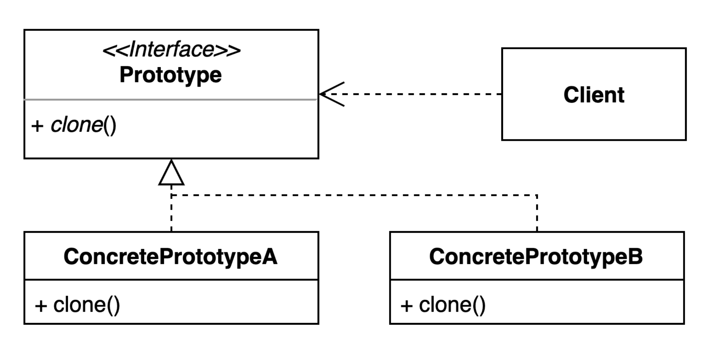

# Prototype Pattern?

- 객체를 생성할 때, 기존 객체의 복사를 통해 새로운 객체를 생성하는 디자인 패턴
- 복제를 통해 생성된 객체는 Prototype 객체라고 부름

# 구조

- 대상 interface는 데이터 보호를 이유로 Clonable()를 구현해야만 사용 가능
- 복사는 Java에서 제공하는 clone() 사용

# 언제 사용하는가?
1. 객체 생성 방법이 복잡할 때
2. 구체적인 객체 타입 모를 때
3. 객체가 캡슐화 되어 있음

# 장점
- 객체 생성을 위한 복잡한 과정 간소화 -> 오버헤드 줄일 수 있음
- 유사한 객체 생성 비용과 시간의 감소

# 단점
- 복제 대상 객체가 복잡한 내부 구조를 가지고 있다면, 요구사항에 맞는 정확한 복사본 보장할 수 없음 (Deep copying Complexity)
- 변형 가능한 상태의 객체를 복제한다면, 예외사항 발생 가능 (Managing object state)

# 예시. 몬스터 게임

- 필드에 몬스터를 대량으로 출몰시켜야 함
- 매번 몬스터를 생성하는 것이 아닌, 한 마리의 몬스터를 복사해서 다른 곳에 뿌릴 수 없을까?

```java
// Prototype
public interface Monster extends Cloneable {
    String getName();
    Monster createClone();
}

// ConcretePrototype
public class MonsterA implements Monster {
    private String name;

    public MonsterA(String name) {
        this.name = name;
    }

    @Override
    public String getName() {
        return name;
    }

    @Override
    public Monster createClone() {
        Monster monster;
        try {
            monster = (Monster) clone();
        } catch (CloneNotSupportedException e) {
            throw new RuntimeException(e);
        }
        return monster;
    }
}
```

```java
// Registry
public class MonsterRegistry {
    private Map<String, Monster> registry;

    public MonsterRegistry() {
        this.registry = new HashMap<>();
    }

    public void register(Monster monster) {
        registry.put(monster.getName(), monster);
    }

    public Monster getMonster(String name) {
        return registry.get(name);
    }
}

// Client
public class MonsterMaker {
    private MonsterRegistry registry;

    public MonsterMaker(MonsterRegistry registry) {
        this.registry = registry;
    }

    public void register(Monster monster) {
        registry.register(monster);
    }

    public Monster create(String monsterName) {
        return registry.getMonster(monsterName).createClone();
    }
}
```

```java
public class Client {
    public static void main(String[] args) {
        MonsterMaker monsterMaker = new MonsterMaker(new MonsterRegistry());
        MonsterA mobA = new MonsterA("mobA");
        monsterMaker.register(mobA);

        Monster mobA1 = monsterMaker.create("mobA");
        System.out.println(mobA.getName().equals(mobA1.getName())); // true
        System.out.println(mobA.equals(mobA1)); // false
    }
}
```