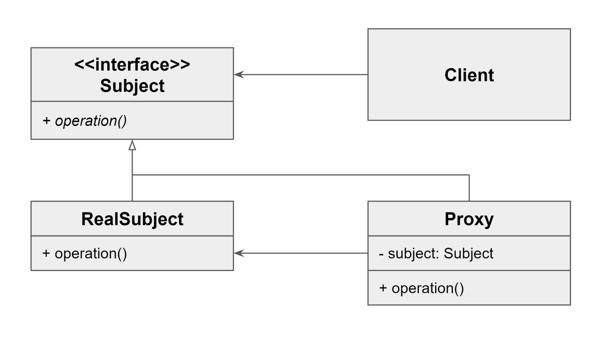

# Proxy Pattern
## Proxy Pattern이란?
- Proxy는 사전적으로 대리 혹은 대리인과 같은 의미
- 사용자가 접근하고 싶은 오브젝트에 접근 전 프록시 오브젝트라 불리는 오브젝트에 접근을 먼저 하도록 강제하는 것
- 오브젝트 접근 요청 시 해당 요청은 먼저 프로시 오브젝트로 간다

## Proxy Pattern 사용이유
- 객체의 접근 제어
- 객체 생성의 비용 절감 
- 원격 시스템과의 통신 등을 위해 사용

## Proxy Pattern의 구성요소
### 클라이언트가 접근할 Subject와 이에 대한 구현체인 RealSubject, Proxy가 존재


### (1) Subject 
- Proxy와 RealSubject가 모두 구현하는 인터페이스로 클라이언트가 프록시와 실제 대상을 동일하게 다룰 수 있도록 정의

### (2) RealSubject 
- 클라이언트가 직접 상호작용하는 실제 객체
- Proxy가 표현하고자 하는 실제 오브젝트를 정의

### (3) Proxy
- RealSubject를 감싸며 실제 작업을 수행하는 주체로 클라이언트와 RealSubject 사이에 위치한 중간 객체
- RealSubject의 같은 이름의 메서드를 호출하며, 클라이언트의 요청을 처리하기 전이나 후에 추가적인 작업을 수행가능

## Proxy Pattern 유형
### 가상 프록시 (Virtual Proxy)
- 실제 객체의 생성 비용이 많이 드는 경우, 실제 객체가 필요할 때까지 생성을 미루기 위해 사용
- 실제 객체를 생성하지 않고도 클라이언트와 상호작용할 수 있는 경량의 프록시 객체를 제공

### 보호 프록시 (Protection Proxy)
- 실제 객체에 대한 접근을 제어하기 위해 사용
- 권한 검사와 같은 작업을 통해 클라이언트가 실제 객체에 접근할 수 있는지 확인

### 원격 프록시 (Remote Proxy)
- 다른 주소 공간에 있는 객체에 대한 접근을 제어
- 주로 분산 시스템이나 원격 서버와의 통신을 추상화하기 위해 사용

### 캐싱 프록시 (Caching Proxy)
- 요청된 데이터를 캐싱하여 반복적인 요청에 대해 동일한 결과를 반환하는 데 사용
- 데이터의 재사용을 통해 성능을 향상시킬 수 있다.
  

## 사용예제
### 인터페이스 : subject
```java
public interface CarMaker {
    void makeCar();
}
```

### 구현체 : RealSubject
```java
public class MyCarMaker implements CarMaker{
    Random random = new Random();

    @Override
    public void makeCar() {
        randomDelay();
        System.out.println("드디어 차를 완성했습니다.");
    }

    private void randomDelay() {
        try {
            int randomDelay = random.nextInt(501) + 1000;
            Thread.sleep(randomDelay);
        } catch (InterruptedException e) {
            e.printStackTrace();
        }
    }
}
```

### 프록시 : Proxy
```java
public class MyCarMakerProxy implements CarMaker {
    CarMaker carMaker;

    @Override
    public void makeCar() {
        if (this.carMaker == null) {
            System.out.println("최초로 CarMaker 를 호출하여 CarMaker 가 생성됩니다.");
            this.carMaker = new MyCarMaker();
        }

        long beforeMs = System.currentTimeMillis();
        carMaker.makeCar();
        long afterMs = System.currentTimeMillis();
        System.out.println("걸린 시간 :" + (afterMs - beforeMs));
    }
}
```
### 메인 : 클라이언트
```java
public class Client {
    public static void main(String[] args) {
        CarMaker carMaker = new MyCarMakerProxy();
        carMaker.makeCar();
        carMaker.makeCar();
    }
}

// 결과
최초로 CarMaker 를 호출하여 초기화됩니다.
드디어 차를 완성했습니다.
걸린 시간 :1064
드디어 차를 완성했습니다.
걸린 시간 :1494
```

## 정리
- 프록시는 실제 서비스와 같은 이름의 메서드를 구현, 이때 인터페이스를 사용
- 프록시는 실제 서비스에 대한 참조 변수를 갖는다.(합성)
- 프록시는 실제 서비스의 같은 이름을 가진 메서드를 호출하고 그 값을 클라이언트에게 반환
- 프록시는 실제 서비스의 메서드 호출 전후에 별도의 로직을 수행


