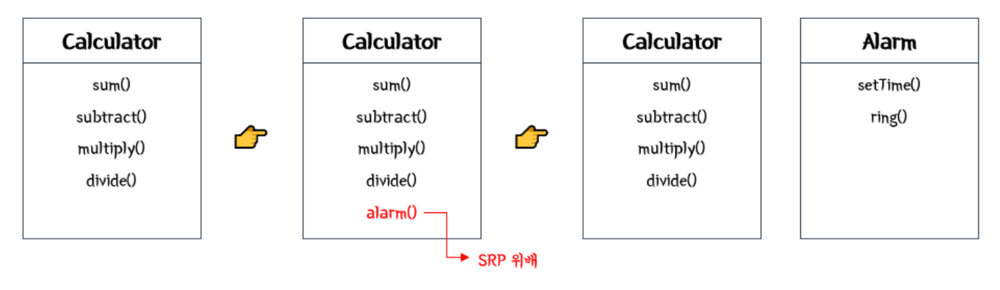
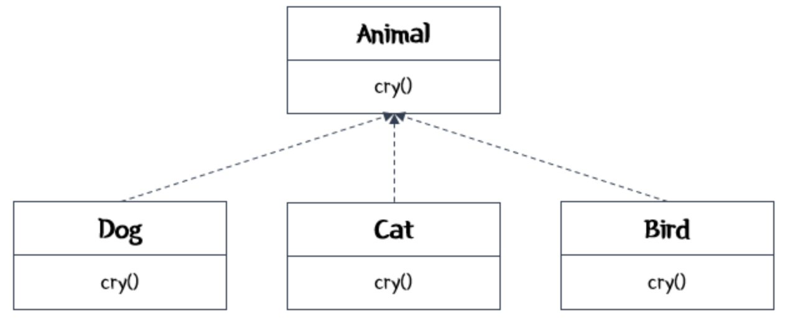
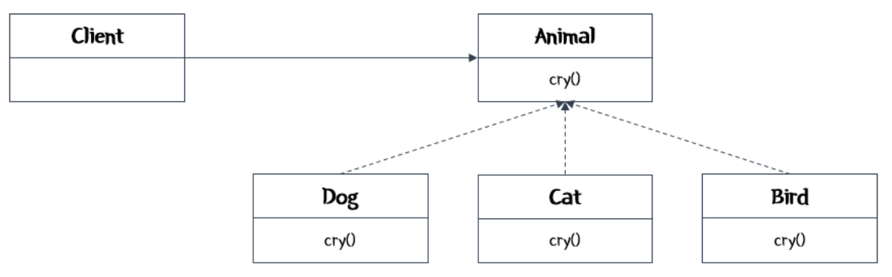
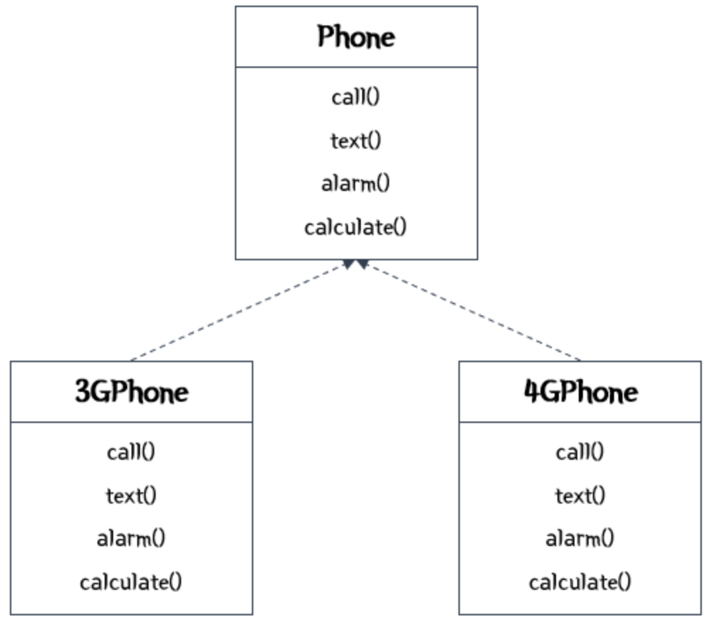
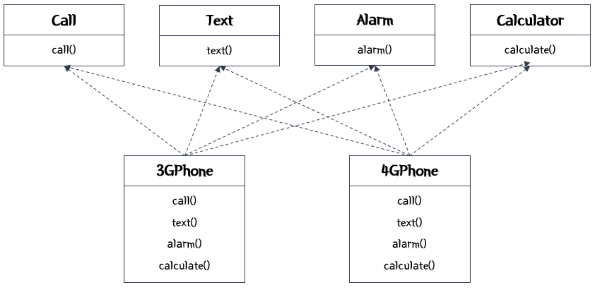

# Solid Pattern
## Solid Pattern이란?
- 객체 지향 프로그래밍과 설계의 5가지 기본 원칙
- 이 원칙들은 소프트웨어의 유지보수성, 확장성, 유연성을 향상시키기 위함
- 컴퓨터 프로그래밍에서 Solid란 SW작업에서 프로그래머가 소스 코드를 읽기 쉽고 확장하기 쉽게 될 때까지 SW 소스 코드를 리팩토링하여 코드 냄새를 제거

## SOLID 원칙
### (1) 단일 책임원칙(Single Responsibility Principle : SRP)

 > 객체는 단 하나의 책임만 가져야한다.

- 객체에 책임이 많을수록 객체 내부에서 서로 다른 역할을 수행하는 코드끼리 강하게 결합할 가능성이 높아짐
- 객체마다 책임을 제대로 나누지 않으면 시스템은 매우 복잡해짐
- 객체가 하는 일에 변경이 있을 때에 해당 기능을 사용하는 부분을 모두 다시 테스트해야 하기 때문
- 한 객체가 단 하나의 일만 가지도록 분배하여 시스템에 변화가 생겨도 그 영향을 최소화

### (2) 개방-폐쇄 원칙 (Open-Closed Principle : OCP)
 
 > 확장에는 개방되고 변경에는 닫혀있어야 한다.

- 여러 객체에서 사용하는 동일한 기능을 인터페이스에 정의하는 방법 : 캡슐화

### (3) 리스코프 치환 법칙(Liskov Subsituation Principle : LSP)
> 부모 클래스와 자식 클래스 사이의 행위가 일관성 있어야 한다.

- 자식 클래스는 최소한 부모 클래스에서 가능한 행위를 수행할 수 있어야 한다.
- 자식 클래스는 부모 클래스의 역할을 대체할 수 있어야 한다.
- 자식 클래스는 부모 클래스의 책임을 무시하거나 재정의하지 않고, 확장만 수행
- 오버라이드(재정의)는 가급적 피하기
  
### (4) 의존 역전 원칙(Dependency Inversion Principle : DIP)
 
> 의존 관계를 맺을 때, 변화하기 쉬운 것 or 자주 변화하는 것보다  
> 변화하기 어려운 것, 거의 변화가 없는 것의 의존해야 한다.

### (5) 인터페이스 분리 원칙(Interface Segregation Principle: ISP)
### Bad Exapmle
 

### good Exapmle
 

> 클라이언트 자신이 이용하지 않는 기능에는 영향을 받지 않아야 한다.
> 즉, 인터페이스를 클라이언트에 특화되도록 분리시키라는 설계 원칙 

- 객체들이 서로 정보를 주고 받을 때 의존 관계가 형성
- 객체들은 추상성이 낮은 클래스보다 추상성이 높은 클래스와 의존 관계를 맺어야 한다.

