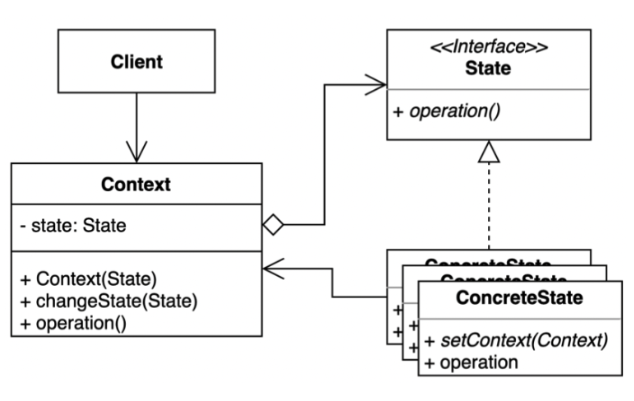

## State Pattern이란?
- 객체가 특정 상태에 따라 행위를 달리하는 상황
- 직접 상태를 체크하여 상태에 따라 행위를 호출하지 않고, 상태를 객체화 하여 행동 할 수 있도록 위임하는 패턴

    - 상태란 객체가 가질 수 있는 어떤 조건이나 상황을 의미
    - 객체의 특정 상태 -> 클래스
    - 해당 상태에서 할 수 있는 행위 -> 각 클래스 내의 메서드
    - 이러한 상태 클래스들을 인터페이스로 캡슐화해, 클라이언트에서는 인터페이스를 호출하는 방식

## State Pattern의 필요성

### 노트북 전원 예시

- 노트북이 켜져있는 상태에서 전원 버튼을 누르면 전원을 끌 수 있음
- 노트북이 꺼져있는 상태에서 전원 버튼을 누르면 전원을 켤 수 있음

```Java
public class Laptop {
    public static String ON = "on";
    public static String OFF = "off";
    private String powerState = "";

    public Laptop(){
        setPowerState(Laptop.OFF);
    }

    // 상태 변경
    public void setPowerState(String powerState){
        this.powerState = powerState;
    }

    // 현재 상태
    public void powerPush(){
        if ("on".equals(this.powerState)) {
            System.out.println("전원 off");
        }
        else {
            System.out.println("전원 on");
        }
    }
}
```
```Java
public class Client {
    public static void main(String args[]){
        Laptop laptop = new Laptop();
        laptop.powerPush();
        laptop.setPowerState(Laptop.ON);
        laptop.powerPush();
    }
}
```

#### _만약 절전모드를 추가한다면?_
- 노트북이 켜져있는 상태에서 전원 버튼을 누르면 전원을 끌 수 있음
- 노트북이 꺼져있는 상태에서 전원 버튼을 누르면 절전모드가 됨
- 노트북이 절전모드인 상태에서 전원 버튼을 누르면 전원을 켤 수 있음

```Java
public class Laptop {
    public static String ON = "on";
    public static String OFF = "off";
    public static String SAVING = "saving";
    private String powerState = "";

    public Laptop(){
        setPowerState(Laptop.OFF);
    }

    public void setPowerState(String powerState){
        this.powerState = powerState;
    }

    public void powerPush(){
        if ("on".equals(this.powerState)) {
            System.out.println("전원 off");
        }
        else if ("saving".equals(this.powerState)){
            System.out.println("전원 on");
        }
        else {
            System.out.println("절전 모드");
        }
    }
}
```
```Java
public class Client {
    public static void main(String args[]){
        Laptop laptop = new Laptop();
        laptop.powerPush();
        laptop.setPowerState(Laptop.ON);
        laptop.powerPush();
        laptop.setPowerState(Laptop.SAVING);
        laptop.powerPush();
        laptop.setPowerState(Laptop.OFF);
        laptop.powerPush();
        laptop.setPowerState(Laptop.ON);
        laptop.powerPush();
    }
}
```

- 상태가 하나 추가되었기 때문에 조건문이 하나 추가됨
- 현재는 문제가 없지만, 상태가 굉장히 많아질 경우 상태에 따른 행위를 파악하기 어려워짐
- State Pattern을 사용하면 새로운 행동을 추가하더라도 다른 행동에 영향을 주지 않음
- 이렇듯 상태에 따라 행위를 달리해야 하는 경우에 사용하는 패턴을 **State Pattern**이라고 함

## State Pattern의 적용



- 각 상태들을 의미하는 On, Off, Saving 상태를 클래스로 정의
- 이들을 하나의 인터페이스로 묶음
- 이후 Laptop이 상태 인터페이스의 메서드를 호출하면, 각 상태 클래스에서 정의된 행위가 수행되는 방식
- 이때, 상태 클래스는 싱글톤 클래스로 구성해야함. 상태는 그 객체의 현재를 나타내는 것이기 때문에 대부분의 상황에서 유일하게 존재해야함

1. 전원 상태를 캡슐화한 인터페이스 선언
```Java
public interface PowerState {
    public void powerPush();
}
```

2. PowerState 인터페이스를 구현한 각 상태 클래스를 정의
```Java
public class On implements PowerState{
    public void powerPush(){
        System.out.println("전원 off");
    }
}
```
```Java
public class Off implements PowerState {
    public void powerPush(){
        System.out.println("절전 모드");
    }
}
```
```Java
public class Saving implements PowerState {
    public void powerPush(){
        System.out.println("전원 on");
    }
}
```

3. Laptop 클래스 적용
```Java
public class Laptop {
    private PowerState powerState;

    public Laptop(){
        this.powerState = new Off();
    }

    public void setPowerState(PowerState powerState){
        this.powerState = powerState;
    }

    public void powerPush(){
        powerState.powerPush();
    }
}
```

4. Client 클래스 정의
```Java
public class Client {
    public static void main(String args[]){
        Laptop laptop = new Laptop();
        On on = new On();
        Off off = new Off();
        Saving saving = new Saving();

        laptop.powerPush();
        laptop.setPowerState(on);
        laptop.powerPush();
        laptop.setPowerState(saving);
        laptop.powerPush();
        laptop.setPowerState(off);
        laptop.powerPush();
        laptop.setPowerState(on);
        laptop.powerPush();
    }
}
```
## State Pattern은 언제 사용?
- 객체의 상태에 따라 각기 다른 행동을 할 때
- 상태의 전환에 걸쳐 대규모의 조건 분기 코드와 중복 코드가 발생할 때
- 런타임단에서 객체의 상태를 유동적으로 변경해야할 때

## 장점
- 상태에 따른 동작을 개별 클래스로 옮겨서 관리할 수 있음
- 각 상태 클래스에서 동작을 관리하므로 코드 복잡도를 줄일 수 있음
- 단일 책임 원칙을 준수
- 개방 폐쇄 원칙을 준수
- 하나의 상태 객체만을 통해 변경이 일어나므로 일관성 없는 상태 주입을 방지할 수 있음

## 단점
- 상태 별로 클래스를 생성하므로, 무분별한 사용시 관리할 클래스 수의 증가
- 상태 클래스 개수가 많고 규칙이 자주 변경될 경우 Context의 상태 변경 코드 복잡해질 수 있음
- 객체 상태가 별로 없거나, 변경이 자주 일어나지 않을 경우 과한 사용으로 판단될 수 있음

## Strategy Pattern과 차이점?
- **상태 패턴**은 코드 내의 조건문을 대체하려는 목적
- **전략 패턴**은 상속을 대체하려는 목적, 사용자가 쉽게 알고리즘 전략을 바꿀 수 있도록 유연성 제공