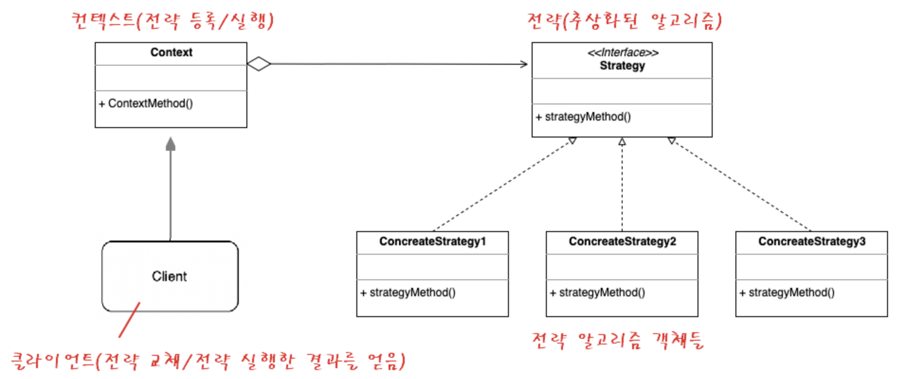

# 전략 패턴 (Strategy Pattern)

## 1. 전략 패턴

- 전략 패턴은 실행(런타임) 중에 알고리즘 전략을 선택해서 실시간으로 바뀌도록 할 수 있게 하는 행위 디자인 패턴이다.
- 여기서 전략이란 일종의 알고리즘이 될 수도 있으며, 기능이나 동작이 될 수도 있는 특정한 목표를 수행하기 위한 행동 계획이다.
- 어떤 일을 수행하는 알고리즘이 여러 가지 존재할 때, 동작들을 미리 전략으로 정의해놓고 **손쉽게 전략을 교체할 수 있도록 하는 패턴**이다. 따라서 알고리즘 변형이 빈번하게 필요한 경우에 적합하다.

### (1) 전략 패턴 구조



- 전략 알고리즘 객체들 : 알고리즘, 행위, 동작을 객체로 정의한 구현체
- 전략 인터페이스 : 모든 전략 구현체에 대한 공용 인터페이스
- 컨텍스트 : 알고리즘을 실행해야 할 때마다 해당 알고리즘과 연결된 전략 객체의 메서드를 호출한다.
- 클라이언트 : 특정 전략 객체를 컨텍스트에 전달함으로써 전략을 등록하거나 변경하고, 전략 알고리즘을 실행한 결과를 누린다.

### (2) GoF의 디자인 패턴 책에서의 정의

1. 동일 계열의 알고리즘 군을 정의한다.
2. 각각의 알고리즘을 캡슐화한다.
3. 이들을 상호 교환이 가능하도록 만든다.
4. 알고리즘을 사용하는 클라이언트와 상관없이 독립적으로 알고리즘을 다양하게 변경할 수 있게 한다.

- 즉, 전략 패턴은 OCP 원칙, DIP 원칙, 합성, 다형성, 캡슐화 등 OOP 기술들의 총집합 버전이다.

### (3) 전략 패턴의 사용 시기

- 전략 알고리즘의 여러 버전 또는 변형이 필요한 경우 → 클래스화를 통해 관리할 수 있다.
- 알고리즘 코드가 노출되어서는 안되는 데이터에 액세스하거나 데이터를 활용하는 경우
- 알고리즘의 동작이 런타임에 실시간으로 교체되어야 하는 경우

### (4) 전략 패턴의 주의점

- 알고리즘이 많아질수록 관리해야 할 객체의 수가 늘어난다는 단점이 있다.
- 어플리케이션에서 알고리즘이 많지 않고 자주 변경되지 않는 경우에 전략 패턴을 이용하면, 새로운 클래스와 인터페이스를 만들어야 하므로 오히려 프로그램이 복잡해질 수 있다.
- 개발자는 적절한 전략을 선택하기 위해 전략 간의 차이점을 파악하고 있어야 하므로, 복잡도가 증가한다.

## 2. 예제 코드

### (1) 템플릿

```java
// 전략 = 추상화된 알고리즘
interface IStrategy {
    void doSomething();
}

// 전략 알고리즘 A
class StrategyA implements IStrategy {
    public void doSomething();
}

// 전략 알고리즘 B
class StrategyB implements IStrategy {
    public void doSomething();
}

// 컨텍스트 = 전략 등록 및 실행을 담당한다.
class Context {
    IStrategy strategy; // 전략 인터페이스를 합성
    
    // 전략 교체 메서드
    void setStrategy(IStrategy strategy) {
        this.strategy = strategy;
    }
    
    // 전략 실행 메서드
    void doSomething() {
        this.strategy.doSomething();
    }
}

// 클라이언트 = 전략을 교체하고, 전략을 실행한 결과를 얻는다.
class Client {
    public static void main(String[] args) {
        // 1. 전략 생성
        Context c = new Context();
        
        // 2. 전략 설정
        c.setStrategy(new StrategyA());
        
        // 3. 전략 실행
        c.doSomething();
        
        // 2. 전략 설정
        c.setStrategy(new StrategyB());
        
        // 3. 전략 실행
        c.doSomething();
    }
}
```

### (2) 예제 1

- 전략 패턴을 적용하지 않은 코드

```java
class TakeWeapon {
    public static final int SWORD = 0;
    public static final int SHIELD = 1;
    public static final int CROSSBOW = 2;
    
    private int state;
    
    void setWeapon(int state) {
        this.state = state;
    }
    
    void attack() {
        if (state == SWORD) {
            System.out.println("칼을 휘두르다");
        } else if (state == SHIELD) {
            System.out.println("방패로 밀친다");
        } else if (state == CROSSBOW) {
            System.out.println("석궁을 발사하다");
        }
    }
}
```

```java
class User {
    public static void main(String[] args) {
        // 플레이어 손에 무기 착용 전략을 설정
        TakeWeapon hand = new TakeWeapon();
        
        // 플레이어가 검을 들도록 전략 설정
        hand.setWeapon(TakeWeapon.SWORD);
        hand.attack(); // "칼을 휘두르다"
        
        // 플레이어가 방패를 들도록 전략 설정
        hand.setWeapon(TakeWeapon.SHIELD);
        hand.attack(); // "방패로 밀친다"
    }
}
```

- 전략 패턴을 적용한 코드

```java
// 전략 = 추상화된 알고리즘
interface Weapon {
    void offensive();
}

class Sword implements Weapon {
    @Override
    public void offensive() {
        System.out.println("칼을 휘두르다");
    }
}

class Shield implements Weapon {
    @Override
    public void offensive() {
        System.out.println("방패로 밀친다");
    }
}

class CrossBow implements Weapon {
    @Override
    public void offensive() {
        System.out.println("석궁을 발사하다");
    }
}
```

```java
// 컨텍스트 = 전략 등록 및 실행을 담당한다.
class TakeWeaponStrategy {
    Weapon weapon;
    
    void setWeapon(Weapon weapon) {
        this.weapon = weapon;
    }
    
    void attack() {
        weapon.offensive();
    }
}
```

```java
// 클라이언트 = 전략을 교체하고, 전략을 실행한 결과를 얻는다.
class User {
    public static void main(String[] args) {
        // 플레이어 손에 무기 착용 전략을 설정
        TakeWeaponStrategy hand = new TakeWeaponStrategy();
        
        // 플레이어가 검을 들도록 전략 설정
        hand.setWeapon(new Sword());
        hand.attack(); // "칼을 휘두르다"
        
        // 플레이어가 방패를 들도록 전략 변경
        hand.setWeapon(new Shield());
        hand.attack(); // "방패로 밀친다"
        
        // 플레이어가 석궁을 들도록 전략 변경
        hand.setWeapon(new Crossbow());
        hand.attack(); // "석궁을 발사하다"
    }
}
```

### (3) 예제 2 : 여러 기능 전략을 가진 로봇

- 전략 패턴을 적용하지 않은 코드

```java
public abstract class Robot {
    public abstract void display();
    public abstract void move();
}

class WalkingRobot extends Robot {
    public void display() {
        System.out.println("걷기 로봇");
    }
    public void move() {
        System.out.println("걸어서 배달합니다 삐-빅");
    }
}

class RunningRobot extends Robot {
    public void display() {
        System.out.println("달리는 로봇");
    }
    public void move() {
        System.out.println("달려서 배달합니다 삐-빅");
    }
}

class Main {
    public static void main(String[] args) {
        Robot robot1 = new WalkingRobot();
        robot1.display();
        robot1.move();

        Robot robot2 = new RunningRobot();
        robot2.display();
        robot2.move();
    }
}
```

```java
public abstract class Robot {
    public abstract void display();
    public abstract void move();
    public abstract void translate(); // 번역 메소드 하나를 추가했을 뿐인데
}

// 클래스 갯수가 두 배로 늘어나 버렸다!!

class KoreanWalkingRobot extends Robot {
    public void display() {
        System.out.println("걷기 로봇");
    }
    public void move() {
        System.out.println("걸어서 배달합니다 삐-빅");
    }
    public void translate() {
        System.out.println("한국어로 번역합니다 삐-비-빅");
    }
}

class KoreanRunningRobot extends Robot {
    public void display() {
        System.out.println("달리는 로봇");
    }
    public void move() {
        System.out.println("달려서 배달합니다 삐-빅");
    }
    public void translate() {
        System.out.println("한국어로 번역합니다 삐-비-빅");
    }
}

class JapaneseWalkingRobot extends Robot {
    public void display() {
        System.out.println("걷기 로봇");
    }
    public void move() {
        System.out.println("걸어서 배달합니다 삐-빅");
    }
    public void translate() {
        System.out.println("일본어로 번역합니다 삐-비-빅");
    }
}

class JapaneseRunningRobot extends Robot {
    public void display() {
        System.out.println("달리는 로봇");
    }
    public void move() {
        System.out.println("달려서 배달합니다 삐-빅");
    }
    public void translate() {
        System.out.println("일본어로 번역합니다 삐-비-빅");
    }
}
```

- 전략 패턴을 적용한 코드

```java
// 이동 전략 (추상화된 알고리즘)
interface MoveStrategy {
    void move();
}

class Walk implements MoveStrategy {
    public void move() {
        System.out.println("걸어서 배달합니다 삐-빅");
    }
}

class Run implements MoveStrategy {
    public void move() {
        System.out.println("달려서 배달합니다 삐-빅");
    }
}

// 번역 전략 (추상화된 알고리즘)
interface TranslateStrategy {
    void translate();
}

class Korean implements TranslateStrategy {
    public void translate() {
        System.out.println("한국어로 번역합니다 삐-비-빅");
    }
}

class Japanese implements TranslateStrategy {
    public void translate() {
        System.out.println("일본어로 번역합니다 삐-비-빅");
    }
}
```

```java
// 컨텍스트 = 전략 등록 및 실행을 담당한다.
public class Robot {
    MoveStrategy moveStrategy;
    TranslateStrategy translateStrategy;

    Robot(MoveStrategy moveStrategy, TranslateStrategy translateStrategy) {
        this.moveStrategy = moveStrategy;
        this.translateStrategy = translateStrategy;
    }

    void move() {
        moveStrategy.move();
    }

    void translate() {
        translateStrategy.translate();
    }

    void setMove(MoveStrategy moveStrategy) {
        this.moveStrategy = moveStrategy;
    }

    void setTranslate(TranslateStrategy translateStrategy) {
        this.translateStrategy = translateStrategy;
    }
}
```

```java
// 클라이언트 = 전략을 교체하고, 전략을 실행한 결과를 얻는다.
class User {
    public static void main(String[] args) {
        Robot robot = new Robot(new Walk(), new Korean());
        robot.move(); // 걸어서 배달합니다 삐-빅
        robot.translate(); // 한국어로 번역합니다 삐-비-빅

        // 로봇의 전략(기능)을 run과 Japanese 번역으로 변경한다.
        robot.setMove(new Run());
        robot.setTranslate(new Japanese());

        robot.move(); // 달려서 배달합니다 삐-빅
        robot.translate(); // 일본어로 번역합니다 삐-비-빅
    }
}
```

### (4) 예제 3 : 카드 결제 전략 시스템

```java
// 전략 = 추상화된 알고리즘
interface PaymentStrategy {
    void pay(int amount);
}

class KAKAOCardStrategy implements PaymentStrategy {
    private String name;
    private String cardNumber;
    private String cvv;
    private String dateOfExpiry;
    
    public KAKAOCardStrategy(String nm, String ccNum, String cvv, String expiryDate) {
        this.name = nm;
        this.cardNumber = ccNum;
        this.cvv = cvv;
        this.dateOfExpiry = expiryDate;
    }
    
    @Override
    public void pay(int amount) {
        System.out.println(amount + "원 paid using KAKAOCard.");
    }
}

class LUNACardStrategy implements PaymentStrategy {
    private String emailId;
    private String password;
    
    public LUNACardStrategy(String email, String pwd) {
        this.emailId = email;
        this.password = pwd;
    }
    
    @Override
    public void pay(int amount) {
        System.out.println(amount + "원 paid using LUNACard.");
    }
}
```

```java
// 컨텍스트 = 전략 등록 및 실행을 담당한다.
class ShoppingCart {
    List<Item> items;
    
    public ShoppingCart() {
        this.items = new ArrayList<Item>();
    }
    
    public void addItem(Item item) {
        this.items.add(item);
    }
    
    // 전략을 매개변수로 받아서 바로바로 전략을 실행
    public void pay(PaymentStrategy paymentMethod) {
        int amount = 0;
        
        for (Item item : items) {
            amount += item.price;
        }
        
        paymentMethod.pay(amount);
    }
}
```

```java
class Item {
    public String name;
    public int price;
    
    public Item(String name, int cost) {
        this.name = name;
        this.price = cost;
    }
}

// 클라이언트 = 전략을 교체하고, 전략을 실행한 결과를 얻는다.
class User {
    public static void main(String[] args) {
        // 쇼핑카트 전략 컨텍스트 등록
        ShoppingCart cart = new ShoppingCart();
        
        // 쇼핑 물품
        Item A = new Item("맥북 프로", 3000000);
        Item B = new Item("플레이스테이션", 30000);
        cart.addItem(A);
        cart.addItem(B);
        
        // LUNACard로 결제 전략 실행
        cart.pay(new LUNACardStrategy("kundol@example.com", "pukubababo")); // 4000원 paid using LUNACard.
        
        // KAKAOBank로 결제 전략 실행
        cart.pay(new KAKAOCardStrategy("Ju hongchul", "123456789", "123", "12/01")); // 4000원 paid using KAKAOCard.
    }
}
```

## 3. 내용 출처

- [https://inpa.tistory.com/entry/GOF-💠-전략Strategy-패턴-제대로-배워보자](https://inpa.tistory.com/entry/GOF-%F0%9F%92%A0-%EC%A0%84%EB%9E%B5Strategy-%ED%8C%A8%ED%84%B4-%EC%A0%9C%EB%8C%80%EB%A1%9C-%EB%B0%B0%EC%9B%8C%EB%B3%B4%EC%9E%90)
