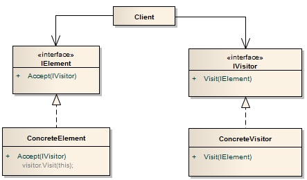

# Visitor Pattern?

- 알고리즘을 객체 구조에서 분리시켜 구조를 변경하지 않고도 새로운 동작을 기존 구조에 추가할 수 있게 함
- 새로운 행동을 기존 클래스들에 통합하는 대신 visitor(방문자)​라는 별도의 클래스에 배치
- 행동을 수행하는 기존 객체는 visitor 메서드의 인수로 전달됨

## 예시

- "나는 상점에 방문한다. 나는 ~를 한다."
- 일반적인 OOP는 '나'라는 객체가 '상점' 객체를 입력 받아 행동을 수행
- Visitor은 '상점' 객체가 '나' 객체를 입력 받아 '나' 객체의 행동을 호출함
- 사용자는 방문자의 입장이 아니라, 방문 장소에 입장에서 먼저 생각해보는 것
    
# 구조



- IElement: 방문 공간 인터페이스, accept()로 자신을 방문할 수 있게 함
- ConcreteElement : 방문 공간 구현 클래스
- IVisitor : 방문자 인터페이스
- ConcreteVisitor : 방문자 구현 클래스, 방문하는 구체적 방법들 구현

# 언제 사용하는가?

1. 자료 구조와 알고리즘을 분리해야할 경우
2. 자료 구조보다 알고리즘이 더 자주 바뀌는 경우

# 장점

- 작업 대상(방문 공간)과 작업 항목(방문 공간을 가지고 하는 일)의 분리
    - 작업 대상(방문 공간)은 단지 데이터를 담고있는 자료구조
    - 작업 주체(방문자)는 visit() 안에 대상을 입력받아 작업 항목 처리
- 즉, 데이터와 알고리즘의 분리로 데이터 독립성 향상

# 단점

- 새로운 방문 공간이 추가될 때마다 방문자 로직이 늘어남
- 즉, 두 객체의 결합도 향상

# 쇼핑몰 상품 가격 계산

- 쇼핑몰에서 구매한 상품들의 총 가격을 계산하는 프로그램
- 쇼핑몰에는 책, 음반, 영화 등 다양한 상품 존재하며, 각각의 상품은 가격을 계산하는 방법이 다름

```java
public interface Element {
    int accept(Visitor visitor);
}

public class Book implements Element {
    private int price;

    public Book(int price) {
        this.price = price;
    }

    public int getPrice() {
        return price;
    }

    @Override
    public int accept(Visitor visitor) {
        return visitor.visit(this);
    }
}

public class Music implements Element {
    private int price;

    public Music(int price) {
        this.price = price;
    }

    public int getPrice() {
        return price;
    }

    @Override
    public int accept(Visitor visitor) {
        return visitor.visit(this);
    }
}

public class Movie implements Element {
    private int price;

    public Movie(int price) {
        this.price = price;
    }

    public int getPrice() {
        return price;
    }

    @Override
    public int accept(Visitor visitor) {
        return visitor.visit(this);
    }
}
```

```java
public interface Visitor {
    int visit(Book book);
    int visit(Music music);
    int visit(Movie movie);
}

public class PriceCalculator implements Visitor {

    @Override
    public int visit(Book book) {
        return book.getPrice();
    }

    @Override
    public int visit(Music music) {
        return music.getPrice() * 2;
    }

    @Override
    public int visit(Movie movie) {
        return movie.getPrice() * 3;
    }
}
```

```java
public class Main {
    public static void main(String[] args) {
        Element book = new Book(10000);
        Element music = new Music(5000);
        Element movie = new Movie(15000);

        Visitor visitor = new PriceCalculator();

        int totalPrice = book.accept(visitor) + music.accept(visitor) + movie.accept(visitor);

        System.out.println("Total price = " + totalPrice);
    }
}
```
1. 새로운 상품이 추가될 때마다 객체 구조를 수정하지 않고도
2. PriceCalculator 클래스의 visit 메소드를 추가하거나 수정함으로써
3. 가격 계산 방식을 변경할 수 있습니다.