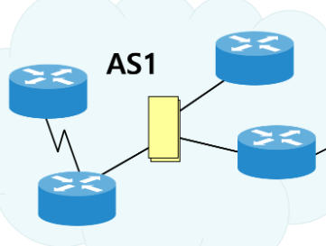
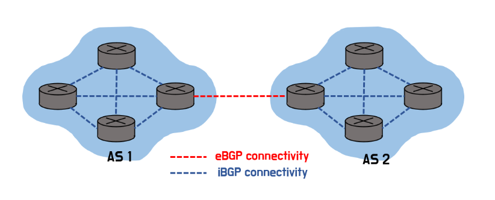
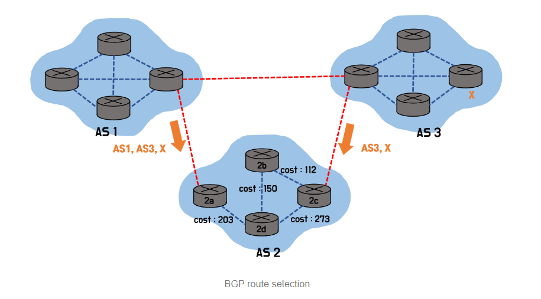

# BGP(Border Gateway Protocol)

## 들어가기 전
### AS란?

- 동일한 라우팅 정책으로 하나의 관리자에 의하여 운영되는 네트워크
- 한 회사나 단체에서 관리하는 라우터 집단을 자율 시스템 즉, AS라 한다
- 네트워크의 관리범위를 계층적으로 체계화하고 단위 별로 라우팅 정보를 효율적으로 관리하기 위하여 AS를 사용

## BGP란?

- Border Gateway Protocol
- 경계 게이트웨이 프로토콜
- AS 간에 경로 정보를 교환하는 데 사용
- 인터넷 상의 다양한 네트워크들이 서로 데이터를 주고받을 수 있도록 경로 정보를 효율적으로 교환하고 관리

## BGP의 유형
### 1) iBGP
- 서로 같은 AS 상의 Border Gateway들 끼리의 연결을 담당하는 BGP.

### 2) eBGP
- 서로 다른 AS 상의 Border Gateway들 끼리의 연결을 담당하는 BGP, inter-AS 라우팅

##  iBGP와 내부라우팅 프로토콜의 차이
### iBGP
- 외부 네트워크와의 연결 경로를 관리, 내부 AS 내에서 외부 경로 정보를 공유하는 데 사용
- 복잡한 정책 기반 라우팅과 대규모 네트워크 관리를 위해 설계

### 내부 라우팅 프로토콜 (Interior Gateway Protocol : IGP)
- 단일 AS 내의 최적 경로를 찾고, 네트워크 내부의 라우팅을 효율적으로 관리하기 위해 사용

## BGP 특징
### 1. 대규모 네트워크
- 인터넷의 핵심 구성 요소 중 하나
- 인터넷 서비스 제공 업체(ISP)등의 대규모 네트워크에서 사용
### 2. 경로 벡터
- 경로 벡터 라우팅 프로토콜로 분류
- 라우터가 AS간 라우팅 정보를 교환할 때, 해당 경로의 전체 경로 정보를 교환하는 것을 의미
### 3. 인터넷 경로 선택
- 인터넷 경로 선택을 위한 기능을 제공
- 여러 경로 중 최정의 경로를 선택가능
### 4. 속도 제한
- 속도 제한을 사용하여 네트워크의 안정성을 보장
- 경로 정보를 전송할 때, 최대 전송 속도를 제한
### 5. 보안
- 다양한 보안 기능 제공
- 라우팅 정보의 위변조 방지

## BGP route selection
### 경로 선택 알고리즘
- AS-PATH와 NEXT-HOP 뿐만 아니라 지역 선호도를 BGP 속성에 추가해 경로를 선택하는 라우팅 알고리즘
- 지역 선호도는 네트워크 관리자의 정책에 따른다.
- 가장 높은 지역 선호값을 가진 경로를 선택, 여러 개라면 이중 최단 AS-PATH를 가진 경로로 선택
- 그럼에도 여러 경로가  존재하면, 뜨거운 감자 라우팅을 실행해 경로를 선택
#
### BGP 경로 선택 우선순위
- 1. Highest Weight: 가장 높은 가중치를 가진 경로.
- 2. Highest Local Preference: AS 내에서 가장 높은 지역 선호도를 가진 경로.
- 3. Locally Originated: 로컬에서 생성된 경로.
- 4. Shortest AS Path: 가장 짧은 AS 경로를 가진 경로.
- 5. Lowest Origin Type: IGP < EGP < Incomplete 순서로 낮은 유형의 경로.
- 6. Lowest MED (Multi-Exit Discriminator): 동일한 AS에서 들어오는 경로 중 가장 낮은 MED 값을 가진 경로.
- 7. eBGP over iBGP: eBGP 경로가 iBGP 경로보다 우선.
- 8. Lowest IGP Metric to BGP Next Hop: 목적지까지의 IGP 메트릭이 가장 낮은 경로.
- 9. Oldest Route: 가장 오래된 경로.
- 10. Lowest Router ID: 라우터 ID가 가장 낮은 경로.
- 11. Lowest Cluster List Length: 클러스터 리스트 길이가 가장 짧은 경로.
- 12. Lowest Neighbor Address: BGP Neighbor IP 주소가 가장 낮은 경로.
#

###  Hot Potato Routing (뜨거운 감자 라우팅)

### AS2에서 AS3로 가기 위한 길이 
-  AS2에서 AS3로 바로 가는 경우
-  AS1을 거쳐 AS3으로가는 경우
- 자신이 속한 AS를 벗어나기 위해서 Next-Hop cost(IGP Metric)가 짧은 link를 선택
- 2d라우터에서 Next-Hop이 짧은 2a 라우터로 전송

  