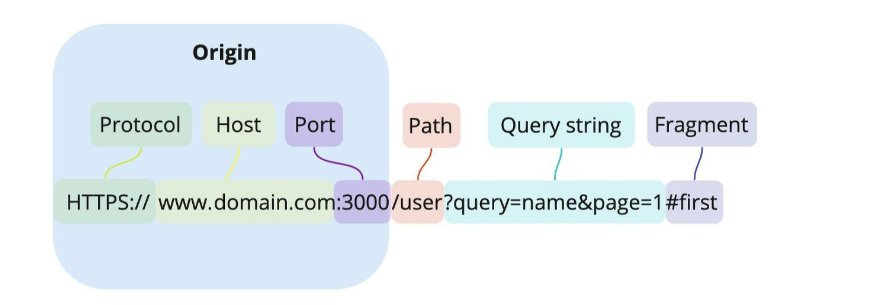
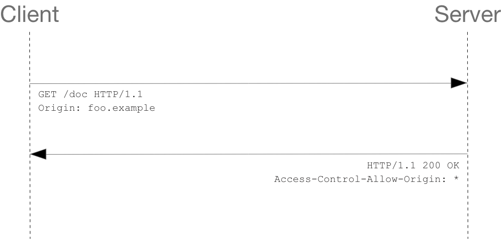
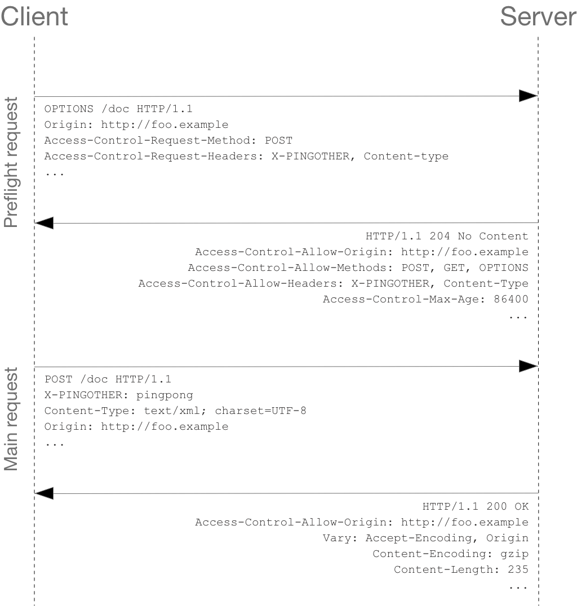

# CORS (Cross-Origin Resource Sharing)

## 1. Origin (출처)

- 우리가 흔히 알고 있는 URL에서 도메인만 의미하는 것이 아니라 프로토콜과 포트까지 포함하는 개념이다.
- Origin(출처)을 구성하는 3가지 요소 : 프로토콜, 도메인(호스트 이름), 포트
- **즉, 두 개의 URL에 대해 프로토콜, 도메인(호스트 이름), 포트가 모두 같다면, 두 URL의 Origin은 같다.**
- 예시 - `https://www.infikei.com` 을 기준으로 각각의 URL은 동일 출처인가?
    - `https://www.infikei.com/about` → 동일 출처
    - `https://www.infikei.com/about?q=1` → 동일 출처
    - `https://coffee.infikei.com` → 교차 출처 (도메인이 다르므로)
    - `http://www.infikei.com` → 교차 출처 (프로토콜이 다르므로)
    - `https://www.infikei.com:8080` → 교차 출처 (포트가 다르므로)

## 2. SOP (Same-Origin Policy, 동일 출처 정책)

- **SOP : 서로 다른 출처 사이에서 리소스 요청과 응답을 차단하는 정책이다. (리소스 공유를 차단한다)**
- **브라우저는 기본적으로 SOP 정책을 따른다.**
- 2011년 RFC 6454에서 등장한 보안 정책이다.
- SOP는 하나의 출처에서 로드된 문서 또는 스크립트가 다른 출처의 리소스와 상호작용할 수 있는 방법을 제한하는 중요한 보안 메커니즘이다.
    - SOP를 통해 보안을 위협하는 문서를 격리하여 보안 위협으로부터 보호할 수 있다.
- 왜 이런 보안 정책이 등장했는가?
    - 출처가 다른 두 개의 어플리케이션이 마음대로 소통할 수 있는 환경은 꽤 위험한 환경이기 때문이다.
    - 웹에서 돌아가는 클라이언트 어플리케이션은 사용자의 공격에 너무나 취약하다. 당장 브라우저의 개발자 도구만 열어도 DOM이 어떻게 작성되어 있는지, 어떤 서버와 통신하는지, 리소스의 출처가 어디인지 등의 각종 정보를 아무런 제재없이 열람할 수 있다.
    - 이렇게 사용자가 소스코드를 직접 볼 수 있는 상황 속에서 다른 출처의 어플리케이션이 서로 통신하는 것을 허용한다면, 악의를 가진 사용자가 소스코드를 구경한 후 CSRF(Cross-Site Request Forgery) 또는 XSS(Cross-Site Scripting) 등의 방법으로 우리의 어플리케이션에서 코드가 실행된 것처럼 꾸며서 사용자의 정보(토큰이나 쿠키)를 탈취하는 것이 너무 쉬워진다.

## 3. CORS (Cross-Origin Resource Sharing, 교차 출처 리소스 공유)

- **CORS : 서로 다른 출처라도 리소스 요청과 응답을 허용하는 정책이다. (리소스 공유를 허용한다)**
- **교차 출처 (Cross Origin) : 다른 출처**
    - 출처가 교차한다는 것은 리소스를 주고받으려는 두 출처가 서로 다르다는 의미이다.
- CORS 허용 설정 : 출처가 다른 서버 간의 리소스 공유를 허용하도록 설정하는 것이다.

### (1) CORS 정책은 언제 검사하는가?

- **출처를 비교하는 로직은 서버가 아니라 브라우저에 구현되어 있는 스펙이다!**
    - 해당 서버가 같은 출처에서 보낸 요청만 받는 로직을 가지고 있지 않은 경우, 우리가 CORS 정책을 위반하는 리소스 요청을 하면 서버에서는 정상적으로 응답을 한다. 이후 브라우저가 이 응답을 분석하여 CORS 정책 위반이라고 판단한다면 그 응답을 사용하지 않고 버린다.
    - **즉, CORS를 위반하더라도 서버는 정상적으로 응답을 해주고, 응답의 파기 여부는 브라우저가 결정하는 것이다.**
    - 따라서 CORS 정책을 위반하는 리소스 요청 때문에 에러가 발생했다고 해도 서버 쪽 로그에는 정상적으로 응답을 했다는 로그만 남기 때문에 에러 트레이싱에 난항을 겪을 수도 있다.
    - CORS는 브라우저의 구현 스펙에 포함되는 정책이므로, 브라우저를 통하지 않고 서버 간 통신을 하는 경우에는 이 정책이 적용되지 않는다.

### (2) CORS 관련 HTTP 요청 헤더

- Origin
    - 현재 자신의 URL 정보를 포함한다.
- Access-Control-Request-Method
    - Preflight Request에서 사용되며, 어떤 method를 사용할지 서버에게 알리기 위해 사용된다.
    - POST, GET, DELETE 등이 포함된다.
- Access-Control-Request-Headers
    - Preflight Request에서 사용되며, 어떤 header를 사용할지 서버에게 알리기 위해 사용된다.
    - X-PINGOTHER, Content-Type 등이 포함된다.
- Access-Control-Request-* 헤더의 경우, 실제 POST 요청 시에는 포함되지 않고 OPTIONS 요청 시에만 포함된다.

### (3) CORS 관련 HTTP 응답 헤더

- Access-Control-Allow-Origin
    - 브라우저가 해당 origin이 리소스에 접근 가능하도록 허용할 때 사용된다.
    - *로 설정할 경우 브라우저는 credentials 옵션이 없는 모든 요청에 한해 모든 origin이 해당 리소스에 접근 가능하는 것이 허용된다.
- Access-Control-Allow-Methods
    - Preflight Request에 대해 리소스에 접근할 때 허용되는 method를 지정하기 위해 사용된다.
    - POST, GET, OPTIONS, * 등이 포함된다.
- Access-Control-Allow-Headers
    - Preflight Request에 대해 해당 요청에서 사용할 수 있는 header를 지정하기 위해 사용된다.
    - X-PINGOTHER, Content-Type 등이 포함된다.
- Access-Control-Allow-Credentials
    - Credentialed Request 방식이 사용될 수 있는지를 지정하기 위해 사용된다.
    - true나 false만 포함된다.
    - 예를 들어 Simple Request에 withCredentials: true가 지정되어 있는데 응답 헤더에 해당 헤더가 true로 명시되어 있지 않다면, 해당 응답은 무시된다.
    - Preflight Request에 대해 해당 헤더가 false로 지정되어 있다면, 해당 요청은 Credentialed Request를 보낼 수 없다.
- Access-Control-Max-Age
    - Preflight Request에 대해 캐시에 얼마나 오랫동안 남아있는지를 지정하기 위해 사용된다.
    - 단위는 초(second)이다.
- Access-Control-Expose-Headers
    - 브라우저 측에서 접근할 수 있게 허용하는 헤더를 지정하기 위해 사용된다.
    - 기본적으로 브라우저에게 노출되지 않는다.
    - Cache-Control, Content-Language, Content-Type, Expires, Last-Modified, Pragma 등이 포함된다.

## 4. CORS의 요청 방식

- CORS 요청은 Simple/Preflight, Credential/Non-Credential의 조합으로 4가지가 존재한다.

### (1) Simple Request

- 다음의 조건을 만족하면 브라우저는 CORS 요청을 Simple Request로 처리한다.
    - HTTP method가 GET, POST, HEAD 중 하나여야 한다.
    - Request Header에는 다음 속성만 허용된다.
        - Accept, Accept-Language, Content-Language, Content-Type, DPR, Downlink, Save-Data, Viewport-Width, Width
    - 만약 Content-Type을 사용하는 경우 다음의 3가지 중 하나여야 한다.
        - application/x-www-form-urlencoded
        - multipart/form-data
        - text/plain
    - CORS-safelisted request-header를 포함하는 경우
    - 요청에 사용된 XMLHttpRequestUpload 객체에 이벤트 핸들러, 이벤트 리스너가 등록되지 않은 경우
    - ReadableStream 객체가 포함되지 않은 경우
- Simple Request는 다음과 같은 방식으로 동작한다.
    1. 사용자가 요청 헤더에 자신의 Origin을 실어서 서버에 요청을 보낸다.
    2. 서버는 요청 헤더의 Origin을 확인한다.
    3. CORS 요청이 유효하다면 서버는 응답 헤더에 Access-Control-Allow-Origin 헤더를 추가하여 사용자에게 다시 전송한다.

### (2) Preflight Request

- Preflight Request는 Simple Request의 조건을 만족하지 못한 경우 브라우저가 자동으로 생성한다.
- Simple Request와 달리 OPTIONS 메서드를 통해 다른 Origin의 리소스로 HTTP 요청을 미리 보내서(preflight) 실제 요청을 전송하기에 안전한지 확인한다. 이후 안전하다고 판단되면 실제 요청을 보낸다.
    - Cross-Origin 요청의 경우 유저 데이터에 영향을 줄 수 있으므로 이와 같이 미리 전송(preflight)하는 것이다.
- Preflight Request는 다음과 같은 방식으로 동작한다.
    1. 브라우저는 위의 XMLHttpRequest가 Cross-Origin 요청인 것을 판단하여 요청에 `Origin: https://foo.example` 헤더를 추가한다. 또한 해당 요청이 POST 방식이고, Content-Type이 application/x-www-form-urlencoded, multipart/form-data, text/plain에 포함되지 않으므로, 브라우저는 헤더 정보를 추가하여 외부 서버로 예비 요청(Preflight Request)을 미리 보낸다.
    2. 서버는 이 예비 요청(Preflight Request)에 대한 응답으로 현재 자신이 어떤 것들을 허용하고 있는지에 대한 정보를 response header에 담아서 브라우저에게 다시 보낸다.
    3. 응답받은 response header의 정보를 통해 브라우저는 본 요청을 외부 서버로 보낼지 말지 여부를 결정한다. 위 예시에서 표시된 정보는 '해당 API는 Cross-Origin에 대해서 POST, GET, OPTIONS와 커스텀 헤더인 X-PINGOTHER, Content-Type을 허용한다'이다. 이에 해당되는 것들은 안전하다고 판단하여 CORS 위반으로 간주하지 않고, 위 예시에서 브라우저는 POST인 본 요청을 외부 서버로 보낸다.
- 참고로 Preflight Request 방식은 많은 리소스를 잡아먹는다. 따라서 서버에서 Access-Control-Max-Age 헤더 정보를 통해 Preflight Request를 캐싱함으로써 그 효율을 높일 수 있다.

## 5. 출처 및 참고한 링크

- [https://velog.io/@effirin/CORS란-무엇인가](https://velog.io/@effirin/CORS%EB%9E%80-%EB%AC%B4%EC%97%87%EC%9D%B8%EA%B0%80)
- https://yoo11052.tistory.com/139
- https://docs.tosspayments.com/resources/glossary/cors
- [https://dongwooklee96.github.io/post/2021/03/23/sopsame-origin-policy-란-무엇일까.html](https://dongwooklee96.github.io/post/2021/03/23/sopsame-origin-policy-%EB%9E%80-%EB%AC%B4%EC%97%87%EC%9D%BC%EA%B9%8C.html)
