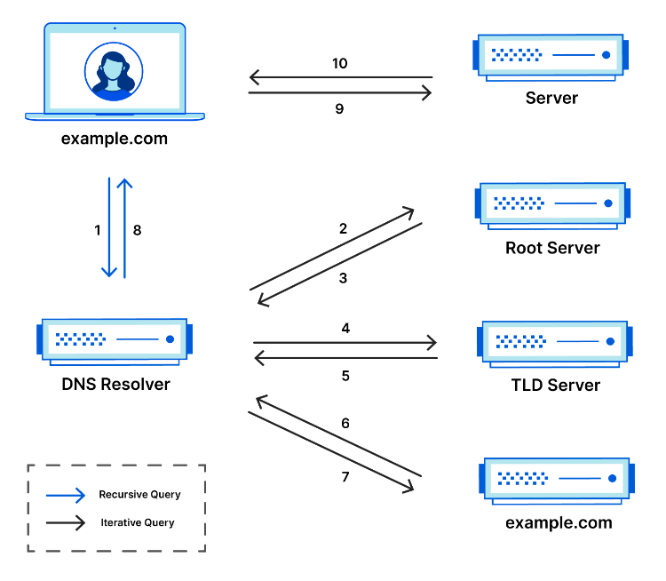
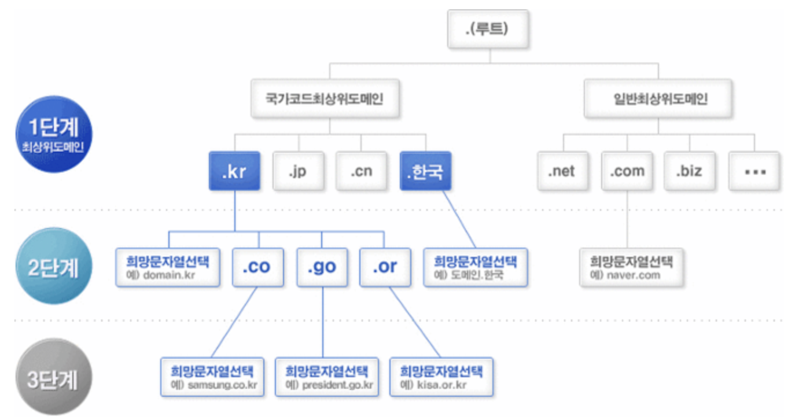
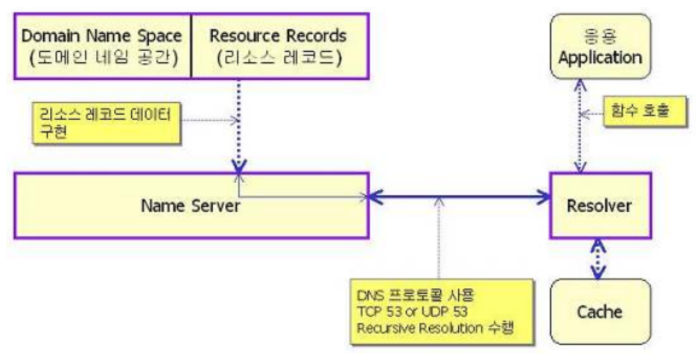
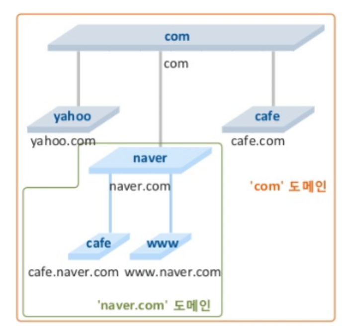
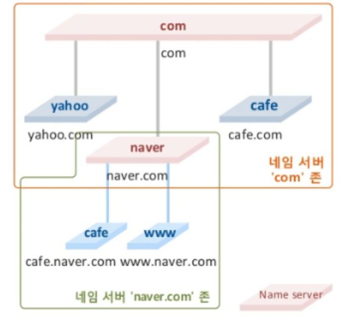
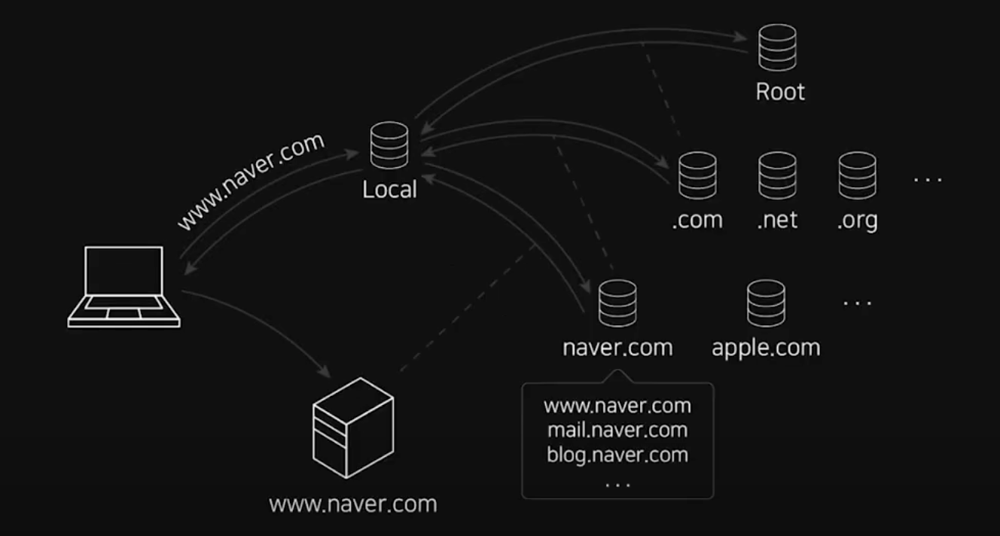

# DNS
## DNS란?

- Domain Name System
- 일반적으로 웹 사이트에 접속할 때 IP주소 대신 도메인 이름을 사용한다
- 인터넷에서 모든 장치는 IP주소를 가지지만,  IP보다 도메인이 더 기억하기 쉽다
- 즉, 입력한 도메인 주소를 실제 네트워크에서 사용하는 IP주소로 해석해주는 서비스
- www.naver.com에서 www : host name , naver.com : 도메인

## DNS 특징
-  전세계적으로 약속된 규칙을 공유
-  상위 기관에서 인증된 기관에게 도메인을 생성하거나 IP 주소로 변경할 수 있는 ‘권한’을 부여
-  상위 기관과 하위 기관과 같은 ‘계층 구조’를 가지는 분산 데이터베이스 구조

### 분산 구조를 가지는 이유
- 네임 서버가 여러 개 있기 때문
- 네임 서버를 여러 개 두면 모든 서버에서 정보 공유가 가능해야하기 때문에 분산 구조 선택
- 도메인 주소에 .(dot)이 계층을 의미

## DNS 구성

- 최상의 루트 도메인이 존재하고 그 아래 com, net, org 등 top 도메인이 존재
- .com : 기업체, .edu : 교육기관, .gov : 정부기관, .kr : 국가 도메인으로 체계적으로 분류되어 관리

## DNS 구성 요소

### (1-1) 도메인 네임 스페이스(Domain Name Space)
- 흔히 인터넷에서 사용되고 있는 도메인 네임의 계층적 구조 공간을 의미
- 네임 주소 영역을 분배, 할당, 구성하는 방식을 제공하며 트리 형태의 계층적 구조로 이루어짐
  
### (1-2) 리소스 레코드(Resource Reoceds)
- 도메인 네임 공간 중에서 지정된 도메인 네임에 대해 필요한 자원 정보를 매핑하는 수단을 제공
### (2) 네임 서버(Name Server) 
- 도메인 zone 의 정보를 소유하고 이에 대한 질의에 응답하는 역할을 하는 서버
- 도메인 네임에 대한 다양한 형태의 분산 구조
- 설정된 리소스 레코드로 구성된 데이터베이스를 포함
### (3) 리졸버(Resolver) 
- DNS 클라이언트 요청을 네임 서버로 전달하고 찾은 정보를 클라이언트에게 제공하는 기능을 수행

## 도메인과 존의 차이

- 도메인은 하나의 노드가 관리하는 영역, 즉 해당 노드의 하위 영역을 의미
- com 도메인은 노드 com 을 포함한 그 하위 영역(오렌지색 영역)에 해당
- 또 다른 도메인 naver.com 은 노드 naver 를 포함한 그 하위 영역(초록색 영역)에 해당
#

- zone 은 하나의 네임서버가 관리하는 영역을 의미
- 노드 naver 가 네임 서버의 역할을 한다고 하면,   
  naver 하위의 노드들의 정보는 네임서버 naver.com 이 관리하는 동시에  
  해당 영역(초록색 영역)이 하나의 존으로 형성
## DNS의 흐름
  

