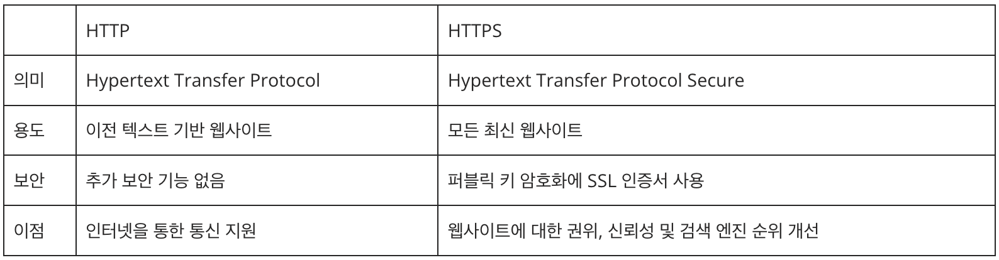

# HTTP & HTTPS
## HTTP란?

- Hyper Text Transfer protocol
- 텍스트 기반의 통신규약으로 인터넷에서 데이터를 주고 받을 수 있는 프로토콜
- 클라이언트와 서버간의 통신을 담당하며, 웹 브라우저와 웹 서버간 데이터 전송에 주로 사용
- 응용 계층에서 사용된다.

## HTTP동작

- 사용자가 브라우저를 통해 서비스를 url <br>
- 요청(Request)    : Client -> Server <br>
- 응답(Response)   : Server -> Client

## HTTP 특징
### 1. 클라이언트 서버 구조
- 클라이언트가 요청을 보내면 서버가 응답해주는 방식
- 클라이언트의 요청에 대한 서버의 응답에는 요청 처리 결과에 따라 응답 코드가 다르게 온다

### 2. Stateless 프로토콜
- 서버가 요청을 보낸 클라이언트와 관련된 상태를 기억하지 않는 것
- 서버는 수 많은 요청을 받기 때문에 상태를 관리하지 않는 것이 효율적
- 반대로 상태를 유지하는 것은 Stateful인데 이 방식은 비용이 비싸진다는 단점이 존재

### 3. Connectionless
- Connection을 유지하게 되면 지속적으로 리소스가 사용
- Connection 유지는 최소화하는 것이 이득

## HTTP 상태코드


## HTTP의 단점
### 1. 암호화가 되어있지 않다
- 네트워크 기기 or 케이블 컴퓨터와 같은 장치로 도청과 정보 유출의 위험
### 2. 낮은 신뢰성
- 통신 상대를 확인하지 않는다
- 서버와 클라이언트가 보낸 정보를 중간에 바꿀 수 있는 위험이 존재

## HTTPS

- HTTP의 확장 버전으로 SSL 암호방식으로 보안성을 강화
- SEO(검색 엔진 최적화) 효과

## 암호화 방식
### 1. 공개키 방식
- 데이터를 안전하게 전송하고 인증하는 데 사용
- 두 개의 서로 다른 키(공개키, 개인키)를 사용하여 데이터를 암호화하고 복호화하는 방법

``` txt
공개키란
공개키는 누구나 볼 수 있고, 누구나 사용할 수 있는 키. 데이터를 암호화하는 데 사용되며, 암호화된 데이터는 해당 공개 키로만 해독할 수 있다.
```
``` txt
* 개인키란
개인키는 공개되면 안되는 비밀 키로서 소유자만 알고 있어야 한다. 개인키는 보안이 매우 중요하며, 타인과 공유해서는 안된다.
```

### 공개키 방식 특징
- 공개키로 암호화 후 개인키로 복호화
- 개인키로 암호화 후 공개키로 복호화

### 2. 대칭키 방식
- 데이터를 암호화하고 복호화하는 데 동일한 키를 사용하는 방식
- 데이터를 암호화하는데 사용되는 키와 데이터를 복호화하는데 사용되는 키가 동일
- 암호화와 복호화에 동일한 비밀키가 사용
- 키가 노출되면 제 3자가 쉽게 데이터를 해독할 수 있으므로 키의 안전한 보관이 필요

### 대칭키 방식 특징
- 동일한 키로 암호화, 복호화가 가능
- 공개키보다 빠르게 통신 가능
- 대칭키는 매번 랜덤으로 생성되며 누출되어도 다음 사용 시 다른 키가 사용되기 때문에 안전

#### * 세션 키가 매번 새로 생성되고 세션 종료 시 폐기되더라도, <br> 해당 세션 동안에는 그 키가 안전하게 보호되어야 한다.

## HTTP와 HTTPS의 차이 요점



#
### (번외)HTTP란 이름을 잘못되었다
- 하이퍼 텍스트라는 이름은 잘못되었다
- HMTP or Hypermedia 전송 프로토콜이라는 이름이 합리적
- but 이미 여론은 HTTP로 굳어져버렸다...


