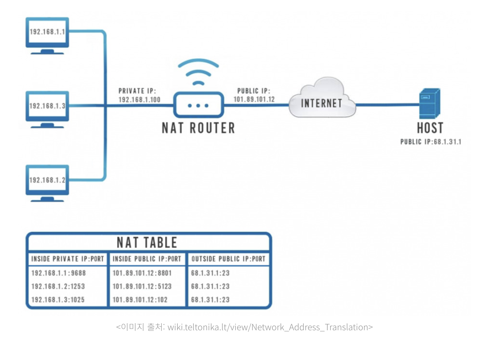

# IP

## 1. IP (Internet Protocol)

- IP는 인터넷 프로토콜의 약자로, 기기 간 네트워크 통신을 할 때 사용하는 프로토콜을 의미한다.

### (1) IP 주소

- IP는 인터넷에 연결되어 있는 모든 장치들을 식별할 수 있도록 각각의 장비에게 부여되는 고유 주소이다.
- 각각의 호스트들을 구분하여 데이터를 정확하게 송수신하기 위해 IP 주소를 사용한다.
- IP 주소에는 IPv4, IPv6 두 종류가 존재한다.

### (2) IPv4

- `.` 으로 구분된 4개의 10진수 형식으로 표기한다.
    - 예시 : `192.168.123.123`
- 각 마디는 옥텟(octet)이라고 부른다.
- $2^{32}$ = 약 42억 개의 IP를 표현할 수 있다.

### (3) IPv6

- 인터넷 환경이 발달함에 따라 기존 IPv4의 주소가 고갈되면서 IPv6가 등장하게 되었다.
- `:` 으로 구분된 8개의 16진수 형식으로 표기한다.
    - 예시 : `2001:0DB8:1000:0000:0000:0000:1111:2222`
- IPv6의 128bit 주소 공간은 $2^{128}$개의 주소를 가지고 있으므로 거의 무한대로 사용할 수 있다.
- IPv6는 네트워크 속도, 보안 측면에서 기존의 IPv4보다 뛰어나다.
- 그러나 기존의 주소 체계를 변경하는 데 비용이 많이 들기 때문에 아직 상용화가 되지 않았다.
    - 기술의 발달로 인해 IPv4의 주소 체계 내에서도 IP를 구분할 수 있는 방법들이 생겨서 기존의 주소 체계를 유지할 수 있게 되었다.

### (4) IPv6의 특징

- 확장된 주소 공간
    - 128비트 주소 체계를 사용하므로 IPv4의 주소 부족 문제를 해결할 수 있다.
    - IP 주소를 절약하기 위해 사용되는 NAT와 같은 주소 변환 기술이 불필요하다.
- 새로운 헤더 포맷
    - 헤더를 고정 길이로 변경한다.
    - 패킷 단편화 관련 필드가 삭제되었다.
    - 체크섬 필드가 삭제되었다.
- 향상된 서비스의 지원
    - IPv6는 트래픽을 효과적으로 분류할 수 있는 기능을 제공한다.
    - 이를 위해 IPv6 내에 플로우 레이블 필드를 이용한다.
- 보안 기능
    - IPv4에서의 보안은 IPSec이라는 보안 관련 프로토콜을 별도로 설치해야 하는 부가 기능(add on)을 필요로 하는 반면, IPv6에서는 프로토콜 내에 보안 관련 기능을 탑재할 수 있도록 설계되었다.
    - 확장 헤더를 통해 네트워크 계층에서의 종단간 암호화를 제공한다.
- 주소 자동설정
    - IPv6에서는 로컬 IPv6 주소를 LAN 상의 MAC 주소와 라우터가 제공하는 네트워크 프리픽스에 결합하여 IP 주소를 자동으로 생성해준다.
    - 이동형 컴퓨터의 경우 어느 곳에서든 네트워크와 연결을 설정하면 자동으로 포워딩 주소를 설정할 수 있게 한다.

## 2. IP 종류

### (1) 고정 IP

- 컴퓨터에 고정적으로 부여되어 변하지 않는 IP이다.
- 장치를 껐다가 켰더라도 부여받은 IP가 바뀌지 않는다.
- 한번 부여되면 IP 반납을 하기 전까지는 다른 장비에 부여할 수 없는 고유의 IP로, 보안성이 우수하기 때문에 보안이 필요한 업체나 기관에서 사용한다.

### (2) 유동 IP

- 변하는 IP이다.
- 인터넷 사용자 모두에게 고정 IP를 부여해주기는 힘들기 때문에, ISP(Internet Service Provider)가 일정 주기마다 또는 사용자가 인터넷에 접속하는 매 순간마다 사용하고 있지 않은 IP 주소를 임시로 발급하는 IP이다.
- ISP 업체들에서 IP 회전률과 가용성을 높이기 위해 DHCP 서버를 사용하여 유동 IP 주소를 공급한다.

<aside>
💡 **DHCP (Dynamic Host Configuration Protocol)**

- DHCP는 호스트의 IP주소와 각종 TCP/IP 프로토콜의 기본 설정을 클라이언트에게 자동적으로 제공해주는 프로토콜이다.
- DHCP는 네트워크에 사용되는 IP 주소를 DHCP 서버가 중앙집중식으로 관리하는 클라이언트-서버 모델을 사용하게 되며, DHCP 지원 클라이언트는 네트워크 부팅 과정에서 DHCP 서버에 IP 주소를 요청하고 이를 얻을 수 있다.
- 즉, 네트워크 내의 컴퓨터에 자동으로 네임 서버 주소, IP 주소, 게이트웨이 주소를 할당해주는 것을 의미하고, 해당 클라이언트에게 일정 기간동안 임대를 하는 동적 주소 할당 프로토콜이다.
</aside>

### (3) 공인 IP (Public IP)

- 인터넷 사용자의 로컬 네트워크를 식별하기 위해 ISP가 제공하는 IP 주소이다.
- 공용 IP 주소라고도 불리며 외부에 공개되어 있는 IP 주소이다.
- 전세계에서 유일한 IP 주소를 가진다.
    - IP 주소는 우리가 임의로 부여하는 것이 아니라 전세계적으로 ICANN이라는 기관이 국가별로 사용할 IP 대역을 관리한다. 우리나라에서는 한국인터넷진흥원(KISA)에서 국내 IP 주소들을 관리하고 있다.
    - 이 주소들을 ISP(Internet Service Provider)(KT, SKT, LG와 같이 인터넷을 제공하는 통신업체)가 부여받고, 우리는 ISP에 가입하여 IP를 제공받아 인터넷을 사용한다. 이렇게 발급받은 IP 주소가 바로 공인 IP이다.
- 공인 IP 주소가 외부에 공개되어 있기 때문에 인터넷에 연결된 다른 PC의 접근이 가능하다.
- 따라서 공인 IP 주소를 사용할 경우 방화벽 등의 보안 프로그램을 설치할 필요가 있다.

### (4) 사설 IP (Private IP)

- **일반 가정이나 회사 내에 할당된 네트워크의 IP 주소**이다.
- 공유기를 사용한 인터넷 접속 환경일 경우, 공유기까지는 공인 IP를 할당하지만, 공유기에 연결되어 있는 가정이나 회사의 각 네트워크 기기에는 사설 IP를 할당한다.
- 즉, 사설 IP는 **어떤 네트워크 안에서만 내부적으로 사용되는 고유한 주소**이다.
- 로컬 IP라고도 불린다.
- 공인 IP는 전세계에서 유일한 반면, 사설 IP는 **하나의 네트워크 내에서만 유일**하다.

## 3. NAT (Network Address Translation)

- NAT는 사설 IP를 공인 IP로 변경할 때 필요한 주소 변환 서비스이다.
- 즉, 라우터 등의 장비를 사용하여 사설 네트워크에 속한 다수의 사설 IP 주소를 하나의 공인 IP 주소로 변환하는 기술이다.
- 공유기를 통해 여러 호스트가 하나의 공인 IP 주소를 공유하며, NAT를 통해 주소 변환을 수행하여 인터넷에 접속한다.
- 주로 기업이나 기관에서 내부망을 사용하는 PC에 사설 IP를 제공하고, 외부 인터넷에 연결할 때는 공인 IP 하나를 같이 사용하는 형태로 운영한다.
- IP 패킷의 TCP/UDP 포트 숫자와 소스 및 목적지의 IP 주소 등을 재기록하면서 라우터를 통해 네트워크 트래픽을 주고 받는 기술이다.
- 사설 IP와 공인 IP 간의 주소 변환을 수행하여 주소 부족 문제를 해결한다.

## 4. 참고 및 출처

- [https://velog.io/@qq7455/IP-주소체계-IPv4-와-IPv6](https://velog.io/@qq7455/IP-%EC%A3%BC%EC%86%8C%EC%B2%B4%EA%B3%84-IPv4-%EC%99%80-IPv6)
- [https://inpa.tistory.com/entry/WEB-🌐-IP-기초-사설IP-공인IP-NAT-개념-정말-쉽게-정리](https://inpa.tistory.com/entry/WEB-%F0%9F%8C%90-IP-%EA%B8%B0%EC%B4%88-%EC%82%AC%EC%84%A4IP-%EA%B3%B5%EC%9D%B8IP-NAT-%EA%B0%9C%EB%85%90-%EC%A0%95%EB%A7%90-%EC%89%BD%EA%B2%8C-%EC%A0%95%EB%A6%AC)
- [https://inpa.tistory.com/entry/WEB-🌐-NAT-란-무엇인가](https://inpa.tistory.com/entry/WEB-%F0%9F%8C%90-NAT-%EB%9E%80-%EB%AC%B4%EC%97%87%EC%9D%B8%EA%B0%80)
- https://jwprogramming.tistory.com/35
- https://brunch.co.kr/@sangjinkang/61
