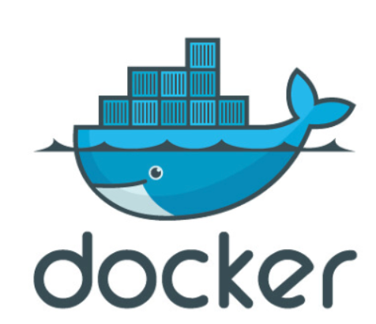
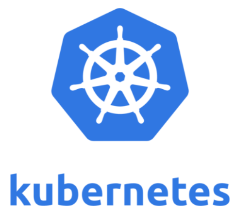
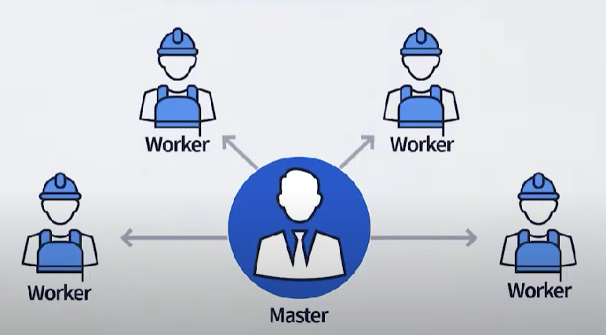
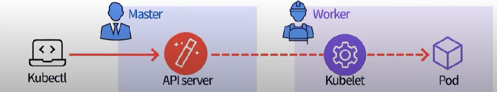
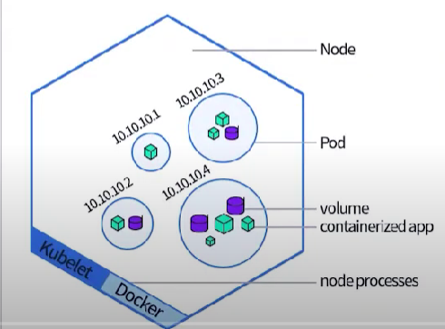
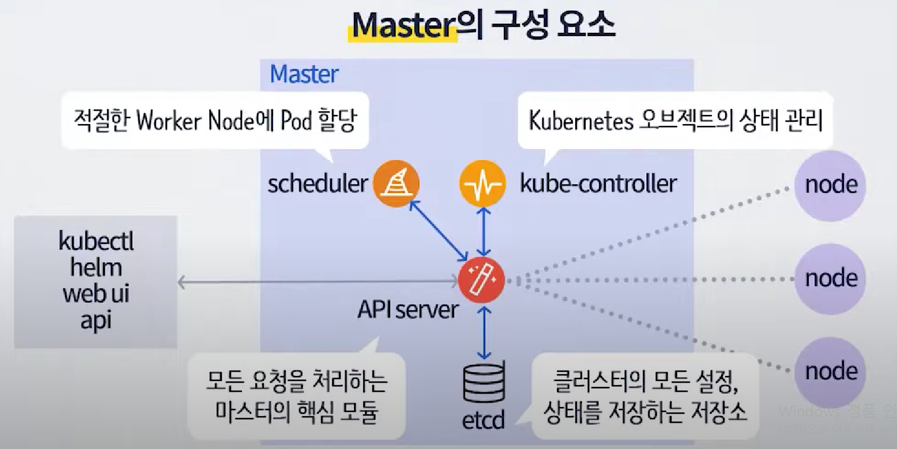
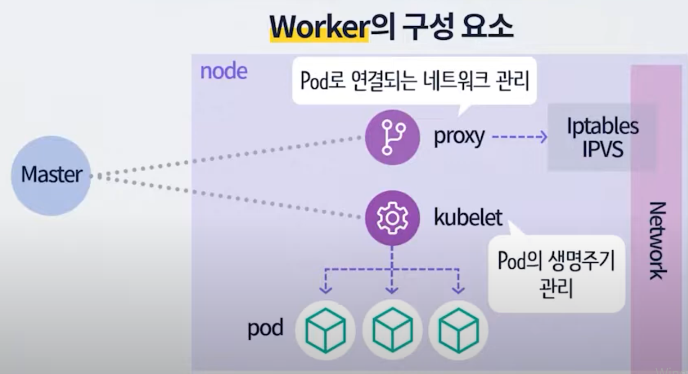

# 쿠버네티스(Kubernetes)

## Kubernetes에 들어가기 전에
### 도커(Docker)

- 컨테이너를 만들고 사용할 수 있도록 하는 컨테이너화 기술
- 애플리케이션의 실행에 필요한 환경을 하나의 이미지로 모은후 , 이미지를 사용하여  
  다양한 환경에서 애플리케이션 실행 환경을 구축 및 운영하기 위한 오픈소스 가상화 플랫폼

### 이미지(Image)란?
- 컨테이너 실행에 필요한 파일과 설정 값 등을 포함하는 것으로, 상태값을 가지지 않고 (Stateless) 변하지 않음 (Immutable).
- 컨테이너는 이미지를 실행한 상태(Runtime)라고 볼 수 있고 추가되거나 변하는 값는 컨테이너에 저장된다.
- 같은 이미지에서 여러개의 컨테이너를 생성할 수 있고 컨테이너의 상태가 바뀌거나 삭제되더라도 이미지는 변하지 않는다 

### 컨테이너란?
- 데스크탑, 클라우드 등 어디서나 실행할 수 있도록 애플리케이션 코드를 해당 라이브러리나 종속 항목과 함께 패키징한 소프트웨어 실행 유닛

## 쿠버네티스(Kubernetes)란?
### 쿠버네티스 등장배경
- 도커의 등장으로 컨테이너 기반 배포 방식이 보편화되고, 많은 서비스들이 도커라이징 되어 이미지로 관리되기 시작
- 점점 이미지가 많아지면서, 관리해야할 컨테이너와 서버들 또한 많아짐
- 즉, 엔지니어가 해야할 일이 많아짐

- 컨테이너를 쉽고 빠르게 배포 및 확장하고, 관리를 자동화해주는 오픈소스 플랫폼
- 명칭은 조타수(helmsman)나 조종사(pilot)를 뜻하는 그리스어에서 유래
- k8s라는 약자로 불리는데, 이는 k,s 사이의 8글자를 나타내는 약식 표기
- 단순한 컨테이너 플랫폼이 아닌 마이크로서비스, 클라우드 네이티브 플랫폼(CNCF) 을 지향
- 컨테이너로 이루어진 것들을 손쉽게 담고 관리할 수 있는 그릇 역할

## 쿠버네티스 구조

- 쿠버네티스가 자동으로 관리해준다는 의미에서 마스터와 워커의 개념이 도입
- 마스터와 워커가 있는 구조를 클러스터라고함
- 마스터: 관리만 한다
- 워커: 일만 한다. (컨테이너 생성, 실행, 종료 등) , 노드라고 불린다.
- 클러스터에 원하는 상태를 작성하면, 마스터가 워커들에게 지시를 내리는 구조

## 쿠버네티스의 Pod

- 작은 무리라는 의미
- 쿠버네티스에서 생성 및 관리할 수 있는 배포 가능한 가장 작은 컴퓨팅 단위 ( 가장 기본적인 배포 단위)
- 마스터가 원하는 Pod 상태를 워커가 원하는 상태에 맞게 Pod가 동작하게 수행
- 컨테이너를 개별 배포하는 것이 아닌, Pod 안에 n개의 컨테이너 탑재하여 배포

## Pod의 장점
### 1. Pod 내부 컨테이너 간의 IP 및 Port 공유를 통한 통신 용이성 향상
- 애플리케이션 안의 컨테이너 A, B는 실시간으로 데이터 교환 및 상태 업데이트가 필요
- 컨테이너 A, B는 별도의 IP 호출없이 localhost를 통해서 통신 가능

### 2. Pod 내부 컨테이너 간의 디스크 볼륨 공유
- 컨테이너 A가 컨테이너 B의 파일 로드 가능
- pod에 로그 수집기 탑재 후 배포시 Pod 내부 컨테이너들의 모든 로그 수집 가능

## 쿠버네티스의 기능
### 많은 기능들이 있지만 가장 많이 사용되는 핵심 기능 4가지
### 1. 자동 복구(Self-Healing) 
- 시스템이 영향받을 때마다 컨테이너의 상태 감지 및 비정상적인 겨우 자체적으로 교체
- 최대한 안정적인 서비스를 유지

### 2. Rolling Update & Rollback
- 이미지 Tag 기능을 통한 버전관리
- 서비스의 단절이 없다

### 3. 로드 밸런싱(Load Balancing)
- Service object를 사용하여 Pod에 트래픽을 분산
- 마스터 노드가 자동으로 관리

### 4. 자동 스케일링(Auto Scaling) 
- 손쉽게 리소스 확장 가능
- Horizontal Pod Autoscaling(HPA) : CPU, MEM 사용량에 따라 Pod 수평 확장 기능, Pod의 수량을 조정
- Vertical Pod Autoscaling(VPA) : Pod 리소스 할당량 조정 (CPU, memory..)
- Cluster Autoscaling(CA) : 노드(서버) 개수 조정 가능 (클라우드 환경에서만)
- 애플리케이션의 부하에 따라 자동으로 서버를 늘리거나 줄일 수 있어 트래픽 증가에 대처하기 용이

### (번외)
## 마스터의 구조

## 워커의 구조

### 참고 링크
https://www.youtube.com/watch?v=OhwZuDpGPWU

  