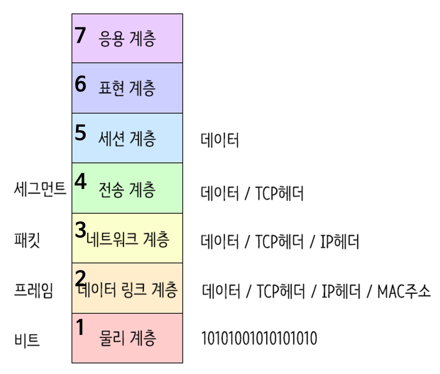

## OSI 7 계층이란?

- 네트워크에서 통신이 일어나는 과정을 7단계로 나눈 것
- 국제 표준화 기구(ISO)에서 정의한 네트워크 표준 모델

## OSI 7 계층 단계

- 발신(캡슐화) : 7계층에서부터 1계층으로 각각의 층마다 인식할 수 있는 헤더를 붙임, 단 2계층만 오류제어를 위해 꼬리에 추가
- 수신(디캡슐화) : 1계층에서부터 7계층까지 헤더를 떼어내며 데이터 확인
- 전송 : 1계층에서 비트 신호로 변환해 전송매체를 통해 전송

## 1. 물리계층 (Physical Layer)

- 전기적, 기계적, 기능적인 특성을 이용해 통신 케이블로 데이터를 전송하는 계층
- 단지 데이터를 전기적인 신호로 변환해 전달만 할 뿐, 주고받는 데이터가 무엇인지 어떤 에러가 있는지는 전혀 신경쓰지 않음
- 통신 단위 : 비트
- 통신 장비 : 케이블, 리피터, 허브

## 2. 데이터링크계층 (DataLink Layer)

- 물리계층을 통해 송수신되는 정보의 오류와 흐름을 관리하여 안전한 정보의 전달을 수행할 수 있도록 도와주는 계층
- 즉, 통신에서의 오류도 찾아주고 재전송도 하는 기능
- 인접한 노드들 간의 신뢰성 있는 정보 전달
- 통신 단위 : 프레임
- 통신 장비 : 브릿지, 스위치
- Mac주소를 통해 통신

## 3. 네트워크계층 (Network Layer)

- 데이터 전달 경로를 선택, 주소(IP주소)를 정하고 경로에 따라 패킷을 전달하는 계층
- 데이터를 목적지까지 가장 안전하고 **빠르게** 전달하는 기능을(라우팅)수행하는데, 이 과정에서 사용되는 프로토콜의 종류와 라우팅 기술이 다양함
- 중계 노드를 통하여 전송하는 경우 어떻게 중계할 것인가를 규정
- 통신 단위 : 패킷
- 통신 장비 : 라우터
- IP주소 사용

## 4. 전송계층 (Transport Layer)

- 종단 간 신뢰성 있고 정확한 데이터 전송을 담당하는 계층
- 송신자와 수신자 간의 신뢰성있고 효율적인 데이터를 전송하기 위하여 오류검출 및 복구, 흐름제어와 중복검사 등을 수행
- 데이터 전송을 위해서 Port 번호 사용(대표적인 프로토콜로 TCP와 UDP 존재)
    - TPC : 신뢰성, 연결지향적
    - UDP : 비신뢰성, 비연결성, 실시간
- 통신 단위 : 세그먼트(Segment)

## 5. 세션계층 (Session Layer)

- 통신 장치 간 상호작용 및 동기화를 제공, 연결 설정하는 계층
- 연결 세션에서 데이터 교환과 에러 발생 시의 복구를 관리

## 6. 표현계층 (Presentation Layer)

- 데이터를 어떻게 표현할지 정하는 역할을 하는 계층 (압축, 암호화)
- 기능
    1. 송신자에서 온 데이터를 해석하기 위한 응용계층 데이터 부호화, 변화
    2. 수신자에서 데이터의 압축을 풀수 있는 방식으로 된 데이터 압축
    3. 데이터의 암호화와 복호화

## 7. 응용계층 (Application Layer)

- 사용자와 가장 밀접한 계층으로 인터페이스 역할
- 응용 프로세스 간의 정보 교환을 담당
