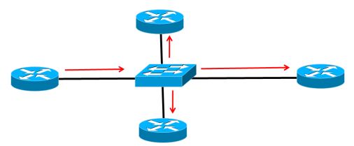
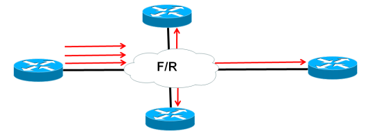
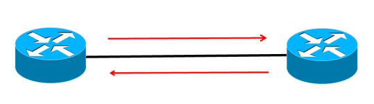

# OSPF (Open Shortest Path First)

## 1. OSPF

- **동적 라우팅 프로토콜**이다.
- 대표적인 **Link-state 라우팅 프로토콜**이다.
    - Link-state 라우팅 프로토콜 (연결 상태 라우팅 프로토콜) : 인터넷에서 **연결된 링크의 상태를 감시하여 최적의 경로를 선택**하는 것
    - 최적의 경로가 의미하는 것은 최단 거리, 또는 연결된 링크가 10M이나 100M 등 속도를 비교하여 더욱 전송 속도가 빠른 링크
    - 최적의 경로는 최단 거리, 또는 10M과 100M 등으로 연결된 링크의 전송 속도가 더 빠른 링크를 의미한다.
- 최적의 경로를 계산할 때 **SPF(Shortest Path First) 또는 다익스트라(Dijkstra) 알고리즘**을 이용하여 각 목적지까지의 최적 경로를 계산한다.
- 주로 **중-대규모 네트워크**를 구성할 때 많이 사용한다.
- OSPF는 **area 단위**로 구성된다. 따라서 **대규모 네트워크를 안정적으로 운영**할 수 있다는 장점이 있다.
    - 특정 area에서 발생하는 상세한 라우팅 정보가 다른 area로 전송되지 않으므로, 큰 규모에서 안정되게 운영할 수 있다. (재분배 설정을 통해 다른 area로 전송 가능)
    - 즉, area 개념을 사용하여 **빠른 업데이트**를 할 수 있고 **라우팅 테이블을 효과적으로 관리**할 수 있다.
- Stub이라는 강력한 축약 기능으로, 기존 라우팅 프로토콜과는 달리 IP 주소가 연속되지 않아도 라우팅 테이블의 크기를 획기적으로 줄일 수 있다는 장점이 있다.
- **표준 라우팅 프로토콜**이다.
- Convergence time이 전반적으로 빠른 편이다.
- VLSM을 지원한다.

## 2. OSPF의 네트워크 분류

### (1) Broadcast Multi-Access 네트워크

- 하나의 Broadcast 패킷을 전송할 경우 **동일 네트워크 상의 모든 장비에게 전달되는 네트워크를 Broadcast 네트워크**라고 하고, **하나의 인터페이스를 통해 다수의 장비와 연결된 네트워크를 Multi-Access 네트워크**라고 한다.
- 브로드캐스트 멀티 액세스 네트워크의 예시로, 이더넷이 있다.
- Broadcast나 Multicast 방식을 사용하여 **하나의 packet만 전송해도 연결된 모든 장비에게 전송된다.**

### (2) Non-Broadcast Multi-Access 네트워크 (NBMA)

- **Broadcast가 지원되지 않는 Multi-Access 네트워크**를 의미한다.
- 예를 들어, ATM, X.25, Frame Relay가 있다.
- 대부분 내부에서 Virtual Circuit(가상회로) 방식을 사용한다.
- NBMA에서는 Broadcast를 사용하여 전송할 경우, **가상회로 하나당 하나씩 Broadcast Packet을 전송해야 한다.**

### (3) Point-to-Point 네트워크

- 하나의 인터페이스와 연결된 장비가 하나뿐인 네트워크이다.
- 예를 들어, HDLC, PPP, F/R의 sub interface 중 point-to-point가 있다.

## 3. OSPF의 패킷

1. OSPF를 설정한 라우터끼리 **hello packet을 교환해서 neighbor 또는 adjacent neighbor**를 맺는다.
    - Adjacent Neighbor : 라우팅 정보(LSA)를 교환하는 neighbor이다.
    - LSA (Link State Advertisement) : OSPF에서의 라우팅 정보이다.
2. Adjacent Neighbor인 라우터 간 **라우팅 정보(LSA)를 서로 교환**하고, **전송받은 LSA를 Link-State Database에 저장**한다.
3. LSA를 모두 교환한 후, SPF(Shortest Path First) 또는 다익스트라(Dijkstra) 알고리즘을 이용하여 **각 목적지까지의 최적 경로를 계산하고 이를 라우팅 테이블에 올린다.**
4. 그 후에도 **주기적으로 hello packet을 교환하면서 정상 동작 중인지 확인**한다.
5. 네트워크의 상태가 변하면 다시 위의 과정을 반복하여 라우팅 테이블을 생성한다.

### (1) Hello Packet

- **OSPF가 설정된 인접한 라우터 간 neighbor 관계를 형성하고 유지하기 위해 사용하는 패킷**이다.
- OSPF가 설정된 인터페이스로 **서로 hello packet을 교환하여 neighbor 관계**를 맺는다.
- Neighbor 관계를 맺은 후에도 **일정 주기(hello 주기)로 hello packet을 전송**한다. 이후 정해진 주기(dead 주기) 안에 상대방에게 hello packet을 수신받지 못한다면 해당 neighbor에 문제가 생긴 것으로 간주하여 neighbor 관계를 끊는다.
- Router id, area id, 인증 암호, 서브넷 마스크, hello 주기, dead 주기, stub area flag, 라우터 priority, DR, BDR, neighbor 리스트의 정보를 가지고 있다.

### (2) DBD Packet

- OSPF의 네트워크 정보를 LSA라고 부르는데, OSPF에서는 자신이 만든 LSA와 neighbor에게 받은 LSA를 Link State Database에 저장한다.
- DBD는 OSPF 라우터의 Link State Database에 있는 **LSA들의 요약된 정보를 알려주는 패킷**이다.
- 즉, neighbor 간 LSA를 교환하기 전에 **자신의 Link State Database에 있는 요약된 LSA 목록을 상대방에게 알려주기 위해** 사용하는 패킷이다.

### (3) LSR Packet

- Neighbor에게 전송받은 DBD에 자신의 Link State Database에 정보가 없는 네트워크가 있는 경우, 그 네트워크에 대한 **상세 정보(LSA)를 요청할 때 사용하는 패킷**이다.

### (4) LSU Packet

- Neighbor에게 LSA를 요청받는 LSR을 받거나 자신이 알고 있는 네트워크의 상태가 변했을 경우, **해당 라우팅 정보를 전송할 때 사용하는 패킷**이다.

### (5) LSAck Packet

- OSPF 패킷을 정상적으로 수신받았음을 상대방에게 알려줄 때 사용한다.
- 즉, DBD, LSR, LSU 패킷을 수신하면 정상적으로 수신받았음을 LSAck 패킷을 통해 상대방에게 전달한다.

## 4. OSPF의 동작 과정

1. DR/BDR 선출
    - **DR** (Designated Router) : **중계 역할을 하는 라우터**이다.
    - **BDR** (Backup DR) : DR에 문제가 발생할 경우를 대비하여 **백업용으로 선출된 라우터**이다.
    - DR과 BDR이 아닌 라우터를 DROTHER라고 한다.
    - OSPF Priority가 가장 높은 라우터가 DR로 선출되며, 다음으로 높은 라우터가 BDR로 선출된다. (OSPF Priority가 동일할 경우, 그 중 router id가 높은 것을 선출)
        - DR, BDR이 선출된 후에 우선순위가 더 높은 라우터가 추가되어도 DR, BDR은 변경되지 않는다. 단, 재부팅하거나 clear ip ospf process 명령어를 사용하면 변경된다.
        - DR에 문제가 발생할 경우 BDR이 DR이 되고 다시 BDR을 선출한다.
    - 이더넷, NBMA 등의 Multi-Access 네트워크에 접속된 라우터가 1:1로 LSA를 교환할 경우 중복된 LSA와 ACK가 다수 발생한다.
    - DR, BDR은 Broadcast 및 Non-Broadcast 네트워크에서만 사용한다. (Point-to-Point 네트워크에서는 사용하지 않는다)
2. Adjacent Neighbor
    - OSPF에서 라우팅 정보(LSA)를 서로 교환하는 neighbor를 adjacent neighbor라고 한다.
    - 종류
        - DR과 다른 라우터
        - BDR과 다른 라우터
        - Point-to-Point 네트워크로 연결된 두 라우터
        - Point-to-Multipoint로 연결된 두 라우터
        - Virtual-link로 연결된 두 라우터
3. OSPF 메트릭
    - OSPF 메트릭은 cost라고 부른다.
    - 10^8 / banddwidth(bps) = cost
    - 코스트를 계산할 때 소수점 이하는 전부 버리고, 1 미만은 1로 계산한다.
    - 인터페이스에서 명령어로 코스트를 변경할 수 있다. (ip ospf cost ?)
4. OSPF Area
    - OSPF는 복수 개의 Area로 나눠서 설정한다.
    - 규모가 작은 경우에는 하나의 Area만 사용해도 상관없다.
    - Area가 하나일 경우 아무 번호나 사용해도 상관없지만, Area가 두 개 이상일 경우 하나는 반드시 0으로 설정해야 한다.
    - Area 0는 Backbone Area이며, 다른 Area는 Area 0와 물리적으로 연결되어야 한다.
    - Backbone Router : Backbone Area (Area 0)에 소속된 라우터
    - Internal(내부) Router : 하나의 Area에만 소속된 라우터
    - ABR (Area Border Router) : 두 개 이상의 Area에 소속된 Area 경계 라우터
    - ASBR (AS boundary Router) : OSPF 네트워크와 다른 라우팅 프로토콜이 설정된 네트워크를 연결하는 AS 경계 라우터

## 5. 내용 출처 및 참고한 자료

- https://nirsa.tistory.com/32
