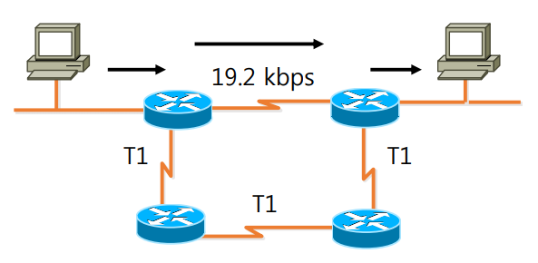
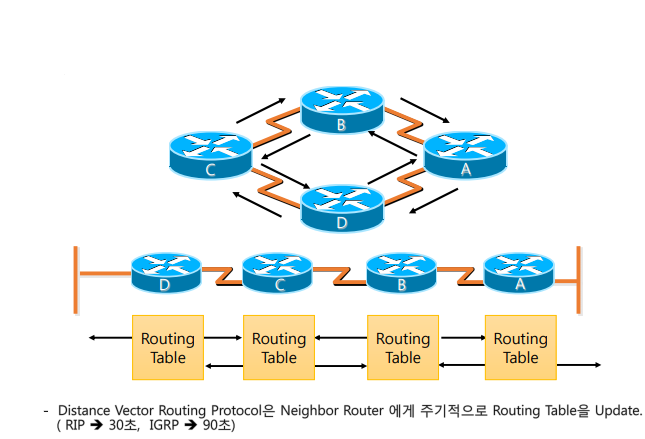
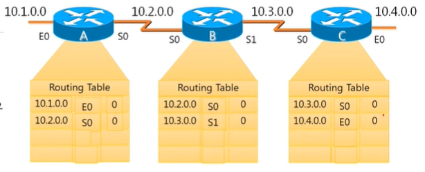
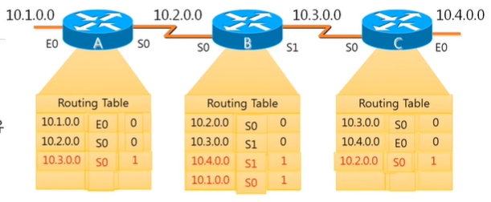
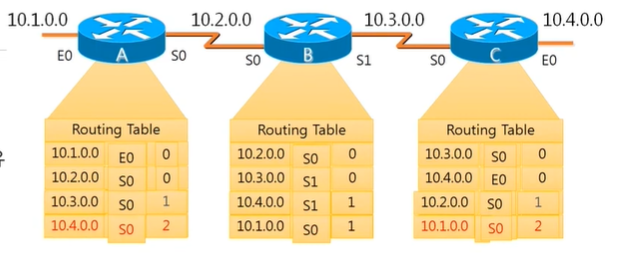
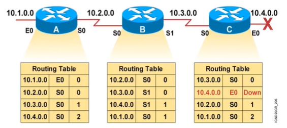
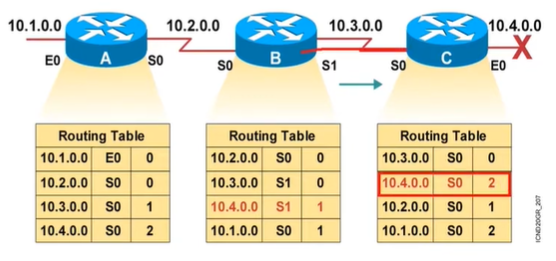
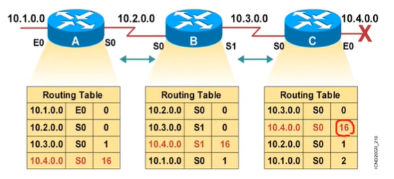

## RIP이란?

> 목적지까지 라우터의 개수로 최적의 경로를 설정하는 프로토콜

- Routing Information Protocol
- 거리벡터 알고리즘을 기반으로 개발된 동적 라우팅 알고리즘
- 인접한 라우터의 라우팅 테이블 정보를 수집해 저장하고, 수집한 정보에서 Hop Count가 가장 작은 경로로 라우팅함

    _Hop Count: 라우터를 거친 수, 하나 거칠 때마다 +1__

## 특징

- Hop Count를 기준으로 Hop Count가 가장 작은 최적의 경로를 찾음
- 최대 Hop Count는 15임 (16은 무한대로, 가지 못한다는 의미)
- 자신의 라우팅 테이블을 30초 주기로 전파(Convergence Time: 30초)
- RIP은 라우팅 경로의 속도와 무관
- AD값은 120
- UDP포트 520번 사용

## 장점
- 간단한 설정
- 작은 규모의 네트워크나 대형 네트워크의 말단 지점에서 사용하기 좋음
- 표준 Routing Protocol이기 때문에 모든 회사의 Router에서 사용 가능

## 단점 
- 라우터끼리 동기화를 시켜주지 않으면, 서로 정보가 달라 Routing looping 이 발생할 수 있음
- 전체 경로를 담은 라우팅 정보를 브로드캐스팅하므로, 트래픽 부하 발생
- 라우터끼리 무조건 30초마다 정보를 보내므로, 라우터가 많아지면 수분 이상 소요됨
- Hop Count가 15 까지밖에 존재하지 않아 규모가 큰 네트워크에서 사용하기에는 한계 존재
- Hop Count수를 기준으로 경로를 결정하기 때문에 Link의 속도를 반영하지 않아 비효율적인 경로 만들어질 수 있음

## 라우팅 정보 공유 방법

- 각 라우터는 자신과 인접한 라우터의 정보를 알고 있음
- 3번째 열은 Hop Count

- 30초가 지나면 인접한 라우터끼리 서로 정보를 주고 받음
- 이때 새롭게 알게 된 정보만 추가함
- A에 추가된 10.3.0.0은 B를 거쳐야 갈 수 있으므로, 즉 라우터 1개를 거쳐야만 갈 수 있는 곳으로 Hop Count 1로 표기됨 (받아온 정보 + 1)

- 30초 마다 라우팅 테이블을 공유하며 Hop Count가 커져가는 것을 볼 수 있음

## Routing Looping

- 10.4.0.0 네트워크 대역에 문제가 발생했다고 가정.
- Router C는 직접적으로 연결되어있으므로 문제가 발생했음을 알 수 있음
- Down, 가지 못하는 곳으로 표시

- 30초 후 라우팅 테이블이 공유되면 B에 있던 정보로 인해 2번 거치면 갈 수 있는 곳으로 인식함

- 30초씩 계속 정보를 주고받으며 Hop Count가 올라가다가 16이 되어서야 못가는 곳임을 인식

## Routing Looping 해결 방법

1. Split Horizon
    - 정보를 받은 곳에 다시 정보를 전달하지 않도록 처리
    - 위의 경우에서 C->B로 전달한 10.4.0.0의 정보를 다시 B->C로 전달하지 않도록 처리

2. Route Poisoning
    - 장애가 발생하면 인접 라우터에 바로 Hop Count 16으로 설정

3. Hold-Down Timer
    - 이웃 라우터로부터 정보를 받든 받지 않든 180초(RIP는 Convergence Time의 6배라서) 동안 대기 후 변화 감지
    - 받은 정보 중 현재 나보다 낮은 Hop Count를 가진 정보만 적용
    - 만약 180초 동안 정보를 받지 못할 경우 hold down 상태로 전환, hold down 상태로 전환된 이후 60초 동안 라우팅 정보를 받지 못할경우 장애가 발생한 것으로 판별되어 해당 경로 삭제

### 참고자료

[RIP이란](https://www.youtube.com/watch?v=Bxtfzp6KRaM)

[Routing Looping](https://www.youtube.com/watch?v=sx9iEgcpOp4)