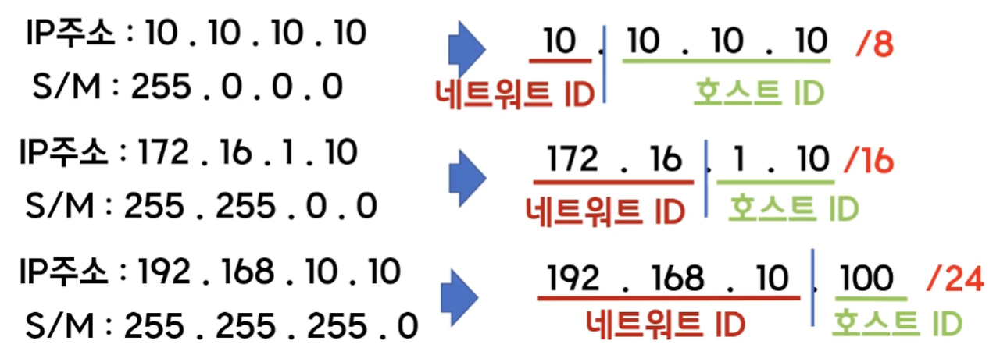

## IP란?

- 인터넷에 연결되어 있는 모든 장치들(컴퓨터, 서버 장비, 스마트폰 등)을 식별할 수 있도록 각각의 장비에게 부여되는 고유 주소
- 마침표로 구분된 4개의 10진수 형식으로 표현
- 주소의 범위는 32비트(약 43억개) 지정 가능 → IPv4

## IP의 주소 구성

- Network ID + Host ID
- 전세계의 호스트들을 관리하기 힘드니 국가마다 Network ID를 부여
- Host ID는 호스트들을 개별적으로 관리하기 위해 사용, 국가의 국민에 해당

## IP 주소 클래스

- IP 주소의 32비트를 4개로 분할하고, 그 각각의 8비트들을 옥텟이라고 함
- 클래스를 이용한 IP 주소 할당 방식은 과거에 사용하던 방식이고 현재는 CIDR 방식을 사용
- 위에서 IP 주소는 네트워크 ID와 호스트 ID로 구성된다고 했는데, 이 “네트워크 ID와 호스트 ID에 몇개의 옥텟을 부여하는지에 따라서 클래스가 구분”됨

**→ 즉, 클래스를 통해 하나의 IP주소에서 네트워크 영역과 호스트영역을 구분해 알 수 있음**

- 보통 우리가 사용하는 클래스는 A, B, C 클래스임
- IP 주소에서 첫 옥텟이 0과 127로 시작하는 주소는 예약이 되어있어 사용할 수 없음
    - 0.0.0.0 → 미지정 주소
    - 127.0.0.0 → 루프백 주소
- A 클래스: 호스트에 가장 많은 옥텟(host 대역: 1670만개)을 할당하는 클래스로 대규모 네트워크 환경에 적합(첫 옥텟의 범위: 1~126)
- B 클래스: 호스트에 절반 정도의 옥텟(host 대역: 65000개)을 할당하는 클래스로 중규모 네트워크 환경에 적합(첫 옥텟의 범위: 128~191)
    - 첫번째 옥텟의 첫 두 비트가 10으로 고정 → 첫 옥텟의 범위: 128~191
- C 클래스: 호스트의 하나의 옥텟(host 대역: 256개)을 할당하는 클래스로 소규모 네트워크 환경에 적합(첫 옥텟의 범위: 192~223)
    - 첫번째 옥텟의 첫 세 비트가 110으로 고정 → 첫 옥텟의 범위: 192~223
- D 클래스: 첫 옥텟의 첫 네 비트가 1110으로 고정, 멀티캐스트용 대역으로 IP 주소에 할당되지 않음
    - 멀티캐스트란? 한 번의 송신으로 메시지나 정보를 목표한 여러 컴퓨터에 동시에 전송하는 것
- E 클래스: 첫 옥텟의 첫 네 비트가 1111로 고정
    - 연구용 예약된 주소 대역으로 IP 주소에 할당되지 않음

## 네트워크 주소 & 브로드 캐스트 주소

- 가장 첫 번째의 “호스트 주소”는 “네트워크 자체”를 지칭하며, 호스트 주소의 가장 마지막 주소는 브로드캐스트용 주소로 사용됨 → 어떤 클래스 주소이던지 간에 적용되는 규칙
- 네트워크 주소: 호스트 ID가 0인 주소로 “네트워크 자체”를 나타내는 주소
- 브로드 캐스트 주소: 호스트 ID가 모두 1인 주소로 네트워크의 모든 호스트로 데이터를 전달하기 위한 통로로서의 주소
- 192.168.10.0 ~ 192.168.10.255의 주소가 있다고 할 때 호스트 주소의 0과 1은 네트워크와 브로드캐스트 주소로 사용되고 이 주소를 제외한 192.168.10.1 ~ 192.168.10.254을 우리가 실제로 사용 (하지만 보통 192.168.10.1은 보통 공유기(라우터)가 가져가게 되어 그 뒤부터 할당받게 됨)

## 서브넷

### 서브넷 등장 배경
- 클래스를 이용해 기업이나 사무실 등등에 한 클래스를 할당했다고 했을 때, 그 클래스에서 지원하는 호스트 아이디 수에 딱 맞게 기업이나 사무실 인원에 맞는 경우는 거의 없음
- 그 경우에 호스트 아이디들이 낭비되게 됨

### 서브넷이란?
- “하나의 네트워크가 분할되어 나눠진 작은 네트워크”
- 서브넷을 만들기 위해 네트워크를 분할하는 것을 서브네팅(Subnetting)이라고 함. 만일 ip가 100개만 필요하다면 C 클래스(사용 가능한 호스트 ID 수: 256)을 더 쪼갤 수 있음
- 서브네팅을 하면 IP 할당 범위를 더 작은 단위로 쪼갤 수 있게 됨
- 그리고 이 서브네팅은 “서브넷 마스크(Subnet Mask)”를 통하여 계산되어 수행됨

## 서브넷 마스크
- IP 주소에서 네트워크 ID와 호스트 ID를 “구분”하기 위한 목적으로 만들어짐
- 서브넷 마스크는 IP 주소와 같이 32비트 2진수로 표현
- IP주소와의 차이점: 서브넷 마스크는 연속된 1과 연속된 0으로 구성 → 10011111.11011111.11110011.00000000은 불가능 / 11111111.11111111.11111100.00000000은 가능
- 예를 들어, 192.168.0.1/24 라고 하면 C 클래스이며 디폴트 마스크는 255.255.255.0임, 즉 24는 연속으로 1이 24개 있다라는 의미이며 1은 네트워크 영역이고 0이 호스트 영역이라는 것
- 이때, 24는 Prefix로 서브넷 마스크의 bit 수 의미

**→ 즉, 서브넷 마스크는 IP 주소의 클래스가 어떤 클래스인지 식별 가능하게 해줌**

- 서브넷 마스크의 옥텟이 255 = 그에 상응하는 IP 주소의 옥텟은 네트워크 ID
- 서브넷 마스크의 옥텟이 0 = 그에 상응하는 IP 주소의 옥텟은 호스트 ID

## 서브네팅
- IP 주소를 효율적으로 나누어 사용하기 위한 방법으로, 네트워크 영역과 호스트 영역을 쪼개는 작업 실시
- 서브네팅을 통해 IP 할당 범위를 더 작은 단위로 나눌 수 있게 됨. (클래스를 이용하였을 땐 클래스별로 1670만개, 65000개, 256개에서만 선택하여 사용해야 했던 문제를 해결 가능)
- 자신의 네트워크 주소를 더 작은 서브 네트워크로 “2의 배수”로 나누는 과정

- 예를 들어 호스트를 50개만 사용하는 기업이 192.168.10.0/24 아이피 주소를 사용한다면 가정하면, C클래스이니까 총 256개의 주소를 할당하게 됨
- 256개 전체를 주기에는 낭비가 되니까, 이 256개를 절반으로 나누고(128개) 또 절반으로 나눈(64개) 주소를 기업에게 할당하고 남는 네트워크 주소는 다른 사용처로 할당하는 작업

## 서브네팅 계산

### 주소 범위 절반으로 나누기 (2등분)
- 절반으로 나누기 위해 서브넷 구분 비트 지정
- 서브넷 구분 비트는, 네트워크 주소를 어느 기준으로 쪼개서 서브넷을 만들어 구분할지 정하는 비트임
- 항상 호스트 ID 왼쪽부터 결정되어야 함
- 즉, C클래스 일 때 . . .0 / . . .1로 나누어 (0~127)/(128~255)의 IP 주소를 할당

- 이때 위에서 유의했듯 어느 한 네트워크 범위의 가장 첫번째 주소(0) 과 마지막 주소는 네트워크/브로드캐스트 주소로서 제외하여야 하므로 호스트는 (1~126)/(129~254)를 사용할 수 있음

### 한 번 더 나눈다면?
- 항상 호스트 ID 왼쪽부터 결정되어야함에 따라 왼쪽 2비트를 서브넷 구분비트로 함
- 즉, . . .00/ . . .01/ . . .10/ . . .11로 나누어 (0~63)/(64~127)/(128~191)/(192~255)의 IP주소를 할당

### 네트워크 주소, 브로드캐스트 주소의 특징

- 네트워크 주소는 **항상 짝수**로 나온다는 특징과 브로드 캐스트 주소는 **항상 홀수**로 나온다는 특징 존재
- 따라서 브로드 캐스트 주소를 구했는데 짝수가 나온다면 잘못 계산한것임

### 계산 방법 정리

- 즉, 한 비트씩 가져올 때마다 호스트 수는 2로 나누어짐을 알 수 있음
- 2^(Prefix-네트워크비트수) = 의 결과값 만큼 주소를 나눈다는 의미
- 위 예시에서 192.168.10.0/25 = 2^(25-24) = 2, 즉 2개로 나눈다는 의미로 (192.168.10.0~192.168.10.127)/(192.168.10.128~192.168.10.255)임

### 계산해보기
1. 172.168.100.5/22의 네트워크 구간은?

    2^(22-16) = 64이므로 256/64=4개씩 구분

    : 172.168.0.0~172.168.3.255

    : 172.168.4.0~172.168.7.255

    ...
    
    **: 172.168.100.0~172.168.103.255**

2. 170.100.112.0/20은 호스트 주소로 사용할 수 있는가?