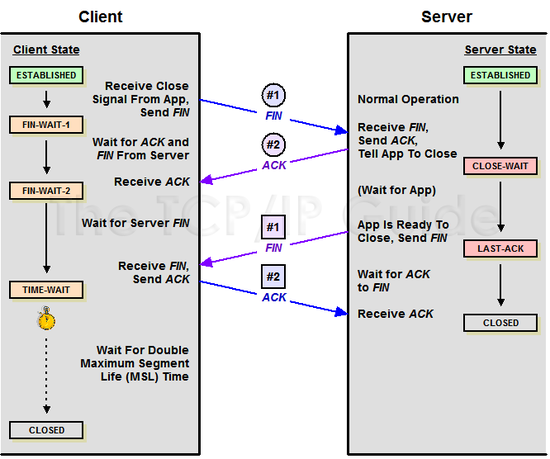
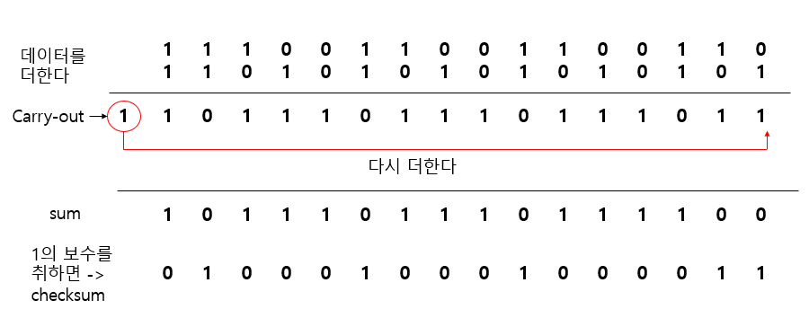

## TCP란?
- Transmission Control Protocol
- 전송을 제어하는 프로토콜로, 인터넷상에서 데이터를 메시지의 형태로 보내기 위해 IP와 함께 사용하는 프로토콜
- 일반적으로 TCP/IP로 함께 사용하는데 TCP는 패킷 추적 및 관리를, IP는 데이터 배달을 처리함
- 연결형 서비스를 지원하는 프로토콜로 인터넷 환경에서 기본으로 사용
- **연속성보다 신뢰성있는 전송이 중요할 때** 사용하는 프로토콜로 파일 전송, 이메일 전송 등의 상황에서 사용

### 특징
- 연결 지향 방식으로 패킷 교환 방식을 사용, 즉 연결 지향 방식이라는 것은 패킷을 전송하기 위한 논리적 경로를 배정한다는 것
- 3-way-handshaking 과정을 통해 연결을 설정하고 4-way-handshaking 과정을 통해 연결을 해제함
- 흐름 제어 및 혼잡 제어
- 높은 신뢰성 보장
- UDP보다 속도가 느림

### 3-way-handshake
- TCP 연결 초기화를 목적으로 사용
- 출발지, 목적지 모두 데이터를 송신/수신할 준비가 되었다는 것을 보장
- 양쪽 모두 상대편에 대한 초기 순차일련번호를 얻을 수 있도록 함

    

1. A클라이언트는 B서버에 접속을 요청하는 SYN패킷을 보냄. 이때 A클라이언트는 SYN을 보내고 SYN/ACK응답을 기다리는 SYN_SENT상태로 전환.

2. B서버는 SYN요청을 받고 A클라이언트에게 요청을 수락한다는 ACK와 SYN flag 가 설정된 패킷을 발송, A가 다시 ACK으로 응답하기를 기다림. 이때 B서버는 SYN_RECEIVED상태로 전환.

3. A클라이언트는 B서버에게 ACK을 보내고 이후로부터는 연결이 이루어지고 데이터가 전달 시작함. 이때의 B서버 상태가 ESTABLISHED임.

### 4-way-handshake
- TCP 연결 세션 종료를 목적으로 사용

    

1. 클라이언트가 연결을 종료하겠다는 FIN플래그 전송

2. 서버는 일단 확인메시지를 보내고 자신의 통신이 끝날때까지 기다림, 이 상태가 TIME_WAIT

3. 서버 통신이 끝났으면 연결 종료되었다고 클라이언트에게 FIN플래그를 전송

4. 클라이언트는 확인했다는 메시지 전송

## UDP란?
- User Datagram Protocol
- 데이터를 데이터그램(독립적인 관계를 지니는 패킷) 단위로 처리하는 프로토콜
- 비연결형 서비스를 지원하는 프로토콜로, 각각의 패킷은 다른 경로로 전송되고 처리됨
- **신뢰성보다 연속성이 중요할 때** 사용하는 프로토콜로, 실시간 스트리밍 등의 상황에서 사용

### 특징
- 정보를 주고 받을 때 수신/송신의 신호 절차를 거치지 않음
- UDP 헤더의 CheckSum 필드를 통해 최소한의 오류만 검출
- 낮은 신뢰성
- TCP보다 속도가 빠름

### UDP CheckSum
- 네트워크를 통해 전송된 데이터의 무결성을 검사하는 값으로, 이를 통해 수신된 데이터에 오류가 있는지를 판단
- 데이터 전송 전, 후 한 번씩 수행되는 계산으로 다른 결과값이 나올 경우 데이터가 손상되었음을 의미

1. 도착 IP주소, 송신 포트번호, 수신 포트번호, 데이터 길이, payload 등의 데이터들을 16비트 단위로 쪼개서 전부 더함
2. 만약 더하는 도중 overflow되서 carry-out된 값이 있다면 결과에 다시 더해서 sum 값을 만듦
3. 계산한 sum 값을 1의 보수를 취함

    