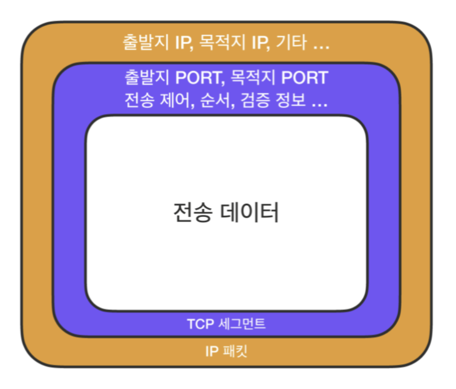

# TCP VS UDP

## 0. 프로토콜

- 프로토콜은 클라이언트와 서버가 정보를 교환할 수 있도록 하는 **메시지 형식에 대한 규칙**이라고 보면 된다.
- 수신 호스트가 전송받은 메시지를 이해하기 위해서는 설계된 규칙에 따라 데이터 형식이 작성되어야 한다.
- HTTP, IP, TCP, UDP는 모두 프로토콜이다.
- HTTP 메시지 헤더 또한 일종의 규칙이며, IP 주소 또한 규칙이다.

## 1. TCP (Transmission Control Protocol)

- IP(Internet Protocol)는 복잡한 인터넷 망에서 클라이언트와 서버가 IP 주소와 패킷과 같은 규칙을 통해 서로 통신할 수 있도록 하는 것이다.
- IP 규칙으로만 통신한다면 패킷 순서가 이상하거나 패킷이 유실될 가능성이 있다.
- TCP는 **패킷 전송을 제어하여 신뢰성을 보증**하는 프로토콜이며, 이를 통해 IP 규칙으로만 통신하기에 부족하거나 불안정한 여러 단점들을 커버할 수 있게 된다.

### (1) IP VS TCP

- IP와 TCP는 모두 프로토콜이지만 같다고 혼동해서는 안되며 이 둘은 별개의 규칙이다.
- IP 규칙에 써있는 대로 목적지까지 다다랐으면, TCP 규칙에 써있는 대로 정확히 누구에게 전달되어야 하는지 하나하나 따지는 것이다.
- 따라서 은행 업무나 메일과 같이 반드시 수신자가 정보를 받아야 하는 신뢰성 있는 통신이 필요할 때 TCP가 사용된다.

### (2) 안전 포장

- 비유하자면 IP는 단순히 배달 주소지이고, TCP는 이 배달지로 문제 없이 전송되도록 택배 스티커 등 여러 부가 정보들을 가미한 것이다.
- TCP에는 **단순히 목적지 뿐만 아니라 순서, 검증, 전송 제어 정보가 포함**되어 있어 IP 주소지로만 전달하기에는 불안정한 부분들을 확실하게 커버하여 목적지까지 안전하게 도착하는 것을 보증한다.

### (3) 꼼꼼한 통신 확인 - 3 Way Handshake, 4 Way Handshake

- TCP는 신뢰성 프로토콜답게, 배달하기 전에 목적지가 무사한지 미리 확인하고 배달이 끝난 후에도 또 확인하는 프로토콜이다.
- 즉, **통신을 시작할 때와 종료할 때 서로 준비가 되어있는지를 반드시 미리 확인**하며, **패킷을 전송할 순서를 정하고 나서 본격적인 통신**을 시작한다.
- 이 과정이 바로 **3 Way Handshake와 4 Way Handshake 과정**이다.
- 3 Way Handshake는 통신을 시작할 때 거치는 과정이며, 4 Way Handshake는 통신을 마칠 때 거치는 과정이다.
- 즉, **한 번 통신하는 데 Handshake을 두 번 해서 신뢰성을 보장**한다.

### (4) 전송 제어 기법

- TCP는 **전송 흐름을 제어하는 기능**을 프로토콜 자체에 포함하고 있다.
- TCP가 없었다면 개발자가 일일이 데이터를 어떤 단위로 보낼 것인지 정의해야 하고, 패킷이 유실되었을 경우에는 어떤 예외처리를 할 것인지 신경 써야 했을 것이다.
- 하지만 TCP로 인해 개발자는 온전히 상위의 동작에만 집중할 수 있게 된다.
- 보통 TCP의 전송 제어 방법은 흐름 제어, 오류 제어, 혼잡 제어의 3가지로 정리된다.

## 2. UDP (User Datagram Protocol)

- UDP는 **데이터그램 방식을 사용하는 프로토콜**이므로, 각각의 패킷 간의 순서가 존재하지 않는 독립적인 패킷을 사용한다.
- 데이터그램 방식은 패킷의 목적지만 정해져있다면 중간 경로는 신경 쓰지 않는 방식이다.
- 따라서 UDP에서는 **TCP의 Handshake와 같은 연결 설정이 필요하지 않다.**
- 즉, TCP에서 신뢰성을 확보하기 위한 과정을 UDP에서는 거치지 않기 때문에 **UDP의 속도가 더 빠르다.**
- 따라서 UDP는 실시간 영상 스트리밍과 같이 고용량 데이터를 다루는 곳에서 이용된다.

## 3. TCP VS UDP

- 비교

    |  | TCP | UDP |
    | --- | --- | --- |
    | 연결 방식 | 연결형 서비스 | 비연결형 서비스 |
    | 패킷 교환 | 가상 회선 방식 | 데이터그램 방식 |
    | 전송 순서 보장 | 보장한다 | 보장하지 않는다 |
    | 신뢰성 | 높다 | 낮다 |
    | 전송 속도 | 느리다 | 빠르다 |

## 0. 참고한 링크

- [https://inpa.tistory.com/entry/NW-🌐-아직도-모호한-TCP-UDP-개념-❓-쉽게-이해하자](https://inpa.tistory.com/entry/NW-%F0%9F%8C%90-%EC%95%84%EC%A7%81%EB%8F%84-%EB%AA%A8%ED%98%B8%ED%95%9C-TCP-UDP-%EA%B0%9C%EB%85%90-%E2%9D%93-%EC%89%BD%EA%B2%8C-%EC%9D%B4%ED%95%B4%ED%95%98%EC%9E%90)
