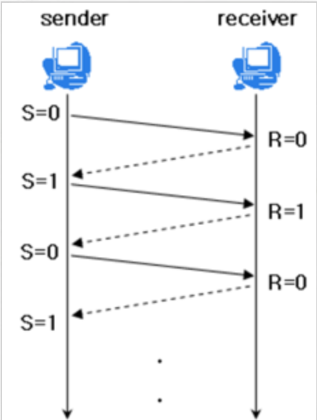
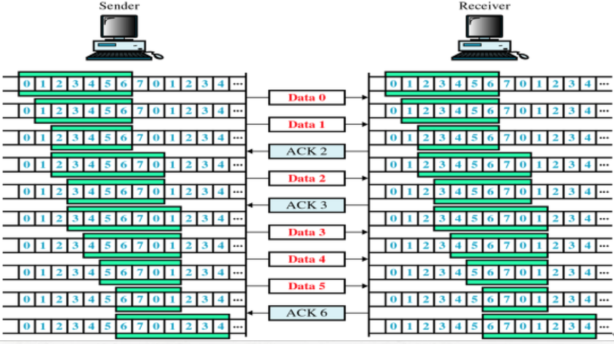
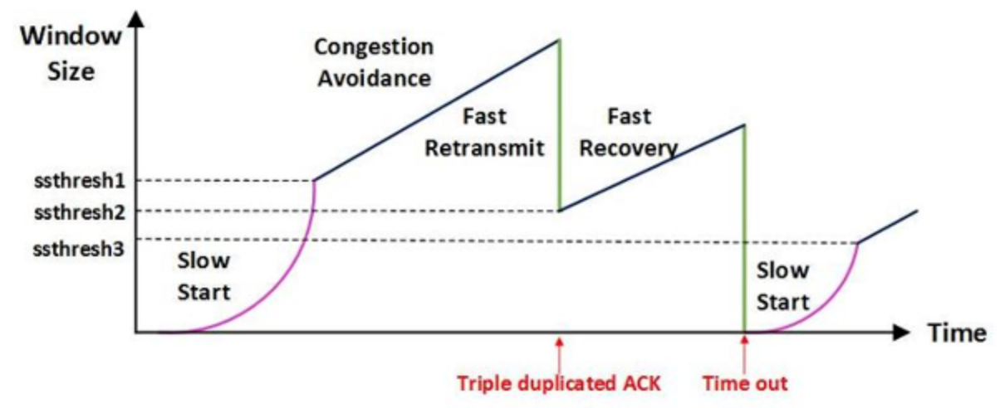
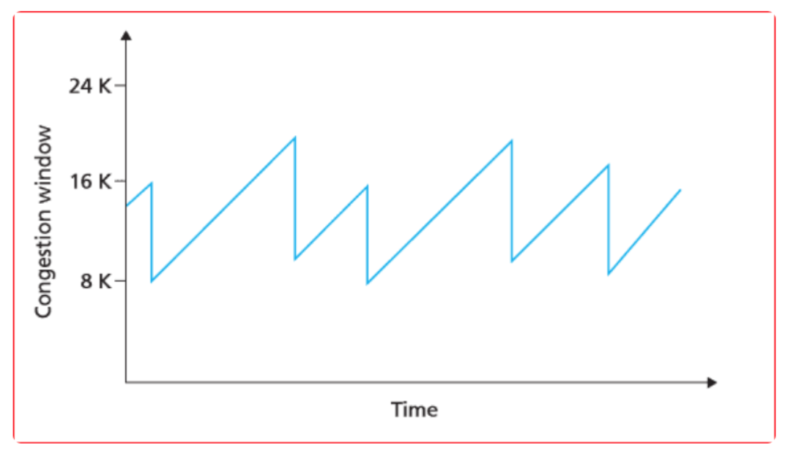
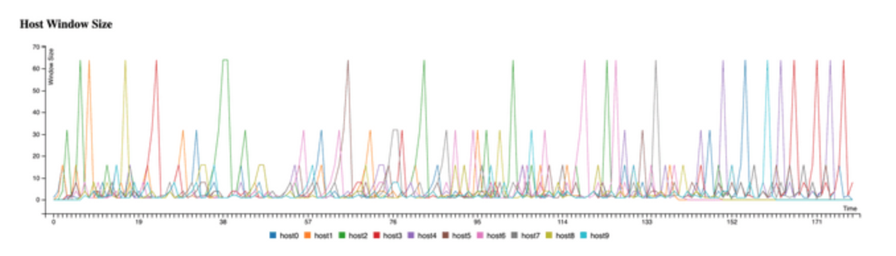
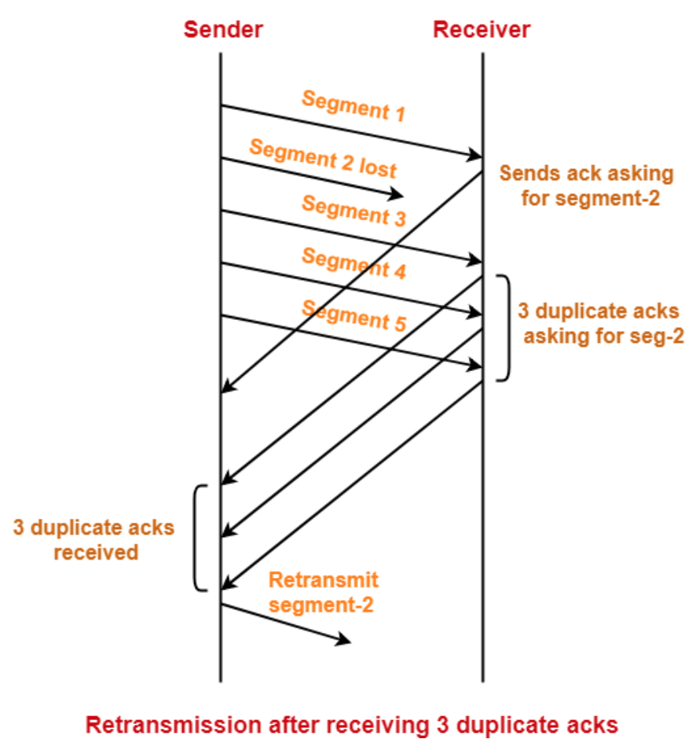
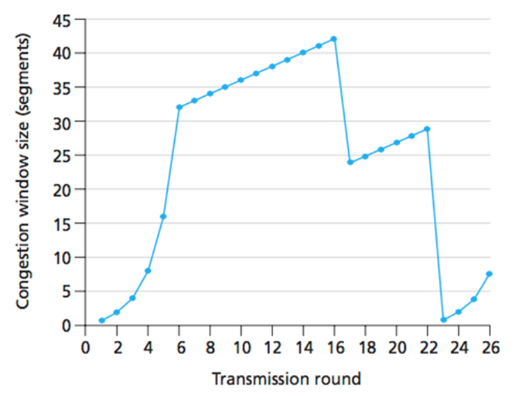

# TCP 통신이란?
- 네트워크 통신에서 신뢰적인 연결방식
- TCP는 기본적으로 unreliable network에서, reliable network를 보장하는 프로토콜
  
## reliable network의 4가지 문제
(1) 손실 : packet이 손실될 수 있는 문제  
(2) 순서 바뀜 : packet의 순서가 바뀌는 문제  
(3) Congestion : 네트워크가 혼잡한 문제  
(4) Overload : receiver가 overload 되는 문제

# TCP/IP 흐름&혼잡 제어
- TCP/IP_FlowControl&CongestionControl
- TCP가 데이터를 안정적으로 전송하기 위해 사용하는 메커니즘

## 흐름제어(FlowControl)
- 송신 측과 수신 측 간의 데이터 전송률을 조절하여 수신 측의 버퍼 오버플로우를 방지
- 수신자가 처리할 수 있는 양의 데이터만을 송신자에게 허용
- 기본 개념은 receiver가 sender에게 현재 자신의 상태를 feedback한다는 것

## 흐름제어 방식
### stop and wait

- 매 번 전송한 패킷에 대해 ACK(확인 응답)을 받으면 다음 패킷을 전송하는 방식
- 패킷을 하나씩 보내기 때문에 비효율적인 방법
   
### sliding window

- 2가지의 Continous ARQ 중 1개인 Go Back N ARQ
- 수신 측에서 설정한 윈도우 크기만큼 송신 측에서 ACK없이 패킷을 전송가능 하여 데이터 흐름을 동적으로 조절하는 제어 기법
- 전송은 되었지만, ACK를 받지 못한 byte의 숫자를 파악하기 위해 사용하는 protocol

### 동작 방식
1. 최초로 수신자는 윈도우 사이즈를 7로 설정
2. 송신자는 수신자의 ACK를 받기 전까지 데이터를 송신
3. ACK를 송신자에게 보내면, 슬라이딩 윈도우 사이즈를 충족할 수 있게끔 윈도우를 옆으로 이동
4. 이후 데이터를 다 받을 때까지 위 과정을 반복

## 혼잡제어

- 송신측의 데이터는 지역망이나 인터넷으로 연결된 대형 네트워크를 통해 전달된다. 
- 한 라우터에 데이터가 몰릴 경우, 자신에게 온 데이터를 모두 처리 불가
- 네트워크의 혼잡을 피하기 위해 송신측에서 보내는 데이터의 전송속도를 강제로 줄이는 작업

## 혼잡제어 기법
### AIMD

- 처음에 패킷을 하나씩 보내고 이것이 문제없이 도착하면 window 크기를 1씩 증가시키며 전송
- 공평한 방식으로 여러 호스트가 한 네트워크를 공유하고 있으면 나중에 진입하는 쪽이 처음에는 불리하지만, 시간이 흐르면 평형상태로 수렴하게 되는 특징
- 네트워크가 혼잡해지고 나서야 대역폭을 줄이는 방식

### Slow Start (느린 시작)

- AIMD와 마찬가지로 패킷을 하나씩 보내면서 시작, 패킷이 문제없이 도착하면 각각의 ACK 패킷마다 window size를 1씩 증가
- 즉, 한 주기가 지나면 window size가 2배로 증가 
- 네트워크의 수용량을 예상 불가, 한번 혼잡 현상이 발생하면 수용량을 어느 정도 예상 가능

### Fast Retransmit (빠른 재전송)

- 패킷을 받는 수신자 입장에서는 내용들이 순서대로 도착하지 않는 경우가 있다
- 이 떄 수신측에서는 순서대로 도착한 마지막 패킷의 다음 순서를 ACK패킷에 실어보낸다.
- 이러한 중복 ACK를 3개 받으면 재전송이 이루어진다.

### Fast Recoverry (빠른 회복))

- 혼잡한 상태가 되면 window size를 1로 줄이지 않고 반으로 줄이고 선형증가시키는 방법
- 혼잡 상황을 한번 겪고 나서부터는 순수한 AIMD 방식으로 동작
